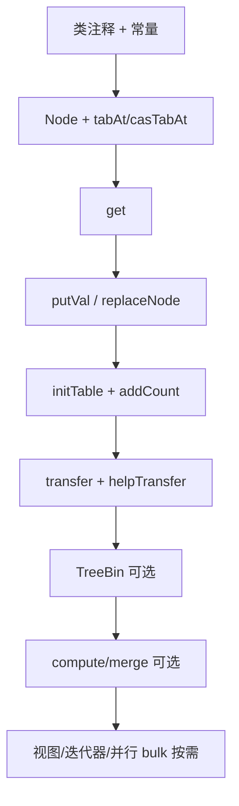

# ConcurrentHashMap 了解地图

> 基于 JDK 21（Temurin）`java.util.concurrent.ConcurrentHashMap` 源码梳理。  
> 源码约 **6385 行**，核心并发机制集中在约 **800～1500 行**；其余为视图、迭代器、并行 bulk、序列化兼容等。

---

## 1. 在 JUC 里重要吗？

**非常重要**，是 `java.util.concurrent` 中最值得精读的一类实现之一。

| 维度         | 说明                                                                      |
|------------|-------------------------------------------------------------------------|
| 使用频率       | 高并发缓存、注册表、去重、计数（配合 `LongAdder`）、本地配置等                                   |
| 设计价值       | 集中体现 **无锁读、CAS、细粒度锁、协作扩容、红黑树退化、分布式计数**                                  |
| MianShi/进阶 | 并发 Hash 的标准答案；常与 `HashMap`、`Hashtable`、`Collections.synchronizedMap` 对比 |
| 源码体量       | 体量大，但可按模块分层阅读，不必从头到尾通读                                                  |

### 类注释中的核心契约

- **读操作（含 `get`）一般不阻塞**，可与 `put`/`remove` 等写操作重叠。
- 检索反映的是「在检索开始时已完成的更新」的 happens-before 语义。
- **不支持对整个表加锁**以阻止所有访问（无全局表锁）。
- **`size()`、`isEmpty()`、`containsValue()`** 在并发更新时只是近似/瞬态值，适合监控，不宜用于强一致控制流。
- **迭代器弱一致性**：不抛 `ConcurrentModificationException`；反映创建迭代器时或之后的某一时刻状态。
- **不允许 `null` 作为 key 或 value**（与 `HashMap` 不同，与 `Hashtable` 类似）。

---

## 2. 心智模型：一张表 + 很多桶

```
table[i]  →  Node → Node → Node          （链表，hash ≥ 0）
          →  TreeBin（红黑树，hash = TREEBIN = -2）
          →  ForwardingNode（扩容中，hash = MOVED = -1）
          →  ReservationNode（占位，hash = RESERVED = -3）
```

| 概念 | 含义 |
|------|------|
| **桶（bin）** | `table` 数组的一个槽位，`i = (n - 1) & hash` |
| **冲突** | 同桶内挂链表；链表长度 ≥ 8 且表容量 ≥ 64 时 **树化** |
| **特殊 hash** | `MOVED(-1)`、`TREEBIN(-2)`、`RESERVED(-3)` 用负数区分普通 `Node` |

### 关键常量（速查）

| 常量 | 值 | 含义 |
|------|-----|------|
| `DEFAULT_CAPACITY` | 16 | 默认初始容量（2 的幂） |
| `LOAD_FACTOR` | 0.75 | 负载因子（阈值常用 `n - (n >>> 2)`） |
| `TREEIFY_THRESHOLD` | 8 | 桶内节点数达到此值可树化 |
| `UNTREEIFY_THRESHOLD` | 6 | 扩容拆分时可退化为链表 |
| `MIN_TREEIFY_CAPACITY` | 64 | 表容量小于此值时优先扩容而非树化 |
| `MAXIMUM_CAPACITY` | 1 << 30 | 最大表容量 |

---

## 3. 五个核心字段

读懂下面 5 个字段，就掌握了大半结构：

| 字段 | 作用 |
|------|------|
| `table` | 当前哈希表，`volatile Node<K,V>[]` |
| `nextTable` | 扩容进行中的新表 |
| `sizeCtl` | **控制字**：未初始化时表大小；初始化/扩容中为负；否则为下次扩容阈值 |
| `transferIndex` | 多线程协作扩容时，从哪一段桶开始迁移 |
| `baseCount` + `counterCells` | 元素个数（类似 `LongAdder`），避免每次 `put` 竞争单一计数器 |

### 底层访问：`tabAt` / `casTabAt` / `setTabAt`

通过 `Unsafe` 对数组槽做 **volatile 读 / CAS / release 写**，保证并发下对桶头的可见性与原子替换。

---

## 4. 三条主路径（优先精读）

### 4.1 读：`get` —— 尽量无锁

```
spread(key.hashCode())
  → tabAt(table, (n-1) & h) 读桶头
  → 头节点 hash 匹配 → 比 key，返回 val
  → eh < 0 → e.find(h, key)（ForwardingNode / TreeBin）
  → 否则沿 next 遍历链表
```

**要点**：读路径 **不 `synchronized`**；依赖 `volatile` 的 `val`、`next` 与 happens-before。

---

### 4.2 写：`putVal` —— 空桶 CAS，非空桶锁头结点

```
for (;;) {
  表空/null/length==0     → initTable()
  桶空                    → casTabAt(新 Node) → 成功 break
  头.hash == MOVED        → helpTransfer() 帮扩容
  onlyIfAbsent 且头匹配  → 可能直接返回已有值
  否则                    → synchronized(头结点 f) {
                              链表：插入/覆盖
                              TreeBin：putTreeVal
                            }
}
addCount(1, binCount)   // 可能触发扩容；binCount 用于判断是否树化
```

**要点**：

- 锁粒度是 **单个桶的头结点**，不是整表，也不是 JDK7 的 Segment。
- **空桶用 CAS**，减少锁竞争。
- `put` / `putIfAbsent` 共用 `putVal(key, value, onlyIfAbsent)`。

---

### 4.3 扩容：`addCount` → `transfer` + `helpTransfer`

| 步骤 | 说明                                                          |
|----|-------------------------------------------------------------|
| 触发 | `sumCount() >= sizeCtl` 且未达 `MAXIMUM_CAPACITY`              |
| 发起 | CAS 将 `sizeCtl` 设为负值相关标记，创建 `nextTable`（约 2 倍）              |
| 迁移 | 旧桶头替换为 `ForwardingNode`，指向 `nextTable`                      |
| 协作 | 其他线程 `put`/`get` 遇到 `MOVED` 调用 `helpTransfer` 分担 `transfer` |
| 优化 | 链表迁移用 **lastRun**：同一高位/低位的一段可整块搬，少建 Node                    |
| 完成 | `table = nextTab`，更新 `sizeCtl` 为新阈值                         |

**要点**：扩容是源码最难也最精彩的部分；第一遍理解「ForwardingNode + 多线程按 stride 分桶搬」即可。

---

## 5. 节点与辅助结构（第二遍读）

| 类型                     | 作用                                               |
|------------------------|--------------------------------------------------|
| `Node`                 | 普通链表节点；`key` 为 `final`，`val`/`next` 为 `volatile` |
| `TreeNode` / `TreeBin` | 桶内冲突过多时 O(log n) 查找                              |
| `ForwardingNode`       | 扩容占位，`find` 引导到新表                                |
| `ReservationNode`      | `computeIfAbsent` 等复合操作中的占位                      |
| `spread`               | `(h ^ (h >>> 16)) & HASH_BITS`，打散高位、清零符号位        |
| `tableSizeFor`         | 计算 ≥ c 的最小 2 的幂容量                                |

### JDK7 → JDK8+ 演进（阅读提示）

- **JDK7**：`Segment` 分段锁 + 每段内 HashMap。
- **JDK8+**：**bin 锁（锁桶头）+ CAS 空桶 + 协作扩容 + 红黑树**。
- JDK21 中 `Segment` **仅保留序列化兼容壳**，无实际分段逻辑。

---

## 6. 与其它 Map 对比

|                | HashMap        | ConcurrentHashMap | Hashtable          |
|----------------|----------------|-------------------|--------------------|
| 线程安全           | 否              | 是                 | 是（方法 synchronized） |
| null key/value | 允许             | **不允许**           | 不允许                |
| 读              | 无同步            | 无锁为主              | 每次加锁               |
| 写              | 无同步            | CAS + 桶锁          | 每次加锁               |
| 扩容             | 单线程            | **多线程协作**         | 旧实现                |
| 迭代器            | fail-fast（CME） | **弱一致性**          | 枚举类                |
| `size()`       | 单线程下精确         | 并发下近似             | 加锁统计               |

---

## 7. 源码模块分层（6385 行怎么拆）



### 7.1 必读（核心并发）

| 模块                          | 大致行号区间（JDK21） | 内容                          |
|-----------------------------|---------------|-----------------------------|
| 常量与 `Node`                  | ~500–700      | 阈值、特殊 hash、链表节点             |
| 字段与工具方法                     | ~760–820      | `table`、`sizeCtl`、`tabAt` 等 |
| `get`                       | ~934          | 无锁读                         |
| `putVal`                    | ~1010         | 写路径核心                       |
| `replaceNode`               | ~1110         | remove/replace 实现           |
| `initTable`                 | ~2291         | 懒初始化                        |
| `addCount`                  | ~2324         | 计数 + 触发扩容                   |
| `helpTransfer` / `transfer` | ~2363–2570    | 协作扩容                        |

### 7.2 第二优先级

- `computeIfAbsent` / `compute` / `merge`（原子复合操作，含 `ReservationNode`）
- `TreeBin` / `TreeNode`（树化与拆树）
- `clear`、批量 `putAll`（`tryPresize`）

### 7.3 可延后（体量大、与并发核心弱相关）

- `KeySetView` / `ValuesView` / `EntrySetView`
- `Iterator` / `Spliterator` / `Traverser`
- 并行 `forEach` / `search` / `reduce` 及大量 `ForkJoin` Task（约 3700 行以后）
- `writeObject` / `readObject`（兼容旧版 Segment 序列化）

---

## 8. 推荐阅读顺序

| 阶段 | 时间（参考）  | 内容                                               |
|----|---------|--------------------------------------------------|
| 1  | ~30 min | 类注释、`Node`、`spread`、`table`/`sizeCtl`            |
| 2  | ~45 min | `get` + `putVal` + `replaceNode`                 |
| 3  | ~60 min | `initTable`、`addCount`、`transfer`、`helpTransfer` |
| 4  | 按需      | `compute*`、`TreeBin`、并行 bulk、视图                  |

---

## 9. MianShi / 实战重点清单

1. **读无锁、写锁桶头**（空桶 CAS）。
2. **不允许 null**（避免 `get` 与「不存在」的歧义）。
3. **`size()` 在并发下是估计值**，不宜做精确控制流判断。
4. **扩容时其他线程可 `helpTransfer`**，`MOVED` 节点是标志。
5. **链表过长树化**（8），退化阈值 6；表太小时（<64）优先扩容。
6. **计数用 LongAdder 思路**（`baseCount` + `CounterCell[]`）。
7. **迭代器弱一致性**，不保证不丢不重、不抛 CME。
8. 与 `HashMap` 对比：结构相似，但并发语义、null 策略、扩容、计数完全不同。

---

## 10. 常见使用模式

### 并发计数（Multiset / 频率统计）

```java
// ConcurrentHashMap<String, LongAdder> freqs
freqs.computeIfAbsent(key, k -> new LongAdder()).increment();
```

### 注意点

- 需要 **原子「不存在则创建」** 时用 `putIfAbsent` 或 `computeIfAbsent`，不要 `get` 再 `put`。
- 需要遍历快照时，考虑 `mappingCount()`、并行 `forEach`（注意弱一致与 `parallelismThreshold`）。
- 高冲突 key（相同 `hashCode()`）会严重拖慢性能；`Comparable` key 可在树中辅助排序打破平局。

---

## 11. 相关链接

- 源码：`java.base/java/util/concurrent/ConcurrentHashMap.java`（JDK `lib/src.zip`）
- 作者：Doug Lea（JSR-166）
- 规范：与 `Hashtable` 功能规格兼容，但同步细节不同

---

## 12. 后续可深入的主题（本图未展开）

- [ ] `put` 遇到扩容的完整时序（含 `ForwardingNode.find`）
- [ ] `TreeBin` 加锁与 `TreeNode` 的平衡、拆分
- [ ] `computeIfAbsent` 与 `ReservationNode` 防递归更新
- [ ] 并行 bulk 操作的 `parallelismThreshold` 与 ForkJoin 任务划分
- [ ] JDK7 Segment 与 JDK8+ 设计的MianShi对比话术

---

*文档生成日期：2026-05-28*
