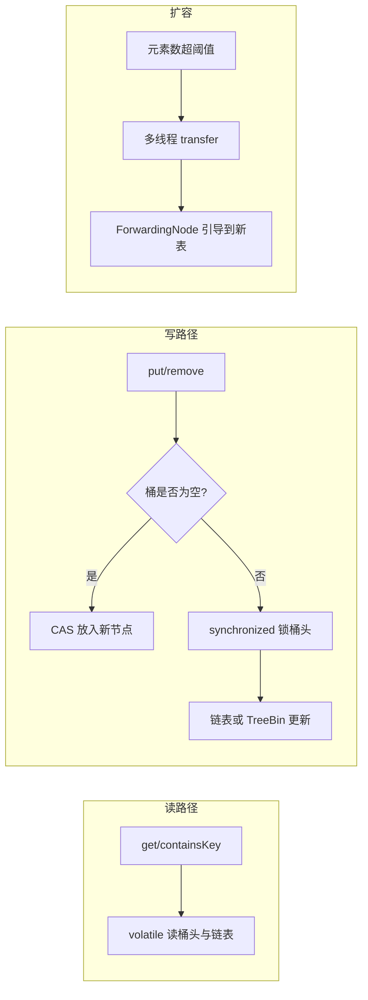

# ConcurrentHashMap 技术解读

> 从「是什么 → 为什么 → 怎么解决 → 关联对比」四个维度理解 `java.util.concurrent.ConcurrentHashMap`。  
> 参考实现：JDK 21 `java.util.concurrent.ConcurrentHashMap`（Doug Lea / JSR-166）。

---

## 1. 这个技术是什么

### 1.1 一句话定义

**ConcurrentHashMap** 是 Java 标准库提供的一种 **线程安全的关联数组（哈希表）**，对外表现为 `Map<K,V>`，允许多个线程 **同时读、并发写**，且在常见负载下保持接近 O(1) 的期望时间复杂度。

### 1.2 它不是什么

| 容易误解 | 实际情况 |
|----------|----------|
| 「给 HashMap 加了把大锁」 | 没有锁整张表；读写路径经过专门设计 |
| 「强一致性的数据库」 | 聚合操作（`size`、迭代）在并发下是 **弱一致 / 近似** |
| 「Hashtable 的升级版」 | 功能规格类似，但 **锁粒度、扩容、迭代语义** 完全不同 |
| 「允许 null」 | **key、value 均不允许 null**（与 `HashMap` 不同） |

### 1.3 在 Java 生态中的位置

```
java.util.Map（接口）
    ├── HashMap          — 单线程 / 外部同步
    ├── Hashtable        — 方法级 synchronized（遗留）
    ├── Collections.synchronizedMap(HashMap) — 包装锁
    └── ConcurrentHashMap — JUC 原生并发哈希表 ★
```

它是 **JUC（`java.util.concurrent`）** 里最常用、也最具代表性的 **并发集合** 之一：业务缓存、注册中心本地表、去重集合、配合 `LongAdder` 做频率统计等，几乎无处不在。

### 1.4 核心能力摘要

- **高并发读**：`get` 等读操作通常 **不加锁**，依赖 `volatile` 与内存可见性。
- **高并发写**：通过 **CAS + 按桶（bin）细粒度锁** 完成插入、更新、删除。
- **可扩展扩容**：表满时 **多线程协作迁移** 桶数据，而不是单线程阻塞全表。
- **冲突退化**：单桶链表过长时 **树化**（红黑树），缓解哈希碰撞攻击或极差分布。
- **弱一致遍历**：迭代器 **不抛** `ConcurrentModificationException`，反映某一时刻或之后的快照。

---

## 2. 为什么有它，解决什么问题

### 2.1 要解决的根问题

多线程环境下，多个线程同时读写同一个「键 → 值」映射时，必须保证：

1. **数据不错乱**：不会出现链表断链、丢更新、读到半写入结构。
2. **性能可接受**：不能为了安全把整张表锁死，否则并发度退化为 1。
3. **语义可用**：程序员仍能用 `put`/`get`/`remove` 等熟悉的 API 写业务逻辑。

### 2.2 历史方案及其痛点

#### （1）`Hashtable`：每个 public 方法 `synchronized`

```text
线程 A: put(k1) ──锁整张逻辑表──▶
线程 B: get(k2) ──必须等同一把锁──▶ 即使 k1、k2 不同桶也互斥
```

- **问题**：锁粒度 = 整张表，读读、读写、写写全部串行化，扩展性差。

#### （2）`Collections.synchronizedMap(new HashMap<>())`

- 本质仍是 **粗粒度互斥**（包装后方法 synchronized）。
- 迭代时仍需 **手动 `synchronized(map)`**，否则 `ConcurrentModificationException`。
- 与 `Hashtable` 类似：**正确但慢**。

#### （3）「自己用 `HashMap` + `ReentrantReadWriteLock`」

- 可行，但容易写错（忘记锁迭代、锁顺序死锁、锁范围过大）。
- 读写锁在读极多时仍有开销；写多时写锁仍竞争。

#### （4）「每个线程一份 `HashMap`，最后 merge」

- 适合特定场景，但 **无法共享实时视图**，合并成本高，内存翻倍。

### 2.3 ConcurrentHashMap 要填的坑

| 痛点 | ConcurrentHashMap 的目标 |
|------|---------------------------|
| 全表锁导致读多写少场景性能差 | 读路径尽量 **无锁** |
| 写冲突集中在少数桶 | 只锁 **冲突桶的头结点** |
| 扩容时长时间阻塞 | **协作式、分段迁移** |
| 迭代时结构变化 | **弱一致迭代**，不 fail-fast |
| 需要近似规模统计 | **分布式计数**（LongAdder 思路） |

### 2.4 典型业务场景

- **本地缓存**：多线程读配置、写缓存条目。
- **服务注册 / 路由表**：动态注册与查询实例。
- **幂等 / 去重**：`putIfAbsent` 保证同一 key 只处理一次。
- **并发计数**：`computeIfAbsent` + `LongAdder` 做访问频率、限流窗口统计。
- **并行流聚合**：在仍有并发更新的 Map 上做 `forEach` / `reduce`（需注意语义）。

---

## 3. 它是怎么解决的——原理与机制

### 3.1 总体思路：「分而治之 + 无锁读 + 有锁写桶」



**核心思想**：把竞争从「整张 Map」降到「某一个 hash 桶」，读操作尽量不参与锁竞争。

### 3.2 数据结构层

1. **`table`**：`Node<K,V>[]`，长度始终为 2 的幂，用 `(n-1) & hash` 定位桶。
2. **`Node` 链表**：同一桶内 hash 冲突的键值对；`val`、`next` 为 `volatile`，保证无锁读可见性。
3. **`TreeBin` / `TreeNode`**：单桶节点 ≥ 8 且表容量 ≥ 64 时树化，最坏 O(log n)。
4. **特殊节点**：
   - `ForwardingNode`（`hash = MOVED`）：扩容迁移中的占位，读/写会帮助或转发到新表。
   - `ReservationNode`：复合操作（如 `computeIfAbsent`）中的占位，防止重复计算。

### 3.3 哈希与索引

- **`spread(hashCode)`**：`(h ^ (h >>> 16)) & 0x7fffffff`  
  - 打散高位，避免仅高位不同的 key 在 2 的幂表长下全部落入同一桶。
  - 保留符号位为 0，负数 hash 留给特殊节点类型。

### 3.4 写操作原理：`putVal`

| 情况 | 策略 | 原理 |
|------|------|------|
| 表未初始化 | `initTable()`，CAS 竞争初始化权 | 懒加载，避免无谓分配 |
| 目标桶为空 | `casTabAt` 直接放入新 `Node` | **无锁成功路径**，最快 |
| 桶头是 `ForwardingNode` | `helpTransfer` | 扩容中，协助迁移或到新表重试 |
| 桶非空 | `synchronized(头结点 f)` | **只锁一个桶**；双重检查 `tabAt(tab,i)==f` |
| 插入后 | `addCount`，可能触发扩容 | 分布式计数 + 阈值判断 |

**为什么锁头结点而不是锁 key？**  
头结点是桶在 `table` 中的「锚点」，锁住它即可安全地修改整条链表或树，且锁对象稳定、粒度最小。

### 3.5 读操作原理：`get`

- 用 `tabAt`（volatile 语义）读桶头。
- 若普通节点：比对 hash 与 key，沿 `next` 走链表。
- 若 `hash < 0`：调用 `find`（处理 `ForwardingNode`、`TreeBin`）。
- **全程不加锁**；依赖 JMM：对已发布节点的 `val` 可见。

**语义**：读到的是「在本次 `get` 开始前已完成」的写入（happens-before）；可能与正在进行的 `put` 交错，但不读到结构损坏的中间态。

### 3.6 扩容原理：协作式 transfer

1. 某线程发现 `size >= sizeCtl`，CAS 设置 `sizeCtl` 为负值相关状态，分配 `nextTable`（约 2 倍）。
2. 按 `transferIndex` 与 **stride** 把旧表桶任务分给多个线程。
3. 迁移完的桶在旧表位置放 `ForwardingNode`，读/写线程可 **帮忙搬剩余桶**。
4. 链表迁移利用 **lastRun** 优化：同一子链高位/低位相同的一段可整块复制。
5. 全部完成后：`table = nextTable`，`sizeCtl` 更新为新扩容阈值。

**效果**：扩容不再是「一个人搬完整张表、其他人干等」，而是 **多核并行搬桶**，缩短停顿感知时间。

### 3.7 计数原理：为何不用 `size` 字段 + 一把锁

- 每次 `put`/`remove` 若原子更新全局 `size`，会成为热点。
- 采用 **`baseCount` + `CounterCell[]`**（类似 `LongAdder`）：  
  - 低竞争时更新 `baseCount`；  
  - 高竞争时分散到多个 cell，最后 `sumCount()` 求和。  
- 因此 **`size()`、`mappingCount()` 是近似值**，在并发更新时可能瞬时偏差。

### 3.8 复合操作：`putIfAbsent`、`computeIfAbsent`、`merge`

- 在 **桶锁内** 完成「判断 + 更新」，保证对单个 key 的原子性。
- `computeIfAbsent` 可能用 `ReservationNode` 占位，避免同一 key 上递归重入计算。
- 仍 **不等于** 数据库事务：不保证跨 key 的原子性。

### 3.9 设计上的刻意权衡

| 选择了 | 放弃了 |
|--------|--------|
| 高吞吐、细粒度锁 | 强一致的全局 `size`、快照迭代 |
| 无锁读 | 允许 null（null 会破坏「get 区分不存在」） |
| 协作扩容复杂度 | 实现简单的一次性全表复制 |
| 弱一致迭代 | fail-fast 迭代器 |

---

## 4. 关联知识点与对比

### 4.1 与同类 Map 对比

| 特性 | HashMap | Hashtable | synchronizedMap | ConcurrentHashMap |
|------|---------|-----------|-----------------|-------------------|
| 线程安全 | 否 | 是 | 是 | 是 |
| 锁粒度 | — | 方法级（整表） | 方法级（整表） | 桶级 + CAS |
| 读是否阻塞写 | — | 是 | 是 | 通常否 |
| null key/value | 允许 | 不允许 | 取决于底层 Map | 不允许 |
| 迭代器 | fail-fast | 枚举，弱一些 | fail-fast（需手动同步） | 弱一致，无 CME |
| 扩容 | 单线程 | 旧实现 | 同 HashMap | 多线程协作 |
| 性能（多线程） | 差（需外部锁） | 差 | 差 | 优 |
| 推荐场景 | 单线程 | 遗留代码 | 简单兼容 | **高并发共享 Map** |

### 4.2 与「锁 + HashMap」手写方案对比

| 方案 | 优点 | 缺点 |
|------|------|------|
| `ReadWriteLock` + `HashMap` | 语义清晰，读锁可并发 | 实现易漏锁；写锁仍粗；扩容需自行处理 |
| `ConcurrentHashMap` | JDK 优化多年，扩容/树化/计数内置 | API 语义（弱一致）需学习 |

### 4.3 与其它 JUC 结构的关系

| 结构 | 关系 |
|------|------|
| **ConcurrentSkipListMap** | 同样线程安全 Map，但 **有序**（按 key 排序），基于跳表；写开销与场景不同，适合需要排序遍历 |
| **CopyOnWriteArrayList** | 读多写极少时「写时复制」；Map 侧类似思想见于 **快照迭代**，但 CHM 不是全表复制 |
| **LongAdder / AtomicLong** | CHM 的 `addCount` 与计数 cell 同源思想；做 value 计数时常与 CHM 组合 |
| **BlockingQueue** | 解决生产者-消费者 **排队**，不是 key-value 查找；问题域不同 |
| **ConcurrentLinkedQueue** | 无界非阻塞队列；无随机访问 |

### 4.4 与分布式缓存 / 数据库的边界

| 维度 | ConcurrentHashMap | Redis / DB |
|------|-------------------|------------|
| 范围 | **JVM 进程内** | 跨进程、跨机器 |
| 一致性 | 单 JVM 内按 JMM + 实现保证 | 网络、事务、副本协议 |
| 过期、淘汰 | 需自行实现 |  Often 内置 TTL、LRU |
| 适用 | 本地缓存、会话表、热数据索引 | 共享缓存、持久化 |

**不要** 把 CHM 当作分布式锁或跨节点一致性方案；跨 JVM 需 Redis、ZooKeeper、数据库等。

### 4.5 与 `volatile`、`CAS`、`synchronized` 的关系

ConcurrentHashMap 是三种机制的组合教材：

- **`volatile`**：`Node.val`、`Node.next`、`table` 引用 → 无锁读的可见性。
- **CAS（Unsafe / VarHandle）**：空桶插入、`sizeCtl`、计数 cell、`tabAt` 替换。
- **`synchronized`**：非空桶内链表/树修改，保证复合操作原子性。

理解 CHM 有助于理解 **「什么时候 CAS 够、什么时候必须加锁」**。

### 4.6 常见误用与注意点

| 误用 | 正确做法 |
|------|----------|
| `if (!map.containsKey(k)) map.put(k, v)` | 用 `putIfAbsent` 或 `computeIfAbsent` |
| 依赖 `size()==0` 做「队列空」判断 | 并发下不可靠；用 `Queue` 或额外同步 |
| 遍历时 `remove` 期待 fail-fast | CHM 弱一致，可能漏/重；用 `remove(key)`、`replaceAll` 等 |
| 用 null 表示「未缓存」 | 不允许 null；用 `Optional`、哨兵对象或外层包装 |
| 极高冲突的 key | 单桶退化；检查 `hashCode`、考虑换 key 或换结构 |

### 4.7 版本演进（建立历史感）

| 版本 | 要点 |
|------|------|
| JDK 5~6 | 引入 CHM，**Segment 分段锁**（默认 16 段） |
| JDK 8 | **取消 Segment**，改为 CAS + synchronized 桶 + 红黑树 + 协作扩容 |
| JDK 8+ | 并行 bulk、`compute*`、`merge`、`mappingCount` 等 |
| 当前阅读 | `Segment` 类仅 **序列化兼容** 保留，逻辑已不在分段锁 |

MianShi常问「JDK7 和 JDK8 ConcurrentHashMap 区别」——本质就是 **分段锁 vs 桶锁 + 树 + 协作扩容**。

---

## 5. 小结：一张思维卡片

```text
┌─────────────────────────────────────────────────────────┐
│ ConcurrentHashMap                                        │
├─────────────────────────────────────────────────────────┤
│ 是什么  │ JVM 内线程安全的哈希 Map（JUC 标准实现）        │
│ 为什么  │ 多线程共享映射：要安全，更要并发性能            │
│ 怎么做  │ 无锁读 + CAS 空桶 + 锁桶头写 + 协作扩容 + 树化  │
│ 不是什么│ 分布式存储、强一致 size、允许 null、全表锁      │
│ 对比谁  │ HashMap / Hashtable / syncMap / SkipListMap    │
└─────────────────────────────────────────────────────────┘
```

---

## 6. 与本目录其它文档的关系

| 文档 | 侧重 |
|------|------|
| [26052801-ConcurrentHashMap了解地图.md](./26052801-ConcurrentHashMap了解地图.md) | 源码结构、阅读顺序、方法分层（**怎么读代码**） |
| **本文** | 技术定位、动机、原理、生态对比（**为什么存在、解决什么**） |

建议：先读本文建立问题与方案框架，再按「了解地图」下钻 JDK 源码。

---

*文档生成日期：2026-05-28*
