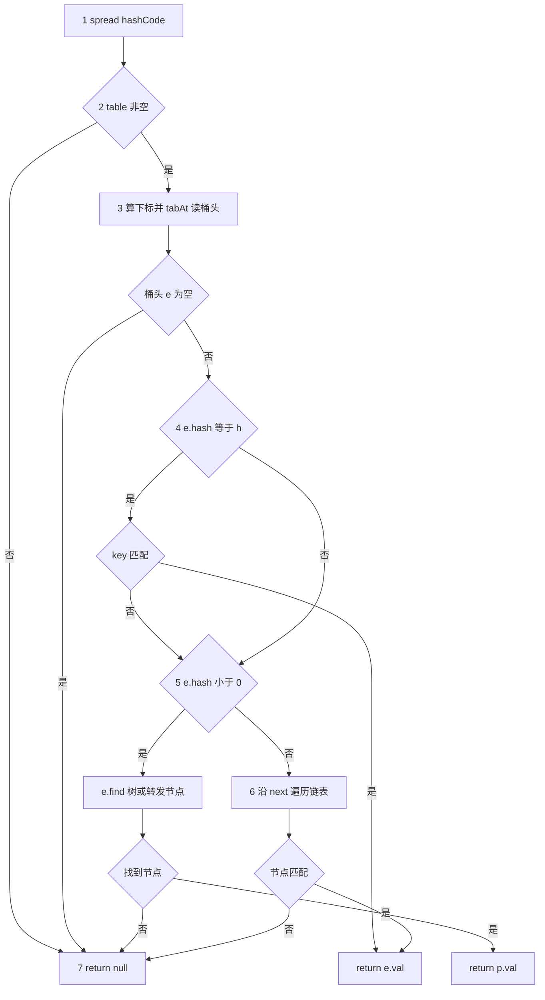

# ConcurrentHashMap.get 方法知识点扫盲

> 基于 **JDK 17** `java.util.concurrent.ConcurrentHashMap` 源码。
> 目标：把 `get` 里每一行代码背后的知识点串起来，并配合**运行中的具体案例**理解难点。
> 前置文档：[ConcurrentHashMap了解地图](./26052801-ConcurrentHashMap了解地图.md)

---

## 1. 先记住：`get` 在干什么

```java
public V get(Object key) {
    Node<K,V>[] tab; Node<K,V> e, p; int n, eh; K ek;
    int h = spread(key.hashCode());                              // ①
    if ((tab = table) != null && (n = tab.length) > 0 &&         // ②
        (e = tabAt(tab, (n - 1) & h)) != null) {                // ③
        if ((eh = e.hash) == h) {                                // ④
            if ((ek = e.key) == key || (ek != null && key.equals(ek)))
                return e.val;
        }
        else if (eh < 0)                                         // ⑤
            return (p = e.find(h, key)) != null ? p.val : null;
        while ((e = e.next) != null) {                           // ⑥
            if (e.hash == h &&
                ((ek = e.key) == key || (ek != null && key.equals(ek))))
                return e.val;
        }
    }
    return null;                                                 // ⑦
}
```

**一句话**：把 key 变成 hash → 算桶下标 → 无锁读出桶头 → 在头节点 / 树 / 转发节点 / 链表中找匹配的 key → 返回值或 `null`。

下面按知识点分组，并标注对应代码行（①～⑦）。

---

## 2. 知识点地图（自检用）

读完后可在「掌握度」列打 ✅ / ⚠️ / ❌。


| 编号 | 知识点                                    | 影响`get` 的哪一步        | 掌握度 |
| ---- | ----------------------------------------- | ------------------------- | ------ |
| K1   | `Object.hashCode()` 与 `equals` 约定      | ① 入口；④⑥ key 比对    |        |
| K2   | `==` vs `equals`                          | ④⑥ 先引用相等再内容相等 |        |
| K3   | 位运算`&`、`^`、`>>>`                     | ①`spread`；③ 桶下标     |        |
| K4   | int 32 位、高位/低位、符号位              | ①③ 全部位运算           |        |
| K5   | 哈希表 = 数组 + 哈希 + 冲突处理           | 整体模型                  |        |
| K6   | 桶（bin）概念                             | ③ 数组一个槽             |        |
| K7   | 链地址法（拉链法）                        | ⑥`e.next` 遍历           |        |
| K8   | 数组长度为 2 的幂                         | ③`(n-1)&h` 成立前提      |        |
| K9   | `h % n` 等价于 `(n-1) & h`（n 为 2 的幂） | ③ 算下标                 |        |
| K10  | 掩码`n-1` 只保留 hash 低位                | ③；也是 spread 的动机    |        |
| K11  | Hash 扰动 / spread                        | ① 整行                   |        |
| K12  | 特殊负数 hash：MOVED/TREEBIN/RESERVED     | ①`HASH_BITS`；⑤ `eh<0`  |        |
| K13  | `Node` 结构：hash/key/val/next            | ④⑤⑥                    |        |
| K14  | 树化（TreeBin + 红黑树）                  | ⑤`e.find`                |        |
| K15  | 扩容 ForwardingNode                       | ⑤`e.find` 递归到新表     |        |
| K16  | `volatile` / happens-before / acquire 读  | ②`table`；③ `tabAt`     |        |
| K17  | `table` 懒初始化                          | ② 可能为 null            |        |
| K18  | 无锁读 vs 有锁写                          | 整体设计                  |        |

**建议阅读顺序**：K5→K6→K8→K9→K10→K3→K11→K12→K13→K7→K14→K15→K16→K17→K18。

---

## 3. 逐步走读：每行代码 + 知识点

### 3.1 ① `int h = spread(key.hashCode());`


| 知识点                | 作用                                                                        |
| --------------------- | --------------------------------------------------------------------------- |
| **K1** `hashCode()`   | 每个 key 必须先能算出一个 int；`null` key 会直接 NPE（CHM 不允许 null key） |
| **K11** spread 扰动   | 把高位混进低位，减轻「只用低位取桶」导致的扎堆                              |
| **K12** `& HASH_BITS` | 强制 hash ≥ 0，避免与普通节点的特殊负数 hash 混淆                          |

**没有 spread 会怎样？**
若 `n=16`，桶下标只看 hash 的**低 4 位**。两个 key 的 hash 只有高位不同、低 4 位相同 → **一定进同一桶**，冲突增多，链表变长，`get` 更慢。

---

### 3.2 ② `(tab = table) != null && (n = tab.length) > 0`


| 知识点                   | 作用                                                         |
| ------------------------ | ------------------------------------------------------------ |
| **K17** 懒初始化         | 新建 CHM 时`table` 可能还是 `null`，第一次 `put` 才分配数组  |
| **K16** `volatile table` | 读`table` 引用时要看到其他线程已发布的新数组（例如扩容替换） |

**案例 A：空 map 上 get**

```java
ConcurrentHashMap<String, Integer> map = new ConcurrentHashMap<>();
map.get("foo");  // table == null → ② 条件失败 → 直接 ⑦ return null
```

---

### 3.3 ③ `(e = tabAt(tab, (n - 1) & h)) != null`


| 知识点                 | 作用                                          |
| ---------------------- | --------------------------------------------- |
| **K8～K10** 2 的幂取模 | `(n-1)&h` 得到桶下标 `i`，范围 `[0, n-1]`     |
| **K6** 桶              | `tab[i]` 逻辑上就是第 `i` 个桶的**头节点**    |
| **K16** `tabAt`        | 用 acquire 语义读槽位，保证看到最新发布的桶头 |

**案例 B：命中桶头（最常见、最快）**

假设：

- `n = 16`，`(n-1) = 0b1111`
- `h = spread("user:1001".hashCode()) = 0x0000_2A3F`
- 桶下标：`0b1111 & 0x2A3F = 0x000F = 15` → 读 `tab[15]`

```
table[15] → Node(hash=h, key="user:1001", val=42, next=null)
```

③ 得到 `e` 非 null → ④ `eh == h` → key 相等 → **return 42**。
全程无锁，只读一次桶头。

---

### 3.4 ④ 头节点 hash 相等且 key 匹配


| 知识点                  | 作用                                                                  |
| ----------------------- | --------------------------------------------------------------------- |
| **K13** Node            | `e.hash` 存的是**插入时**就算好的 `spread(hashCode)`，与当前 `h` 比较 |
| **K2** `==` 再 `equals` | 同一对象直接命中；否则用`equals`（String 等内容比较）                 |

**为什么要先比 `e.hash == h`？**
比 `equals` 便宜。hash 不等 → 几乎不可能是同一 key（除非 hash 碰撞，极少），可快速跳过。

---

### 3.5 ⑤ `else if (eh < 0)` → `e.find(h, key)`


| 知识点                 | 作用                                                   |
| ---------------------- | ------------------------------------------------------ |
| **K12** 负数 hash 语义 | 普通 Node 的 hash ≥ 0；负数表示**特殊节点**           |
| **K14** TreeBin        | `eh == TREEBIN(-2)`，桶内是红黑树，`find` 按树查找     |
| **K15** ForwardingNode | `eh == MOVED(-1)`，扩容中，到新表 `nextTable` 继续 get |

普通 Node 不会进入 ⑤；只有桶头是 **TreeBin** 或 **ForwardingNode**（等 `Node` 子类且 hash<0）才走这里。

---

### 3.6 ⑥ `while ((e = e.next) != null)` 链表扫描


| 知识点          | 作用                                           |
| --------------- | ---------------------------------------------- |
| **K7** 链地址法 | 同桶多个 key 冲突时，除头节点外挂在`next` 链上 |
| **K13**         | 每个节点自带`hash/key/val`                     |

**案例 C：桶内链表，目标在第二个节点**

```
table[3] → Node(h=100, "a", 1)
              ↓ next
           Node(h=200, "b", 2)   ← 要找 key="b"
              ↓ next
           Node(h=300, "c", 3)
```

- 设 `spread("b".hashCode()) = 200`
- ③ 下标 `(n-1)&200` 假设为 3
- ④ 头节点 `eh=100 != 200`，且 `100 >= 0` → 不进 ⑤
- ⑥ 第一次：`e.hash=200==h`，key 是 `"b"` → **return 2**

---

### 3.7 ⑦ `return null`

以下情况都会到这里：

- `table` 未初始化或长度为 0
- 桶为空（`tabAt` 得到 null）
- 桶有节点但没有匹配的 key

**注意**：CHM 的 `get` **无法区分**「key 不存在」和「key 存在但 value 为 null」——因为 CHM **不允许 null value**，所以 `null` 只表示没映射。

---

## 4. 难点展开（配合 get 运行案例）

---

### 4.1 难点一：`(n - 1) & h` 为什么等价于取模？

**知识点**：K8、K9、K10、K3

**前提**：`n` 必须是 2 的幂，例如 16、32、64。CHM 扩容也始终翻倍。

**掩码**：`n=16` 时 `n-1 = 15 = 0b0000_0000_0000_1111`。
`&` 运算：**保留 h 的低 4 位，高位全清零**。


| h（十进制） | h 二进制（低 8 位示意） | (n-1)&h | 等价 h % 16 |
| ----------- | ----------------------- | ------- | ----------- |
| 29          | …0001_1101             | 13      | 13          |
| 45          | …0010_1101             | 13      | 13          |
| 77          | …0100_1101             | 13      | 13          |

**在 get 里**：
`spread` 得到 `h` 后，**只有低 `log2(n)` 位决定去哪个桶**。
这也是为什么要做 **spread**：若 key 的 hash 差异全在「当前 n 用不到的高位」，低几位相同就会挤进同一桶。

**运行案例 D：高位不同、低位相同 → 同桶**

```
n = 8  → 掩码 0b111，只看低 3 位

key1.hashCode() 原始 = ...0010111  → spread 后低 3 位 = 111 → 桶 7
key2.hashCode() 原始 = ...1010111  → 若不做 spread，低 3 位仍 = 111 → 桶 7（碰撞）

spread 会把高 16 位 XOR 进低位，key2 扰动后低 3 位可能变为 010 → 桶 2（碰撞减轻）
```

---

### 4.2 难点二：`spread` 到底改了什么？

**知识点**：K11、K4、K10

```java
static final int spread(int h) {
    return (h ^ (h >>> 16)) & HASH_BITS;  // HASH_BITS = 0x7fffffff
}
```

分两步看：

**步骤 1：`h ^ (h >>> 16)`**

```
h        = abcdefgh_ijklmnop  （32 位，示意）
h >>> 16 = 00000000_abcdefgh
h ^ ...  = 高 16 位不变，低 16 位 = 原低 16 位 XOR 原高 16 位
```

效果：让**高 16 位的信息参与低 16 位**，进而影响 `(n-1)&h` 用到的那些低位。

**步骤 2：`& 0x7fffffff`**

清掉符号位（第 31 位），保证结果 **≥ 0**。

**运行案例 E：为什么要清符号位？**

CHM 用**负数 hash** 标记特殊节点（见 4.3）。若某 key 的 `hashCode()` 本身是 `-1`（合法 int），不清符号位的话：

- 存入 Node 时 `hash = -1` 会与 `MOVED = -1` **撞语义**
- `get` 里 `eh < 0` 会误判成 ForwardingNode

所以 **普通条目的 hash 必须是非负的**，`spread` 统一保证这一点。

**运行案例 F：String key（常见、已较均匀）**

对随机 String，`hashCode` 往往已经较散列，spread 的改善有限，但成本极低（一次 XOR + 一次 AND），JDK 选择「便宜地做一次」。

**运行案例 G：Float 连续整数（JDK 注释中的反例）**

在小表里用 `Float` 作 key 存 1.0f、2.0f、3.0f…，`hashCode` 模式可能导致**低位重复**。spread 后高位参与 XOR，减少全部掉进同一桶的概率。
若仍冲突过多，桶内会链表变长，最终可能 **树化**（见 4.4）。

---

### 4.3 难点三：特殊负数 hash 与 `eh < 0` 分支

**知识点**：K12、K14、K15


| 常量       | 值 | 节点类型          | get 行为                                       |
| ---------- | -- | ----------------- | ---------------------------------------------- |
| `MOVED`    | -1 | `ForwardingNode`  | `find` → 到 `nextTable` 再算 `(n-1)&h` 继续找 |
| `TREEBIN`  | -2 | `TreeBin`         | `find` → 红黑树查找                           |
| `RESERVED` | -3 | `ReservationNode` | 占位，get 一般当不存在                         |

**判断逻辑**：

```
eh = e.hash
if (eh == h)        → 普通节点且 hash 匹配，比 key
else if (eh < 0)    → 特殊节点，委托 e.find(h, key)
else                → 普通节点但 hash 不等，走链表 ⑥
```

**运行案例 H：扩容期间 get（ForwardingNode）**

```
线程1 正在扩容：旧表 tab[5] 已被替换为 ForwardingNode(MOVED, nextTable=新表)

线程2：map.get("order:9")
  ① h = spread(...)
  ③ 在旧表 tab[5] 读到 ForwardingNode，eh = -1 < 0
  ⑤ e.find(h, "order:9")
      → 在 nextTable 上重新 tabAt(nextTable, (n'-1)&h)
      → 与普通 get 相同的 ④⑤⑥ 逻辑
```

对调用者来说 **get 仍是无锁的**；ForwardingNode 负责把查找「转发」到新表。

**运行案例 I：树化桶 get（TreeBin）**

某桶链表长度 ≥ 8 且 `table.length ≥ 64` 时树化：

```
tab[10] → TreeBin(hash=TREEBIN=-2, root=红黑树, ...)

get("heavy:key")：
  ③ tabAt 得到 TreeBin
  ④ eh(-2) == h?  一般不成立（h 是正数 spread 结果）
  ⑤ eh < 0 → TreeBin.find(h, key) → 树内 O(log n) 查找
```

TreeBin 自身的 `hash` 固定为 `TREEBIN`，**不等于**任何正常 key 的 `h`，所以几乎总是进 ⑤。

---

### 4.4 难点四：`tabAt` 为什么不写 `tab[i]`？

**知识点**：K16、K18

```java
static final <K,V> Node<K,V> tabAt(Node<K,V>[] tab, int i) {
    return (Node<K,V>)U.getReferenceAcquire(tab, ...);
}
```

**问题背景（Java 内存模型）**：

- 线程 A 执行 `put`：构造新 Node，并 `setTabAt` / CAS 把桶头换成新节点
- 线程 B 执行 `get`：若用普通数组读，**可能看不到** A 刚写入的引用（可见性问题）

**acquire 读**（类似 volatile 读）保证：

- 读到桶头引用后，能看到该 Node 上**已发布**的字段（在 JMM 意义下与写线程 happens-before）

**对比**：


| 操作                     | 典型场景      | get 是否使用 |
| ------------------------ | ------------- | ------------ |
| `tabAt`（acquire 读）    | 无锁读桶头    | ✅ ③        |
| `casTabAt`               | 空桶 CAS 插入 | ❌ put       |
| `setTabAt`（release 写） | 锁内更新桶    | ❌ put       |

**运行案例 J：并发 put 与 get**

```
初始 tab[2] = null

线程A：put("k1", 1)  → CAS 成功，tab[2] = Node1
线程B：get("k1")
  ② 读到 table 非 null
  ③ tabAt(tab, 2)  → acquire 读应看到 Node1，而非 null 或过期的 stale 引用
  ④ 命中返回 1
```

CHM 的设计目标：**读（get）尽量不阻塞**；写（put/remove）在桶级别同步或 CAS。`tabAt` 是无锁读路径的基石。

---

### 4.5 难点五：`hash` 比对与 `equals` 的完整匹配流程

**知识点**：K1、K2、K13

**运行案例 K：hash 相同、key 不同（哈希碰撞）**

```
Node(h=12345, key="Aa", val=1)
Node(h=12345, key="BB", val=2)   // 极端情况下可能 hash 碰撞
```

`get("BB")`：

- ④ 头节点 `eh==h` 成立，但 `"Aa".equals("BB")`  false → 不返回
- ⑥ 下一个节点 hash 仍相等，equals 成功 → return 2

**运行案例 L：同一 String 内容、不同对象**

```java
String k1 = new String("x");
String k2 = new String("x");
map.put(k1, 99);
map.get(k2);  // k1 != k2 但 equals  true → ④ 仍能命中
```

---

## 5. 综合案例：一次 get 的完整决策树

以 `map.get(key)` 为例，决策顺序如下：



若 Mermaid 仍无法渲染，可参考下面的 ASCII 等价图（与上文 ①～⑦ 对应）：

```text
                    [① spread]
                         |
                  [② table 非空?]---否---> [⑦ return null]
                         |是
              [③ tabAt 读桶头 (n-1)&h]
                         |
                  [桶头为空?]---是---> [⑦ return null]
                         |否
                 [④ e.hash == h?]
                    /          \
                  是            否
                  |              |
            [key 匹配?]      [⑤ eh < 0?]
              /    \            /        \
            是     否         是          否
            |      |          |           |
        return  [⑤?]    [e.find]    [⑥ next 链]
         val      |          |           |
                 ...    找到/未找到    匹配/未匹配
```

---

## 6. 与 HashMap.get 的差异（帮助定位盲区）


| 点             | HashMap                             | ConcurrentHashMap.get           |
| -------------- | ----------------------------------- | ------------------------------- |
| hash 处理      | `(h = key.hashCode()) ^ (h >>> 16)` | `spread` = 上式再 `& HASH_BITS` |
| 读桶           | `tab[i]` 普通读                     | `tabAt` acquire 读              |
| 特殊节点       | 无                                  | ForwardingNode / TreeBin        |
| null key/value | 允许（不推荐）                      | 不允许，否则 NPE                |
| 并发           | 非线程安全                          | 无锁读 + 桶级写同步             |

---

## 7. 动手验证（可选）

在本地写小实验，加深对 ①③ 的直觉：

```java
// 观察 spread 与桶下标（仅作学习，非单元测试规范）
ConcurrentHashMap<String, Integer> map = new ConcurrentHashMap<>(16);
String key = "test";
int raw = key.hashCode();
// 手动复现 spread（与 JDK 一致）
int h = (raw ^ (raw >>> 16)) & 0x7fffffff;
int n = 16; // 默认容量；实际 table 可能已扩容，需反射读 table.length
int index = (n - 1) & h;
System.out.printf("raw=%d, spread=%d, index=%d%n", raw, h, index);
map.put(key, 1);
System.out.println(map.get(key));
```

树化、ForwardingNode 场景较难用几行代码稳定复现，需要较大 map 或并发扩容；理解 4.3 的案例推演即可。

---

## 8. 小结：两行「核心代码」再回顾


| 代码                     | 知识点           | 在 get 中的意义                                       |
| ------------------------ | ---------------- | ----------------------------------------------------- |
| `spread(key.hashCode())` | K1 K4 K11 K12    | 得到**非负**、**低位含高位信息**的 hash，供比对与取桶 |
| `tabAt(tab, (n-1)&h)`    | K6 K8 K9 K10 K16 | **无锁、可见**地定位桶头，进入 ④⑤⑥ 查找            |

---

## 9. 推荐阅读顺序（补课路线）

1. **K5～K10**：哈希表 + 2 的幂取模（本文 4.1）
2. **K11～K12**：spread + 特殊 hash（本文 4.2、4.3）
3. **K13～K15**：Node / 链表 / 树 / 扩容（本文 3.5、3.6、4.3）
4. **K16～K18**：JMM 与 `tabAt`（本文 4.4）
5. 对照 [26052801-ConcurrentHashMap了解地图](./26052801-ConcurrentHashMap了解地图.md) 继续读 `put`、扩容

---

*文档版本：JDK 17 ConcurrentHashMap.get；生成日期：2026-06-01*
