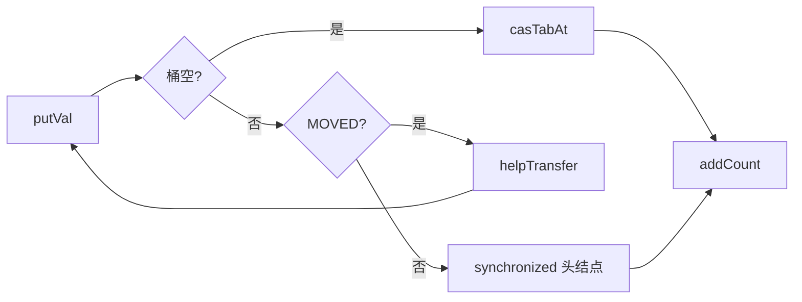
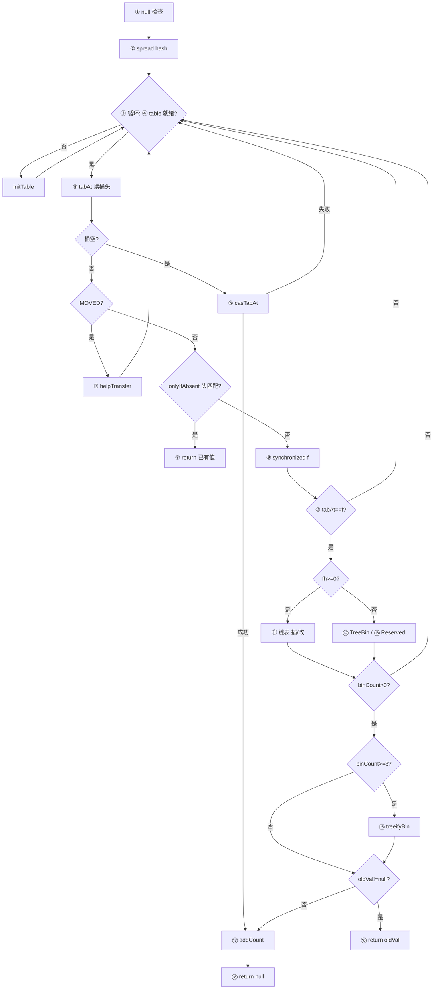

# ConcurrentHashMap.putVal 方法知识点扫盲

> 基于 **JDK 17** `java.util.concurrent.ConcurrentHashMap` 源码。
> 目标：把 `putVal` 里每一行代码背后的知识点串起来，并配合**运行中的具体案例**理解难点。
> 前置文档：[ConcurrentHashMap了解地图](./26052801-ConcurrentHashMap了解地图.md)、[ConcurrentHashMap.get 方法知识点扫盲](./26060101-ConcurrentHashMap-get方法知识点扫盲.md)

---

## 1. 先记住：`putVal` 在干什么

`put` 和 `putIfAbsent` 都委托给同一个实现：

```java
public V put(K key, V value) {
    return putVal(key, value, false);
}

public V putIfAbsent(K key, V value) {
    return putVal(key, value, true);
}
```

核心方法（略去注释，保留行号标注）：

```java
final V putVal(K key, V value, boolean onlyIfAbsent) {
    if (key == null || value == null) throw new NullPointerException();  // ①
    int hash = spread(key.hashCode());                                     // ②
    int binCount = 0;
    for (Node<K,V>[] tab = table;;) {                                     // ③
        Node<K,V> f; int n, i, fh; K fk; V fv;
        if (tab == null || (n = tab.length) == 0)                         // ④
            tab = initTable();
        else if ((f = tabAt(tab, i = (n - 1) & hash)) == null) {          // ⑤
            if (casTabAt(tab, i, null,                                    // ⑥
                         new Node<K,V>(hash, key, value)))
                break;                   // no lock when adding to empty bin
        }
        else if ((fh = f.hash) == MOVED)                                    // ⑦
            tab = helpTransfer(tab, f);
        else if (onlyIfAbsent                                           // ⑧
                 && fh == hash
                 && ((fk = f.key) == key || (fk != null && key.equals(fk)))
                 && (fv = f.val) != null)
            return fv;
        else {
            V oldVal = null;
            synchronized (f) {                                              // ⑨
                if (tabAt(tab, i) == f) {                                   // ⑩
                    if (fh >= 0) {                                          // ⑪ 链表
                        binCount = 1;
                        for (Node<K,V> e = f;; ++binCount) {
                            K ek;
                            if (e.hash == hash &&
                                ((ek = e.key) == key ||
                                 (ek != null && key.equals(ek)))) {
                                oldVal = e.val;
                                if (!onlyIfAbsent)
                                    e.val = value;
                                break;
                            }
                            Node<K,V> pred = e;
                            if ((e = e.next) == null) {
                                pred.next = new Node<K,V>(hash, key, value);
                                break;
                            }
                        }
                    }
                    else if (f instanceof TreeBin) {                        // ⑫ 红黑树
                        Node<K,V> p;
                        binCount = 2;
                        if ((p = ((TreeBin<K,V>)f).putTreeVal(hash, key,
                                                               value)) != null) {
                            oldVal = p.val;
                            if (!onlyIfAbsent)
                                p.val = value;
                        }
                    }
                    else if (f instanceof ReservationNode)                  // ⑬
                        throw new IllegalStateException("Recursive update");
                }
            }
            if (binCount != 0) {                                            // ⑭
                if (binCount >= TREEIFY_THRESHOLD)                          // ⑮
                    treeifyBin(tab, i);
                if (oldVal != null)                                         // ⑯
                    return oldVal;
                break;
            }
        }
    }
    addCount(1L, binCount);                                                 // ⑰
    return null;                                                            // ⑱
}
```

**一句话**：校验非 null → spread 算 hash → **无限重试循环**里按桶状态分岔（初始化 / 空桶 CAS / 帮扩容 / putIfAbsent 快路径 / 锁头结点写链表或树）→ 可能树化 → `addCount` 计数并可能触发扩容 → 返回旧值或 `null`。

下面按知识点分组，并标注对应代码行（①～⑱）。

---

## 2. 知识点地图（自检用）

读完后可在「掌握度」列打 ✅ / ⚠️ / ❌。

| 编号 | 知识点 | 影响 `putVal` 的哪一步 | 掌握度 |
| ---- | ------ | ---------------------- | ------ |
| K1 | `Object.hashCode()` 与 `equals` 约定 | ②⑧⑪⑫ key 比对 | |
| K2 | `==` vs `equals` | ⑧⑪ 先引用相等再内容相等 | |
| K3 | 位运算 `&`、`^`、`>>>` | ②`spread`；⑤ 桶下标 | |
| K4 | int 32 位、高位/低位、符号位 | ②⑤ 全部位运算 | |
| K5 | 哈希表 = 数组 + 哈希 + 冲突处理 | 整体模型 | |
| K6 | 桶（bin）概念 | ⑤ 数组一个槽 | |
| K7 | 链地址法（拉链法） | ⑪`pred.next` 尾插 | |
| K8 | 数组长度为 2 的幂 | ⑤`(n-1)&hash` 成立前提 | |
| K9 | `h % n` 等价于 `(n-1) & h` | ⑤ 算下标 | |
| K10 | 掩码 `n-1` 只保留 hash 低位 | ⑤；spread 动机 | |
| K11 | Hash 扰动 / spread | ② 整行 | |
| K12 | 特殊负数 hash：MOVED/TREEBIN/RESERVED | ⑦`MOVED`；⑪`fh>=0`；⑫树 | |
| K13 | `Node` 结构：hash/key/val/next | ⑥⑪ 新建与遍历 | |
| K14 | 树化（TreeBin + 红黑树） | ⑫⑮`treeifyBin` | |
| K15 | 扩容 ForwardingNode | ⑦`helpTransfer` | |
| K16 | `volatile` / happens-before / acquire 读 | ⑤`tabAt`；⑩ 双重检查 | |
| K17 | `table` 懒初始化 | ④`initTable` | |
| K18 | 无锁读 vs 有锁写 | ⑥ CAS vs ⑨`synchronized` | |
| K19 | null key/value 不允许 | ① NPE | |
| K20 | CAS（Compare-And-Swap） | ⑥`casTabAt`；`initTable` | |
| K21 | `synchronized` 锁桶头结点 | ⑨ 非空桶写路径 | |
| K22 | 双重检查锁定（DCL） | ⑩`tabAt(tab,i)==f` | |
| K23 | `sizeCtl` 控制字 | ④`initTable`；⑰`addCount` | |
| K24 | `onlyIfAbsent` 与 `putIfAbsent` | ⑧ 无锁快路径；⑪覆盖控制 | |
| K25 | `volatile` 写 `val` | ⑪⑫ 更新已有节点 | |
| K26 | `binCount` 与 `TREEIFY_THRESHOLD` | ⑪计数；⑮树化判断 | |
| K27 | `addCount` 分布式计数 | ⑰`baseCount`+`CounterCell` | |
| K28 | 负载因子与扩容触发 | ⑰`sumCount()>=sizeCtl` | |
| K29 | 协作扩容 `helpTransfer` | ⑦ 遇到 MOVED | |
| K30 | `for(;;)` 重试循环 | ③ 表引用可能变化 | |
| K31 | 返回值语义：新插入 vs 覆盖 | ⑯⑱ | |
| K32 | `setTabAt` release 写 | 树化时替换桶头 | |
| K33 | `MIN_TREEIFY_CAPACITY` | ⑮ 小表优先扩容而非树化 | |

**建议阅读顺序**：K5→K6→K8～K11→K19→K17→K20→⑥路径→K21～K22→K7→K24→K15→K29→K14→K26～K33→K27～K28。

---

## 3. 逐步走读：每段代码 + 知识点

### 3.1 ① null 检查

| 知识点 | 作用 |
| ------ | ---- |
| **K19** 不允许 null | CHM 用「`get` 返回 `null`」表示 key 不存在；若允许 null value 则无法区分 |

**案例 A：null 直接失败**

```java
ConcurrentHashMap<String, Integer> map = new ConcurrentHashMap<>();
map.put(null, 1);   // ① NPE
map.put("k", null); // ① NPE
```

与 `HashMap`（允许 null）的显著差异之一。

---

### 3.2 ② `int hash = spread(key.hashCode())`

| 知识点 | 作用 |
| ------ | ---- |
| **K1** `hashCode()` | 每个 key 必须先算出 int |
| **K11** spread | 高位混入低位，减轻扎堆 |
| **K12** `& HASH_BITS` | 普通节点 hash ≥ 0，与 MOVED/TREEBIN 区分 |

与 `get` 的 ① 完全相同；详见 [get 文档 3.1、4.2](./26060101-ConcurrentHashMap-get方法知识点扫盲.md)。

**在 put 中的额外意义**：存入 `Node` 的 `hash` 字段就是这里的 `hash`，后续 `get`/`put` 都用它比对和取桶。

---

### 3.3 ③ `for (Node<K,V>[] tab = table;;)` 无限循环

| 知识点 | 作用 |
| ------ | ---- |
| **K30** 重试循环 | 一次循环未必成功；`tab` 引用、桶状态可能在并发下改变，需重新来过 |

**何时会「转一圈再来」？**

| 情况 | 行为 |
| ---- | ---- |
| ⑦ 遇到 `ForwardingNode` | `tab = helpTransfer(...)` 后 **continue**（隐式），下次用新/旧表重试 |
| ⑥ CAS 失败 | 别的线程先占了空桶，回到 ⑤ 走锁路径 |
| ⑩ 双重检查失败 | 锁内发现桶头已不是 `f`（被扩容替换等），`binCount` 仍为 0 → ⑭ 不 break → 继续外层循环 |

**案例 B：两线程同时 put 进同一空桶**

```
初始 tab[7] = null

线程A：⑤ f=null → ⑥ casTabAt(..., null, NodeA) 成功 → break
线程B：⑤ f=null → ⑥ casTabAt(..., null, NodeB) 失败（A 已占位）
       → 回到 ⑤，这次 f=NodeA 非空 → 走 ⑨ 锁 NodeA → ⑪ 链表追加或覆盖
```

这正是 **空桶 CAS + 失败转锁** 的设计：最快路径无锁，竞争时退化为桶锁。

---

### 3.4 ④ `tab == null || length == 0` → `initTable()`

| 知识点 | 作用 |
| ------ | ---- |
| **K17** 懒初始化 | 构造 CHM 时不分配 `table`，第一次写才建数组 |
| **K23** `sizeCtl` | 未初始化时存目标容量；初始化时 CAS 抢 `-1` 表示「我在建表」 |
| **K20** CAS | `U.compareAndSetInt(this, SIZECTL, sc, -1)` 竞争初始化权 |

**`initTable` 核心逻辑**：

```java
while ((tab = table) == null || tab.length == 0) {
    if ((sc = sizeCtl) < 0)
        Thread.yield(); // 别人正在初始化，自旋让出 CPU
    else if (U.compareAndSetInt(this, SIZECTL, sc, -1)) {
        try {
            if ((tab = table) == null || tab.length == 0) {
                int n = (sc > 0) ? sc : DEFAULT_CAPACITY; // 默认 16
                table = tab = new Node[n];
                sc = n - (n >>> 2);  // 阈值 = n * 0.75
            }
        } finally {
            sizeCtl = sc;  // 恢复为正阈值
        }
        break;
    }
}
return tab;
```

**案例 C：第一次 put 触发建表**

```java
ConcurrentHashMap<String, Integer> map = new ConcurrentHashMap<>();
// table == null, sizeCtl == 0

map.put("first", 1);
// ④ initTable() → 分配 length=16 的数组
// ⑤⑥ 某桶 CAS 放入 Node
// ⑰ addCount → baseCount 变为 1
```

---

### 3.5 ⑤ 算下标 + `tabAt` 读桶头

| 知识点 | 作用 |
| ------ | ---- |
| **K8～K10** | `(n-1)&hash` 得桶下标 `i` |
| **K6** | `tab[i]` 逻辑上是桶头 |
| **K16** | `tabAt` acquire 读，看到最新发布的桶头 |

与 `get` 的 ③ 相同；但 `put` 读完还要**决定写策略**（⑥ CAS / ⑦ 扩容 / ⑨ 加锁）。

---

### 3.6 ⑥ 空桶：`casTabAt` 无锁插入

| 知识点 | 作用 |
| ------ | ---- |
| **K20** CAS | 仅当槽位**仍为** `null` 时，原子替换为新 `Node` |
| **K18** | 空桶写路径**不加锁**，CHM 写操作中最快的分支 |
| **K13** | `new Node(hash, key, value)`，`key` 为 final，`val`/`next` 为 volatile |

```java
static final <K,V> boolean casTabAt(Node<K,V>[] tab, int i,
                                    Node<K,V> c, Node<K,V> v) {
    return U.compareAndSetReference(tab, ..., c, v);
}
```

**案例 D：单线程首次插入（最常见快路径）**

```
map.put("user:1001", 42)

② hash = spread("user:1001".hashCode())
⑤ i = (n-1) & hash，假设 i=3，tabAt 得 null
⑥ casTabAt(tab, 3, null, Node(h,"user:1001",42)) 成功
→ break 出循环 → ⑰ addCount(1, binCount=0) → ⑱ return null
```

`binCount=0` 表示走 CAS 路径，未统计链表长度；`addCount` 的第二个参数 `check=0` 时**仍会加计数**，但 `check <= 1` 分支会**跳过扩容检查**（见 4.5）。

---

### 3.7 ⑦ 桶头是 `ForwardingNode`（`fh == MOVED`）

| 知识点 | 作用 |
| ------ | ---- |
| **K12** `MOVED = -1` | 该桶已迁移，旧槽位是占位转发节点 |
| **K15** ForwardingNode | 指向 `nextTable` |
| **K29** `helpTransfer` | 当前线程协助 `transfer`，并返回 `nextTable` 供外层循环继续 put |

**案例 E：扩容期间 put**

```
旧表 tab[5] = ForwardingNode(MOVED, nextTable=新表)

线程 put("order:9", 99)：
  ⑤ 在旧表读到 ForwardingNode，fh == MOVED
  ⑦ tab = helpTransfer(旧表, f)  // 可能帮忙搬几个桶
  ③ 下一轮循环用新表 tab 重新 ⑤⑥...
```

对调用者透明：不需要自己处理扩容，**遇到 MOVED 就帮忙搬 + 换表重试**。

---

### 3.8 ⑧ `onlyIfAbsent` 快路径（`putIfAbsent` 专用）

| 知识点 | 作用 |
| ------ | ---- |
| **K24** | `putIfAbsent` 传入 `onlyIfAbsent=true` |
| **K2** | 头节点 hash、key 匹配且 `val != null` 时，**不加锁**直接返回已有值 |

**条件缺一不可**：

1. `onlyIfAbsent == true`
2. 头节点 `fh == hash`
3. key 相等
4. **`fv != null`**（值为 null 时不走快路径——CHM 正常不会出现 null value，此条件防御性）

**案例 F：putIfAbsent 命中桶头**

```java
map.put("config:timeout", 30);
V old = map.putIfAbsent("config:timeout", 60);
// ⑧ 头节点即目标 key → return 30，不会写成 60
```

若 key 在链表**第二个**节点，⑧ 不成立，必须走 ⑨ 锁内查找。

---

### 3.9 ⑨⑩ 非空桶：`synchronized(f)` + 双重检查

| 知识点 | 作用 |
| ------ | ---- |
| **K21** 锁桶头 | 锁对象是**头结点 `f`**，不是 key、不是整表 |
| **K22** DCL | 进锁后 `tabAt(tab,i)==f` 再改，防止锁期间桶头已被替换 |
| **K16** | 与 `get` 的 `tabAt` 配合，避免在错误结构上写 |

**为什么锁头结点？**

- 头结点是桶在 `table` 中的锚点；锁住它即可安全改整条链表或 `TreeBin`。
- 不同桶的头是不同对象 → **锁粒度 = 单桶**，并发写不同桶不互斥。

**案例 G：双重检查失败（扩容抢先把头换成 ForwardingNode）**

```
线程准备 synchronized(f) 时 f 是普通 Node
进锁前：扩容线程把 tab[i] 换成了 ForwardingNode
⑩ tabAt(tab,i) == f ?  → false，锁内什么都不做
⑭ binCount 仍为 0 → 不 break → ③ 下一轮走 ⑦ helpTransfer
```

---

### 3.10 ⑪ 链表路径：查找、覆盖、尾插

| 知识点 | 作用 |
| ------ | ---- |
| **K7** 拉链法 | 冲突键挂在 `next` 链上 |
| **K1 K2** | `hash` 先比，再 `equals` |
| **K25** | 覆盖：`e.val = value`（volatile 写，对 `get` 可见） |
| **K26** | `++binCount` 统计桶内节点数，供树化判断 |

**链表内两种结局**：

| 结局 | 代码 | `oldVal` | `onlyIfAbsent` |
| ---- | ---- | -------- | -------------- |
| 找到同 key | `e.val = value` | 原值 | `true` 时不覆盖 |
| 链尾无匹配 | `pred.next = new Node(...)` | `null` | 新节点插入 |

**案例 H：同桶第三个节点覆盖**

```
tab[2] → Node("a") → Node("b") → Node("c", val=10)

put("c", 20)：
  ⑨ 锁头 Node("a")
  ⑪ 遍历：a 不匹配 → b 不匹配 → c 匹配 → oldVal=10, e.val=20
  ⑯ oldVal!=null → return 10
```

**案例 I：哈希冲突尾插**

```
tab[4] → Node(h=100, "Aa", 1)

put("BB", 2)  // 极端情况下 spread 后 h 也为 100
  ⑪ 头节点 hash 相等但 equals 失败 → 走到链尾 → pred.next = Node(100,"BB",2)
  binCount = 2
  ⑱ return null（新插入）
```

---

### 3.11 ⑫ 树路径：`TreeBin.putTreeVal`

| 知识点 | 作用 |
| ------ | ---- |
| **K14** | 桶已树化，`fh == TREEBIN(-2)`，走 `instanceof TreeBin` |
| **K12** | `fh >= 0` 不成立，不会进链表分支 |

`putTreeVal` 在红黑树中按 hash / Comparable 找位置，找到同 key 返回该节点（用于覆盖），否则插入新 `TreeNode`。

**案例 J：树化桶插入新 key**

```
tab[10] → TreeBin(TREEBIN=-2, root=...)

put("heavy:newKey", 1)：
  ⑨ 锁 TreeBin 对象
  ⑫ putTreeVal → 树内插入，返回 null（无旧值）
  binCount = 2（固定赋 2，表示「树路径已处理」）
```

---

### 3.12 ⑬ `ReservationNode` 与递归更新

| 知识点 | 作用 |
| ------ | ---- |
| **K12** `RESERVED = -3` | `computeIfAbsent` 等复合操作的占位节点 |

普通 `put`/`putIfAbsent` **不应**遇到；遇到说明在占位未完成时递归更新同一桶，抛 `IllegalStateException`。

---

### 3.13 ⑭⑮⑯ 锁后收尾：树化、返回旧值、退出循环

| 步骤 | 条件 | 行为 |
| ---- | ---- | ---- |
| **⑭** | `binCount != 0` | 说明锁内确实处理了桶 |
| **⑮** | `binCount >= TREEIFY_THRESHOLD`（8） | 调用 `treeifyBin` |
| **⑯** | `oldVal != null` | 覆盖已有 key，**直接 return 旧值**，不执行 ⑰ |
| break | 新插入 | 跳出 ③，执行 ⑰ |

**`treeifyBin` 要点（K33）**：

```java
if (n < MIN_TREEIFY_CAPACITY)  // 64
    tryPresize(n << 1);          // 表太小 → 优先扩容，不树化
else
    synchronized (b) { ... 链表转 TreeBin，setTabAt 替换桶头 }
```

**案例 K：第 8 个冲突键触发树化（表已 ≥ 64）**

```
某桶链表已有 7 个节点，第 8 次 put 进同一桶：
  ⑪ binCount 递增到 8
  ⑮ treeifyBin → 链表变 TreeBin
后续同桶 put 走 ⑫ 树插入
```

**案例 L：小表（n=16）链表很长**

```
binCount 到 8，但 n=16 < 64：
  ⑮ treeifyBin → tryPresize(32) 扩容
  冲突键分散到更多桶，往往比立刻树化更合适
```

---

### 3.14 ⑰ `addCount(1L, binCount)` 与 ⑱ 返回值

| 知识点 | 作用 |
| ------ | ---- |
| **K27** | `baseCount` + `CounterCell[]`，类似 `LongAdder`，降低计数热点 |
| **K28** | `sumCount() >= sizeCtl` 时触发 `transfer` 扩容 |
| **K31** | 新插入走 ⑱ `return null`；覆盖走 ⑯ `return oldVal` |

**`put` 返回值约定**（与 `HashMap` 一致）：

| 操作 | 返回值 |
| ---- | ------ |
| 新 key 插入 | `null` |
| 覆盖已有 key | **之前的 value** |

---

## 4. 难点展开（配合 putVal 运行案例）

### 4.1 难点一：三条写路径对比（空桶 CAS / 锁链表 / 帮扩容）

**知识点**：K18、K20、K21、K29

| 路径 | 触发条件 | 同步手段 | 典型耗时 |
| ---- | -------- | -------- | -------- |
| **快路径** | `f == null` | `casTabAt` 无锁 | 最低 |
| **中路径** | 普通 Node / TreeBin | `synchronized(f)` | 中等，仅竞争同桶 |
| **慢路径** | `fh == MOVED` | `helpTransfer` 协作搬桶 | 扩容期间 |



**运行案例 M：高并发不同 key**

```
16 个线程各 put 不同 key，hash 落不同桶：
  多数走 ⑥ CAS，几乎无锁竞争
  addCount 可能分散到不同 CounterCell
```

**运行案例 N：高并发同一桶**

```
多线程 put 不同 key 但 hash 冲突进桶 3：
  仅一个 CAS 成功，其余 ⑨ 排队锁头结点
  吞吐量仍远好于「整表 synchronized」
```

---

### 4.2 难点二：为什么空桶用 CAS，非空桶用锁？

**知识点**：K18、K20、K21

| 方案 | 优点 | 缺点 |
| ---- | ---- | ---- |
| 全用锁 | 实现简单 | 空桶也要抢锁，热点桶压力大 |
| 全用 CAS | 无锁 | 链表尾插、覆盖难以仅靠 CAS 完成 |
| **CAS + 桶锁** | 空桶最快；有数据时锁保证结构一致 | 实现复杂 |

CAS 成功条件：`tab[i]` **从 null 变为** 新 Node——单步原子，无需维护 `next` 链。

链表/树更新涉及**多指针**，在 JDK 实现中选择 **锁头结点 + 锁内改链**，与 `get` 无锁读形成互补。

---

### 4.3 难点三：`put` 与 `putIfAbsent` 的分叉点

**知识点**：K24、K31

| 位置 | `put(k,v)` | `putIfAbsent(k,v)` |
| ---- | ---------- | ------------------ |
| 参数 | `onlyIfAbsent=false` | `onlyIfAbsent=true` |
| ⑧ 快路径 | 不进入（条件含 `onlyIfAbsent`） | 头匹配则直接 return |
| ⑪ 链表 | 匹配则**总是** `e.val=value` | 匹配则**不**覆盖 |
| ⑫ 树 | 同上 | 同上 |
| 新插入 | `return null` | `return null` |
| 已存在 | `return oldVal` | `return oldVal`（未写入新值） |

**运行案例 O：经典缓存防重**

```java
ConcurrentHashMap<String, Expensive> cache = new ConcurrentHashMap<>();

cache.putIfAbsent("id:1", loadFromDb("id:1"));
// 若别的线程已放入，本线程拿到已有实例，不会重复 load
```

注意：`putIfAbsent` **不保证**「全局只计算一次」——若两个线程同时发现不存在，仍可能都进入锁内计算；要严格单算需 `computeIfAbsent`（带 `ReservationNode`）。

---

### 4.4 难点四：扩容与 put 的交织

**知识点**：K15、K23、K28、K29

**触发链**：

```
put 成功 → addCount(1, binCount)
  → sumCount() >= sizeCtl
  → CAS sizeCtl 为负标记 → transfer 创建 nextTable
  → 旧桶迁移为 ForwardingNode
  → 其他 put 在 ⑦ helpTransfer
```

**运行案例 P：阈值边界**

```
n=16, sizeCtl=12（阈值 16*0.75）

连续 put 使 sumCount 从 11 → 12：
  某次 addCount 后发现 s>=12，发起扩容至 32
  新 sizeCtl ≈ 24
```

扩容详细算法见了解地图 4.3；`putVal` 只需记住 **⑦ 与 ⑰ 都会牵扯扩容**。

---

### 4.5 难点五：`addCount` 的第二个参数 `binCount` 含义

**知识点**：K26、K27、K28

```java
addCount(1L, binCount);
```

| `binCount` | 来源 | 对扩容检查的影响 |
| ---------- | ---- | ---------------- |
| `0` | ⑥ CAS 空桶成功 | `check <= 1` → 加完计数后**可能提前 return**，跳过本轮 `sizeCtl` 检查 |
| `1～7` | ⑪ 链表长度 | `check >= 0` → 加计数后检查是否扩容 |
| `≥ 8` | ⑪ 链表或 ⑫ 树 | 同上，且 ⑮ 可能 `treeifyBin` |

设计意图：CAS 快路径极常见，用 `binCount=0` 减少不必要的 `sumCount()` 与扩容判断开销；树化/扩容需要准确桶深时由锁内路径提供 `binCount`。

---

### 4.6 难点六：`volatile val` 与并发读写可见性

**知识点**：K16、K25、K18

```java
// Node 字段
final Object key;
volatile V val;
volatile Node<K,V> next;
```

**写路径**（put 覆盖）：`e.val = value` 在 `synchronized` 块内，对 `val` 的 volatile 写 + 解锁 happens-before 后续 `get` 的 volatile 读。

**读路径**（get）：无锁读 `e.val`，依赖 JMM 保证看到已发布值。

**运行案例 Q：一写一读**

```
线程A：put("k", 1) 覆盖为 put("k", 2)
线程B：get("k")
  B 可能短暂看到 1，但不会看到「损坏的引用」
  最终一致看到 2（在 A 完成后发起的 get 必见 2）
```

---

## 5. 综合案例：一次 putVal 的完整决策树

以 `map.put(key, value)` 为例：



ASCII 等价图（与 ①～⑱ 对应）：

```text
[① NPE检查] → [② spread]
        → [③④ table 就绪?] ─否→ initTable ─┐
        → [⑤ tabAt 桶头] ←─────────────────┘
              |
        [空?]─是→ [⑥ CAS] ─成功→ [⑰ addCount] → [⑱ null]
              |          └失败→ 重试③
              否
        [MOVED?]─是→ [⑦ helpTransfer] → 重试③
              否
        [⑧ putIfAbsent 快路径?]─是→ return old
              否
        [⑨锁 f → ⑩DCL → ⑪链/⑫树/⑬Reserved]
              → [⑭ binCount>0?] ─否→ 重试③
              → [⑮树化?] → [⑯ oldVal?] ─是→ return old
                                    └否→ [⑰⑱]
```

---

## 6. 与 HashMap.put 的差异（帮助定位盲区）

| 点 | HashMap.put | ConcurrentHashMap.putVal |
| -- | ----------- | ------------------------ |
| null | 允许 null key/value | **① 不允许**，NPE |
| 桶空插入 | 直接 `tab[i]=newNode` | **⑥ casTabAt** 原子插入 |
| 非空桶 | 锁整个结构（非线程安全，靠外部） | **⑨ synchronized(头结点)** |
| 扩容 | 单线程 rehash | **⑦ helpTransfer** 多线程协作 |
| 树化 | 类似阈值 8 | 另加 **n≥64**，否则先扩容 |
| 计数 | `size++` | **⑰ addCount** 分布式计数 |
| 返回值 | 新插 null / 覆盖旧值 | 相同 |
| 循环 | `if` 一次 | **`for(;;)`** 失败重试 |

---

## 7. 动手验证（可选）

```java
import java.util.concurrent.ConcurrentHashMap;

public class PutValDemo {
    public static void main(String[] args) {
        ConcurrentHashMap<String, Integer> map = new ConcurrentHashMap<>(16);

        // 新插入 → null
        System.out.println(map.put("a", 1));           // null

        // 覆盖 → 旧值
        System.out.println(map.put("a", 2));           // 1

        // putIfAbsent
        System.out.println(map.putIfAbsent("a", 99));    // 2（未覆盖）
        System.out.println(map.putIfAbsent("b", 3));     // null（新插）

        // 手动复现 spread 与桶下标（与 get 文档一致）
        String key = "probe";
        int raw = key.hashCode();
        int h = (raw ^ (raw >>> 16)) & 0x7fffffff;
        int n = 16;
        int index = (n - 1) & h;
        System.out.printf("raw=%d, spread=%d, index=%d%n", raw, h, index);
    }
}
```

并发 CAS、扩容、`ForwardingNode` 建议用多线程压测或阅读源码案例理解；稳定复现 MOVED 需要较大 map 或控制 `sizeCtl` 阈值。

---

## 8. 小结：四行「核心代码」再回顾

| 代码 | 知识点 | 在 putVal 中的意义 |
| ---- | ------ | ------------------ |
| `spread(key.hashCode())` | K1 K11 K12 | 非负 hash，写入 Node，供取桶与比对 |
| `casTabAt(tab, i, null, newNode)` | K20 K18 | **空桶无锁插入**，失败则转锁路径 |
| `synchronized(f) { if (tabAt==f) ... }` | K21 K22 | **单桶锁** + 双重检查，安全改链/树 |
| `addCount(1L, binCount)` | K27 K28 K26 | 分布式计数 + 可能扩容 + 传递桶深 |

---

## 9. 推荐阅读顺序（补课路线）

1. **K5～K12、K19**：哈希表 + spread + 特殊节点（可复用 [get 文档](./26060101-ConcurrentHashMap-get方法知识点扫盲.md) 4.1～4.3）
2. **K17、K20、K23**：`initTable` 与 `sizeCtl`（本文 3.4）
3. **K18、K21、K22**：CAS 空桶 vs 桶锁（本文 4.1、4.2）
4. **K7、K24、K25**：链表尾插、putIfAbsent、volatile val（本文 3.8～3.10、4.3）
5. **K15、K29、K28**：扩容协作（本文 3.7、4.4；地图 4.3）
6. **K14、K26、K33**：树化条件（本文 3.13、4.1 案例 K/L）
7. 继续读 `replaceNode`（remove）、`transfer`（扩容细节）

---

*文档版本：JDK 17 ConcurrentHashMap.putVal；生成日期：2026-06-06*
