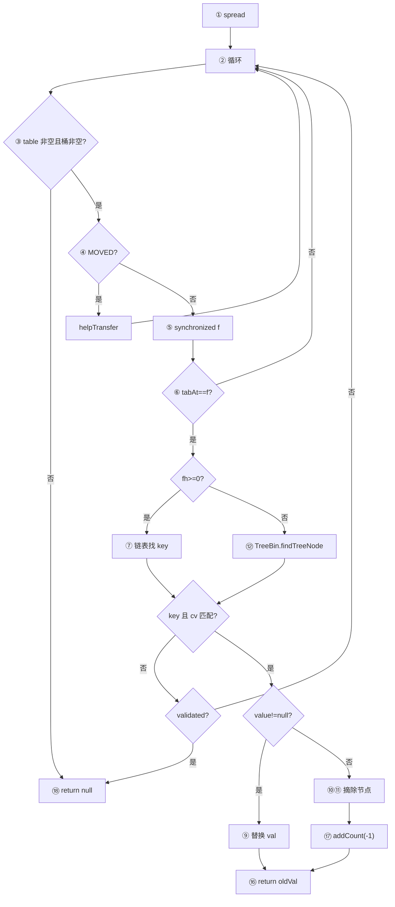

# ConcurrentHashMap.replaceNode 方法知识点扫盲

> 基于 **JDK 17** `java.util.concurrent.ConcurrentHashMap` 源码。
> 目标：把 `replaceNode` 里每一行代码背后的知识点串起来，并配合**运行中的具体案例**理解难点。
> 前置文档：[ConcurrentHashMap了解地图](./26052801-ConcurrentHashMap了解地图.md)、[ConcurrentHashMap.get 方法知识点扫盲](./26060101-ConcurrentHashMap-get方法知识点扫盲.md)、[ConcurrentHashMap.putVal 方法知识点扫盲](./26060601-ConcurrentHashMap-putVal方法知识点扫盲.md)

---

## 1. 先记住：`replaceNode` 在干什么

`remove`、`replace` 等四个公开写方法，**共用**同一个内部实现：

```java
public V remove(Object key) {
    return replaceNode(key, null, null);
}

public boolean remove(Object key, Object value) {
    if (key == null)
        throw new NullPointerException();
    return value != null && replaceNode(key, null, value) != null;
}

public V replace(K key, V value) {
    if (key == null || value == null)
        throw new NullPointerException();
    return replaceNode(key, value, null);
}

public boolean replace(K key, V oldValue, V newValue) {
    if (key == null || oldValue == null || newValue == null)
        throw new NullPointerException();
    return replaceNode(key, newValue, oldValue) != null;
}
```

核心方法（略去注释，保留行号标注）：

```java
final V replaceNode(Object key, V value, Object cv) {
    int hash = spread(key.hashCode());                                     // ①
    for (Node<K,V>[] tab = table;;) {                                     // ②
        Node<K,V> f; int n, i, fh;
        if (tab == null || (n = tab.length) == 0 ||                       // ③
            (f = tabAt(tab, i = (n - 1) & hash)) == null)
            break;
        else if ((fh = f.hash) == MOVED)                                    // ④
            tab = helpTransfer(tab, f);
        else {
            V oldVal = null;
            boolean validated = false;
            synchronized (f) {                                              // ⑤
                if (tabAt(tab, i) == f) {                                   // ⑥
                    if (fh >= 0) {                                          // ⑦ 链表
                        validated = true;
                        for (Node<K,V> e = f, pred = null;;) {
                            K ek;
                            if (e.hash == hash &&
                                ((ek = e.key) == key ||
                                 (ek != null && key.equals(ek)))) {
                                V ev = e.val;
                                if (cv == null || cv == ev ||             // ⑧
                                    (ev != null && cv.equals(ev))) {
                                    oldVal = ev;
                                    if (value != null)                      // ⑨ 替换
                                        e.val = value;
                                    else if (pred != null)                  // ⑩ 删中间/尾
                                        pred.next = e.next;
                                    else                                    // ⑪ 删头
                                        setTabAt(tab, i, e.next);
                                }
                                break;
                            }
                            pred = e;
                            if ((e = e.next) == null)
                                break;
                        }
                    }
                    else if (f instanceof TreeBin) {                        // ⑫ 红黑树
                        validated = true;
                        TreeBin<K,V> t = (TreeBin<K,V>)f;
                        TreeNode<K,V> r, p;
                        if ((r = t.root) != null &&
                            (p = r.findTreeNode(hash, key, null)) != null) {
                            V pv = p.val;
                            if (cv == null || cv == pv ||
                                (pv != null && cv.equals(pv))) {
                                oldVal = pv;
                                if (value != null)
                                    p.val = value;
                                else if (t.removeTreeNode(p))             // ⑬ 删树节点
                                    setTabAt(tab, i, untreeify(t.first)); // ⑭ 退化链表
                            }
                        }
                    }
                    else if (f instanceof ReservationNode)                  // ⑮
                        throw new IllegalStateException("Recursive update");
                }
            }
            if (validated) {                                                // ⑯
                if (oldVal != null) {
                    if (value == null)                                      // ⑰ 真删除
                        addCount(-1L, -1);
                    return oldVal;
                }
                break;
            }
        }
    }
    return null;                                                            // ⑱
}
```

**一句话**：spread 算 hash → 循环定位桶 → 桶空或表未初始化则**直接失败** → 遇 MOVED 帮扩容 → **锁头结点**在链表/树里找 key → 按 `cv` 条件决定改值或删节点 → 删除时 `addCount(-1)` → 返回旧值或 `null`。

**与 `putVal` 的本质差异**：`putVal` 有「空桶 CAS 插入」；`replaceNode` **只处理已存在的映射**，桶空 = key 不存在，立刻退出。

下面按知识点分组，并标注对应代码行（①～⑱）。

---

## 2. 知识点地图（自检用）

读完后可在「掌握度」列打 ✅ / ⚠️ / ❌。

| 编号 | 知识点 | 影响 `replaceNode` 的哪一步 | 掌握度 |
| ---- | ------ | --------------------------- | ------ |
| K1 | `Object.hashCode()` 与 `equals` 约定 | ①⑦⑫ key 比对 | |
| K2 | `==` vs `equals` | ⑦ 先引用相等再内容相等 | |
| K3 | 位运算 `&`、`^`、`>>>` | ①`spread`；③ 桶下标 | |
| K4 | int 32 位、高位/低位、符号位 | ①③ 全部位运算 | |
| K5 | 哈希表 = 数组 + 哈希 + 冲突处理 | 整体模型 | |
| K6 | 桶（bin）概念 | ③ 数组一个槽 | |
| K7 | 链地址法（拉链法） | ⑦`pred`/`next` 删链 | |
| K8 | 数组长度为 2 的幂 | ③`(n-1)&hash` | |
| K9 | `h % n` 等价于 `(n-1) & h` | ③ 算下标 | |
| K10 | 掩码 `n-1` 只保留 hash 低位 | ③；spread 动机 | |
| K11 | Hash 扰动 / spread | ① 整行 | |
| K12 | 特殊负数 hash：MOVED/TREEBIN/RESERVED | ④`MOVED`；⑦`fh>=0` | |
| K13 | `Node` 结构：hash/key/val/next | ⑦⑩⑪ 遍历与摘除 | |
| K14 | 树化（TreeBin + 红黑树） | ⑫`findTreeNode` | |
| K15 | 扩容 ForwardingNode | ④`helpTransfer` | |
| K16 | `volatile` / happens-before / acquire 读 | ③`tabAt`；⑥ DCL | |
| K17 | `table` 懒初始化 | ③ 未初始化则 break | |
| K18 | 无锁读 vs 有锁写 | ⑤ 删除/替换必加锁 | |
| K19 | null key/value 的 API 约束 | 公开方法 NPE；`cv`/`value` 语义 | |
| K20 | `synchronized` 锁桶头结点 | ⑤ 与 putVal 相同 | |
| K21 | 双重检查锁定（DCL） | ⑥`tabAt(tab,i)==f` | |
| K22 | `sizeCtl` / `addCount(-1)` | ⑰ 删除后减计数 | |
| K23 | `for(;;)` 重试循环 | ②④ 表引用可能变化 | |
| K24 | **`cv` 条件值（compare value）** | ⑧ 四合一 API 的核心 | |
| K25 | **`pred` 前驱指针** | ⑩ 删非头节点 | |
| K26 | **删头节点 `setTabAt`** | ⑪ release 写替换桶头 | |
| K27 | **`removeTreeNode` + `untreeify`** | ⑬⑭ 树删与退化 | |
| K28 | **`validated` 标志** | ⑯ DCL 失败时重试 | |
| K29 | **`UNTREEIFY_THRESHOLD`（6）** | ⑬ 树太小则退化 | |
| K30 | 四 API 合一的参数约定 | 见 §3.1 | |

**建议阅读顺序**：K30→K24→K5～K11→K17→③早退→K20～K21→K7→K25～K26→K14→K27→K22→K15→K23。

---

## 3. 逐步走读：每段代码 + 知识点

### 3.1 四个公开 API 如何映射到 `(key, value, cv)`

**知识点 K30**：一个内部方法，三种操作（查无则败、替换、条件删除）靠参数组合区分。

| 公开方法 | `replaceNode(key, value, cv)` | `value` 含义 | `cv` 含义 |
| -------- | ----------------------------- | ------------ | --------- |
| `remove(key)` | `(key, null, null)` | `null` → **删除** | `null` → 不校验旧值 |
| `remove(key, value)` | `(key, null, value)` | `null` → 删除 | **必须等于当前 value** 才删 |
| `replace(key, newVal)` | `(key, newVal, null)` | 写入新值 | `null` → 不校验旧值 |
| `replace(key, old, new)` | `(key, new, old)` | 写入 `new` | **必须等于 old** 才替换 |

**⑧ 条件判断统一写法**：

```java
if (cv == null || cv == ev || (ev != null && cv.equals(ev)))
```

| `cv` | 行为 |
| ---- | ---- |
| `null` | 找到 key 即执行（不比较旧 value） |
| 非 null | 仅当当前 value 与 `cv` 匹配（`==` 或 `equals`）才执行 |

**案例 A：四种 API 对照**

```java
ConcurrentHashMap<String, Integer> map = new ConcurrentHashMap<>();
map.put("k", 10);

map.remove("k");              // replaceNode("k", null, null)  → return 10
map.put("k", 10);
map.remove("k", 99);          // cv=99≠10 → 不删 → return null → false
map.remove("k", 10);          // cv 匹配 → 删 → return 10 → true

map.put("k", 10);
map.replace("k", 20);         // replaceNode("k", 20, null)   → return 10
map.replace("k", 99, 20);     // cv=99≠10 → 不换 → return null → false
map.replace("k", 10, 20);     // cv 匹配 → 换 → return 10 → true
```

---

### 3.2 ① `spread(key.hashCode())`

与 `get`、`putVal` 完全相同；详见 [get 文档 3.1](./26060101-ConcurrentHashMap-get方法知识点扫盲.md)。

**注意**：`replaceNode` 入参是 `Object key`，公开方法里对 `null` key 做 NPE；**方法内部不再检查**（与 `putVal` 在 ① 检查不同）。

---

### 3.3 ②③ 循环 + 早退：桶空 = key 不存在

| 知识点 | 作用 |
| ------ | ---- |
| **K17** | `table == null` 或 `length == 0` → 从未 put 过，直接 ⑱ |
| **K6** | `tabAt` 得 `f == null` → 该桶无任何节点，key 不可能在这 |
| **K23** | 仅当 ④ MOVED 或 ⑯ DCL 失败时才继续循环 |

**与 `putVal` 对比**：

| 情况 | `putVal` | `replaceNode` |
| ---- | -------- | ------------- |
| 表未初始化 | `initTable()` 建表再插 | **break**，return null |
| 桶空 | CAS 插入新节点 | **break**，return null |

**案例 B：对空 map 或不存在 key 删除**

```java
ConcurrentHashMap<String, Integer> map = new ConcurrentHashMap<>();
map.remove("ghost");     // ③ break → ⑱ null
map.put("a", 1);
map.remove("b");         // 桶空或链上无匹配 → ⑱ null
```

删除/替换**不会触发懒初始化**——没有「为了 remove 而建表」的逻辑。

---

### 3.4 ④ `fh == MOVED` → `helpTransfer`

| 知识点 | 作用 |
| ------ | ---- |
| **K15 K29** | 扩容中桶已迁移，需协助 `transfer` 后换表重试 |

**案例 C：扩容期间 remove**

```
旧表 tab[5] = ForwardingNode(MOVED)

map.remove("order:9"):
  ③ 读到 ForwardingNode
  ④ helpTransfer → tab 指向新表
  ② 下一轮在新表 ③⑤... 继续查找删除
```

与 `putVal` ⑦ 相同；删除也必须跟扩容协作，不能对着旧桶硬删。

---

### 3.5 ⑤⑥ 锁头结点 + 双重检查

| 知识点 | 作用 |
| ------ | ---- |
| **K20** | `synchronized(f)`，锁粒度 = 单桶 |
| **K21** | 进锁后 `tabAt(tab,i)==f`，防止锁期间桶头被换 |

**与 `putVal` 的差异**：`replaceNode` **没有空桶 CAS 路径**，非 MOVED 且桶非空时**总是进锁**。

---

### 3.6 ⑦⑧⑨⑩⑪ 链表路径：查找、条件判断、替换或摘除

| 步骤 | 代码 | 知识点 |
| ---- | ---- | ------ |
| 遍历 | `e = f, pred = null` | **K7** 拉链法；**K25** `pred` 记录前驱 |
| 匹配 key | `hash` + `equals` | **K1 K2** |
| 条件 | `cv == null \|\| cv == ev \|\| equals` | **K24** |
| 替换 | `e.val = value`（`value != null`） | **K18** volatile 写 |
| 删中间/尾 | `pred.next = e.next` | **K25** 从链上摘掉 `e` |
| 删头 | `setTabAt(tab, i, e.next)` | **K26** release 写，新桶头 = 原第二个节点 |

**链表删除三分支**（`value == null` 时）：

```
情况1：删头节点（pred == null）
  tab[i] → [e] → next
  ⑪ setTabAt(tab, i, e.next)

情况2：删中间/尾（pred != null）
  tab[i] → ... → [pred] → [e] → next
  ⑩ pred.next = e.next

情况3：key 在链上但 cv 不匹配
  oldVal 保持 null，break 出 for，⑯ 走 break 外层 → ⑱ null
```

**案例 D：删除桶头**

```
tab[3] → Node("a",1) → Node("b",2) → Node("c",3)

remove("a"):
  ⑦ pred=null，命中头节点
  ⑧ cv=null 通过
  ⑪ setTabAt(tab, 3, Node("b",2))
  ⑰ addCount(-1) → return 1
```

**案例 E：删除链表中间节点**

```
remove("b"):
  遍历：pred=Node("a"), e=Node("b") 命中
  ⑩ pred.next = Node("c",3)
  ⑰ addCount(-1) → return 2
```

**案例 F：cv 不匹配，删除失败**

```
remove("b", 999):  // 实际 val=2
  ⑧ cv=999，ev=2，equals 失败 → 不进入 if 体
  oldVal 仍为 null → ⑱ null → API 返回 false
```

**案例 G：key 在链上但遍历完未命中**

```
remove("z"):
  for 循环到 e.next==null 仍无匹配 → break
  oldVal=null → ⑯ validated=true 但 oldVal==null → break → ⑱ null
```

---

### 3.7 ⑫⑬⑭ 树路径：`findTreeNode` + `removeTreeNode` + `untreeify`

| 知识点 | 作用 |
| ------ | ---- |
| **K14** | `TreeBin` 内红黑树查找 `findTreeNode` |
| **K24** | 同样 `cv` 条件判断 |
| **K27** | `removeTreeNode(p)` 从树摘除；返回 `true` 表示树**过小**应退化 |
| **K29** | 过小条件：根或子结构不满足树维持阈值（见源码 `r.right==null` 等） |
| **K26** | `setTabAt(tab, i, untreeify(t.first))` 桶头换回普通链表 |

**删除树节点的特殊之处**：

- 替换 value：`p.val = value`，树结构不变。
- 删除节点：先 `removeTreeNode` 维护红黑树 + 双向链表 `next/prev`，若树太小则 **untreeify** 成普通 `Node` 链表。

**案例 H：树桶条件删除**

```
tab[10] → TreeBin，内含 key="heavy" val=100

remove("heavy", 100):
  ⑫ findTreeNode 命中，cv 匹配
  value=null → removeTreeNode(p)
  若返回 true → ⑭ setTabAt(..., untreeify(first))
  ⑰ addCount(-1) → return 100
```

**案例 I：树桶 replace**

```
replace("heavy", 200):
  value=200 ≠ null → p.val=200，不删节点
  ⑯ oldVal=100 → return 100（不走 ⑰）
```

---

### 3.8 ⑮ `ReservationNode`

与 `putVal` 相同：普通 `remove`/`replace` 不应遇到；`computeIfAbsent` 占位未完成时递归更新会抛 `IllegalStateException`。

---

### 3.9 ⑯⑰⑱ `validated`、减计数与返回值

| 知识点 | 作用 |
| ------ | ---- |
| **K28** `validated` | 锁内确实按「普通链表/树」处理过；DCL 失败则 `validated=false`，**不 break**，继续 ② |
| **K22** | 仅**真删除**（`value==null` 且 `oldVal!=null`）时 `addCount(-1L, -1)` |
| 返回值 | 操作成功 → `oldVal`；key 不存在或 cv 不匹配 → `null` |

**`validated` 与 `putVal` 的 `binCount` 对比**：

| 标志 | 方法 | 含义 |
| ---- | ---- | ---- |
| `binCount != 0` | putVal | 锁内完成了插入/更新，可树化 |
| `validated == true` | replaceNode | 锁内进入了链表/树分支（即使没找到 key） |
| `oldVal != null` | replaceNode | 真正发生了替换或删除 |

**案例 J：DCL 失败重试**

```
线程准备删 tab[2] 头节点
进锁前：扩容线程把 tab[2] 换成 ForwardingNode
⑥ tabAt(tab,2) == f ? → false，validated 仍为 false
⑯ validated 为 false → 不 break → ② 下一轮走 ④ helpTransfer
```

**案例 K：替换不减计数，删除才减**

```java
map.put("x", 1);
map.replace("x", 2);   // oldVal=1 返回，不调用 addCount(-1)
map.remove("x");       // oldVal=2 返回，addCount(-1)
```

---

## 4. 难点展开（配合 replaceNode 运行案例）

### 4.1 难点一：为什么删除用 `value==null` 而不是单独布尔参数？

**知识点**：K30、K24

JDK 把「写新值」与「删除」合并进第二个参数 `value`：

- `value != null` → 更新 `e.val` / `p.val`
- `value == null` → 从链表/树摘除节点

好处：四个公开 API 共用一套锁内逻辑，避免 `remove` 与 `replace` 两套重复代码。

**运行案例 L：一次锁内完成「比对 + 删」**

```
remove("k", expectedVal)  →  replaceNode(key, null, expectedVal)

锁内：找到 key → ⑧ 比对 cv 与 ev → 匹配才执行 ⑩/⑪ 摘除
不匹配则什么都不改，并发安全
```

---

### 4.2 难点二：链表删除为何分「删头」与「删非头」？

**知识点**：K25、K26、K7

`table[i]` 存的是**桶头引用**。删头节点必须改 `table[i]` 本身；删中间节点只需改前驱的 `next`，`table[i]` 仍指向原头。

| 操作 | 修改点 | 方法 |
| ---- | ------ | ---- |
| 删头 | 桶槽位 | `setTabAt(tab, i, e.next)` release 写 |
| 删非头 | 前驱指针 | `pred.next = e.next`（锁内，对读线程需可见） |

**运行案例 M：删头后 get 仍正确**

```
删前：tab[4] → Node("a") → Node("b")
remove("a") → tab[4] → Node("b")

另一线程 get("b")：
  tabAt 应看到新头 Node("b")（setTabAt release 语义）
```

---

### 4.3 难点三：`remove(key, value)` 为何要求 `value != null`？

**知识点**：K19、K24

```java
return value != null && replaceNode(key, null, value) != null;
```

- CHM **不允许 null value**，映射里存的 value 必非 null。
- 若允许 `remove(key, null)`，语义会与「删除」混淆（第二个参数既是 cv 又是 null value）。
- API 层直接拒绝 `value == null`，抛 NPE 由调用方避免。

---

### 4.4 难点四：树删除后的 `untreeify`

**知识点**：K27、K29

`removeTreeNode` 返回 `true` 表示树结构**太矮/太小**，维持红黑树得不偿失：

```java
else if (t.removeTreeNode(p))
    setTabAt(tab, i, untreeify(t.first));
```

`untreeify` 把剩余 `TreeNode` 链转成普通 `Node` 链表——与 `putVal` 里 `treeifyBin` **互逆**。

**运行案例 N：树桶删到 6 个以下**

```
某 TreeBin 7 个节点，remove 1 个后 removeTreeNode 返回 true
→ 桶退化为链表，后续 remove 走 ⑦ 链表路径
```

---

### 4.5 难点五：与 `putVal` 完整路径对比

| 维度 | `putVal` | `replaceNode` |
| ---- | -------- | ------------- |
| 目标 | 插入或覆盖 | 替换或删除 |
| 表空/桶空 | 初始化 / CAS 插 | **直接失败** |
| 空桶 | `casTabAt` 无锁 | 不适用 |
| 非空桶 | `synchronized(f)` | `synchronized(f)` |
| 条件参数 | `onlyIfAbsent` | `cv`（比对新旧 value） |
| 结构变更 | 尾插 / 树插 | 摘链 / 删树节点 |
| 计数 | `addCount(+1)` | 删除时 `addCount(-1)` |
| 树化 | `binCount>=8` 可能 `treeifyBin` | 删后可能 `untreeify` |
| 快路径 | `putIfAbsent` 无锁读头 | **无**（桶非空必锁） |

---

### 4.6 难点六：并发 remove 与 get 的交错

**知识点**：K16、K18、K26

- `get` 无锁读链表；`remove` 在锁内改 `next` 或 `setTabAt`。
- 锁释放前完成结构修改；`setTabAt` / `volatile next` 保证 `get` 不会读到「半摘除」的中间态（不会 next 指向已回收节点）。

**运行案例 O：一线程删、一线程读**

```
线程A：remove("k") 锁内 pred.next = e.next 或 setTabAt
线程B：get("k")
  B 可能在删除前读到旧值，删除后读到 null（不存在）
  不会无限循环或 NPE（CHM 保证链结构一致）
```

---

## 5. 综合案例：一次 replaceNode 的完整决策树

以 `map.remove(key)` → `replaceNode(key, null, null)` 为例：



ASCII 等价图：

```text
[① spread] → [② 循环]
    → [③ 表空/桶空?] ─是→ [⑱ null]
    → [④ MOVED?] ─是→ helpTransfer → 重试
    → [⑤锁 f → ⑥DCL]
         → [⑦ 链 / ⑫ 树 找 key]
         → [⑧ cv 匹配?] ─否→ [⑯ validated] → [⑱ null]
         → [⑨ value≠null 替换 | ⑩⑪ value=null 摘除]
         → [⑰ 删除则 addCount-1] → return oldVal
```

---

## 6. 与 HashMap 删除/替换的差异

| 点 | HashMap | ConcurrentHashMap.replaceNode |
| -- | ------- | ----------------------------- |
| 线程安全 | 非线程安全 | 桶锁 + DCL |
| 删头节点 | `tab[i] = e.next` 普通写 | `setTabAt` release 写 |
| 扩容 | 单线程 | ④ `helpTransfer` |
| 树删除 | `removeTreeNode` + 可能 untreeify | 同思想，锁在 `TreeBin` 外层的 `f` |
| `remove(key, value)` | 支持 | 支持，且 **value 不能为 null** |
| 计数 | `size--` | `addCount(-1)` 分布式减 |

---

## 7. 动手验证（可选）

```java
import java.util.concurrent.ConcurrentHashMap;

public class ReplaceNodeDemo {
    public static void main(String[] args) {
        ConcurrentHashMap<String, Integer> map = new ConcurrentHashMap<>();
        map.put("a", 10);
        map.put("b", 20);

        // remove(key)
        System.out.println(map.remove("a"));           // 10
        System.out.println(map.containsKey("a"));    // false

        // replace(key, newVal)
        map.put("c", 30);
        System.out.println(map.replace("c", 99));    // 30
        System.out.println(map.get("c"));            // 99

        // replace(key, old, new) — cv 不匹配
        System.out.println(map.replace("c", 1, 2));  // false，仍为 99

        // remove(key, value) — 条件删除
        System.out.println(map.remove("c", 99));     // true
        System.out.println(map.remove("b", 0));      // false（cv 不匹配）

        // 不存在 key
        System.out.println(map.remove("ghost"));      // null
    }
}
```

---

## 8. 小结：四行「核心代码」再回顾

| 代码 | 知识点 | 在 replaceNode 中的意义 |
| ---- | ------ | ----------------------- |
| `cv == null \|\| cv == ev \|\| equals` | K24 K30 | **条件更新/删除**的统一闸门 |
| `pred.next = e.next` / `setTabAt(..., e.next)` | K25 K26 | 链表摘除：非头 vs 删头 |
| `removeTreeNode` + `untreeify` | K27 K29 | 树删除与退化回链表 |
| `addCount(-1L, -1)` | K22 | 仅真删除时减元素计数 |

---

## 9. 推荐阅读顺序（补课路线）

1. **K30、K24**：四 API 参数约定（本文 3.1、4.1）
2. **K17、③早退**：与 putVal 的「无则建」对比（本文 3.3）
3. **K20～K21、K25～K26**：桶锁与链表删除（本文 3.5～3.6、4.2）
4. **K14、K27～K29**：树删除与 untreeify（本文 3.7、4.4）
5. **K15、K22**：扩容协作与减计数（本文 3.4、3.9）
6. 对照 [putVal 文档](./26060601-ConcurrentHashMap-putVal方法知识点扫盲.md) 理解「写路径三兄弟」：`get`（无锁读）/ `putVal`（CAS+锁插）/ `replaceNode`（锁改删）

---

*文档版本：JDK 17 ConcurrentHashMap.replaceNode；生成日期：2026-06-06*
