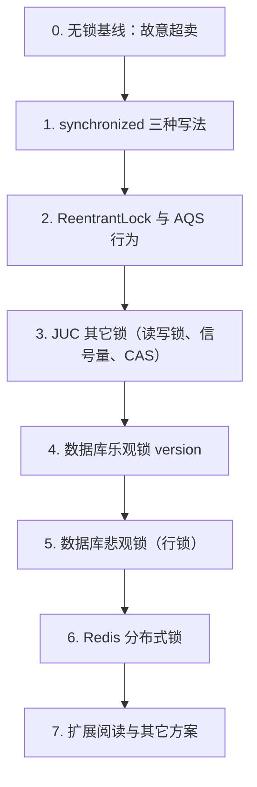

# 并发锁实验：学习路径与总纲

> **知识来源**：[随笔.md — synchronized](file:///Users/m684620/work/gitee/technologyStack/【1-develop】/100-java/随笔.md)（Monitor、锁升级、ReentrantLock/AQS、Redis 可重入、虚拟线程 pinning 等）  
> **落地模块（规划）**：`TestAllModel`（与 [线程池实验](../thread/26052502-TestAllModel-JDK线程池批量写库实验设计.md) 同模块，REST + H2/MySQL 可观测）  
> **详细设计**：[26052602-TestAllModel-并发锁实验设计.md](./26052602-TestAllModel-并发锁实验设计.md)

---

## 一、实验要解决什么问题

你在笔记里已经掌握「锁是什么、原理、面试怎么答」。本实验系列要把**同一业务故事**在不同锁方案下跑一遍，用**可复现的数字与 SQL** 验证：

| 层次 | 典型问题 | 本实验中的体现 |
|------|----------|----------------|
| **单 JVM、多线程** | `i++`、库存扣减丢失更新、超卖 | 无锁时 `final_stock < 0` 或 `lost_updates > 0` |
| **单 JVM、锁语义** | 锁错对象、范围过大、死锁、忘记 unlock | 对照组故意写错，观察仍出错 |
| **多 JVM / 多实例** | 本地锁挡不住另一台机器 | 两个 Spring 进程或 profile 模拟双实例 |
| **数据库** | 乐观锁版本冲突、悲观锁行锁 | `version` 字段、`UPDATE … WHERE version=?` |
| **分布式中间件** | Redis 锁过期、不可重入、主从丢锁 | Redisson / 自研 Lua + 续期说明 |

**统一业务故事（贯穿全程）**：商品 `sku_id` 初始库存 `100`，每线程每次扣 `1`，共发起 `200` 次并发扣减。

- **正确**：最终库存 `0`，成功次数 `100`，失败/拒绝 `100`（或业务返回「库存不足」100 次）。
- **错误（无锁或锁失效）**：最终库存 **≠ 0**，或成功次数 **> 100**（超卖）。

---

## 二、学习路径（建议顺序）

| 步骤    | 主题                                           | 验证什么                      | 对应笔记章节                 |
|-------|----------------------------------------------|---------------------------|------------------------|
| **0** | 无锁 + 多线程                                     | 建立「问题直觉」                  | 为什么要用锁                 |
| **1** | `synchronized`                               | 互斥、可重入、锁对象是谁              | 三种用法、Mark Word         |
| **2** | `ReentrantLock`                              | `tryLock`、公平锁、必须 `unlock` | 与 synchronized 对比、AQS  |
| **3** | `ReadWriteLock` / `Semaphore` / `AtomicLong` | 读多写少、限流、无锁计数              | 性能调优、LongAdder         |
| **4** | DB 乐观锁                                       | 版本冲突、重试、不阻塞读              | 分布式锁层次、幂等              |
| **5** | DB 悲观锁                                       | 行锁、事务边界、死锁风险              | 与乐观锁选型                 |
| **6** | Redis 锁                                      | 跨进程互斥、过期、可重入              | Redisson Hash、watchdog |
| **7** | 扩展                                           | 知道还有哪些、何时不用锁              | 见下文「其它锁方案」             |

**与线程池实验的关系**：锁实验的并发触发可复用 `ThreadPoolExecutor`（见 [26052502](../thread/26052502-TestAllModel-JDK线程池批量写库实验设计.md)），但**业务临界区**是本系列重点，线程池仅作「炮弹发射器」。

---

## 三、锁方案全景（大纲级）

### 3.1 单进程（JVM 内）

| 方案                           | 适用场景         | 实验是否实现  | 备注                     |
|------------------------------|--------------|---------|------------------------|
| **`synchronized`**           | 默认首选、代码块短    | ✅ 必做    | 实例/静态/代码块三形态           |
| **`ReentrantLock`**          | 需要超时、中断、公平   | ✅ 必做    | `finally { unlock() }` |
| **`ReentrantReadWriteLock`** | 读多写少         | ✅ 选做    | 库存「只读查询」+「写扣减」         |
| **`StampedLock`**            | 读极多、乐观读      | 📖 文档列举 | JDK 8+，注意不可重入写锁误用      |
| **`Semaphore`**              | 限制同时 N 个线程进入 | ✅ 小实验   | 如最多 5 个并发扣减            |
| **`Atomic*` / `LongAdder`**  | 简单计数、无复合逻辑   | ✅ 对照    | **不能**单独解决「读-改-写」库存    |
| **`volatile`**               | 可见性          | ✅ 反例    | 与锁组合讲 JMM，不防超卖         |

### 3.2 数据库

| 方案                             | 适用场景        | 实验是否实现 | 备注                                                       |
|--------------------------------|-------------|--------|----------------------------------------------------------|
| **乐观锁（version）**               | 冲突少、读多、允许重试 | ✅ 必做   | `UPDATE … WHERE id=? AND version=?`                      |
| **悲观锁（`SELECT FOR UPDATE`）**   | 冲突多、强一致短事务  | ✅ 必做   | 依赖事务与行锁                                                  |
| **唯一约束 + 幂等表**                 | 防重复提交       | 📖 列举  | 如 `uk(order_id)`                                         |
| **CAS 更新（`WHERE stock >= ?`）** | 单条 SQL 原子扣减 | ✅ 推荐   | `UPDATE stock SET stock=stock-1 WHERE id=? AND stock>=1` |

### 3.3 分布式（多实例）

| 方案                                 | 适用场景         | 实验是否实现 | 备注               |
|------------------------------------|--------------|--------|------------------|
| **Redis（SET NX + Lua / Redisson）** | 最常见分布式锁      | ✅ 必做   | 需本地 Redis；谈续期与主从 |
| **ZooKeeper / etcd**               | 强一致、临时顺序节点   | 📖 列举  | 偏基础设施团队          |
| **数据库分布式锁表**                       | 无 Redis 时的折中 | 📖 列举  | `INSERT` 唯一键抢锁   |
| **ShedLock**                       | 定时任务单实例执行    | 📖 列举  | 与库存扣减场景不同        |
| **MQ 单分区顺序消费**                     | 串行化「同一 key」  | 📖 列举  | 架构层串行，不是锁本身      |

### 3.4 架构层「少锁或不锁」

| 方案                         | 说明              |
|----------------------------|-----------------|
| **分片（按 `sku_id` 路由到固定实例）** | 单 key 单写者，本地锁即可 |
| **库存预扣 + 异步对账**            | 高并发电商常见         |
| **CRDT / 无冲突复制**           | 特定领域，非通用库存      |

---

## 四、实验模块划分（文档索引）

| 文档                                                                     | 内容                      |
|------------------------------------------------------------------------|-------------------------|
| **本文**                                                                 | 路径、全景表、与笔记/线程池的衔接       |
| [26052602-TestAllModel-并发锁实验设计.md](./26052602-TestAllModel-并发锁实验设计.md) | API、表结构、分组实验、观察 SQL、包结构 |
| [26052603-TestAllModel-锁实验实现说明.md](./26052603-TestAllModel-锁实验实现说明.md) | 已实现代码的结构、流程、API 与 curl |
| [26052604-Redis分布式锁实验思路与操作指南.md](./26052604-Redis分布式锁实验思路与操作指南.md) | Redis 已配置后的实验 6 思路、环境与 6a～6c 操作 |

---

## 五、核心验证指标（所有实验统一）

每次实验结束后记录：

| 指标                                   | 含义        | 无锁典型值         | 正确加锁典型值 |
|--------------------------------------|-----------|---------------|---------|
| `initial_stock`                      | 初始库存      | 100           | 100     |
| `thread_count` × `deduct_per_thread` | 总请求量      | 如 200×1       | 200     |
| `success_count`                      | 扣减成功次数    | **> 100**     | **100** |
| `fail_count`                         | 库存不足等失败   | 偏少            | **100** |
| `final_stock`                        | 最终库存      | **≠ 0**（可能为负） | **0**   |
| `elapsed_ms`                         | 总耗时       | 仅供参考          | 仅供参考    |
| `anomaly`                            | 是否出现超卖/负数 | `true`        | `false` |

**一句话结论模板**（建议每做完一组自己写一句）：

> 在 {方案} 下，{thread_count} 个线程并发扣减，最终库存为 {final_stock}，成功 {success_count} 次，{是否} 出现超卖，与预期 {一致/不一致}，原因是 {互斥范围 / 锁对象 / 分布式是否生效}。

---

## 六、与「随笔」知识点的映射

| 笔记要点                  | 在本实验里怎么「看见」                                            |
|-----------------------|--------------------------------------------------------|
| 三种 `synchronized` 锁对象 | 实验 1a/1b/1c：换实例方法、静态方法、`synchronized(sku)`             |
| 错误锁（`Integer`、字符串常量）  | 实验 1d：故意用 `Integer.valueOf(1)` 当锁，观察异常互斥               |
| 可重入                   | 实验 1e：`deduct()` 内调 `log()` 两方法都 `synchronized`        |
| 锁升级 / 性能              | 实验 2：高竞争下对比 `synchronized` vs `ReentrantLock` 耗时（定性即可） |
| `tryLock` / 超时        | 实验 2b：避免死锁演示                                           |
| 乐观锁 vs 幂等             | 实验 4：版本冲突重试次数、`rows_updated=0`                         |
| Redis 可重入 Hash        | 实验 6：同线程重入 `lock()` 两次，计数正确释放                          |
| 虚拟线程 pinning          | 📖 附录：JDK 21+ 可选对比（不在首版强制实现）                           |

---

## 七、在本仓库中的动手顺序

1. 阅读 [26052602](./26052602-TestAllModel-并发锁实验设计.md) 的数据表与 API。
2. **实验 0**：`lockStrategy=NONE`，确认能稳定复现超卖（或负数库存）。
3. **实验 1～2**：只在 `TestAllModel` 单实例内切换 `SYNCHRONIZED` / `REENTRANT_LOCK`。
4. **实验 4～5**：切 MySQL（或 H2 支持的事务），观察 `version` 与 `FOR UPDATE`。
5. **实验 6**：`docker compose` 起 Redis，双实例各打一半请求，验证本地锁失败、Redis 锁成功。
6. 填写个人实验记录表（见 26052602 附录）。

---

## 八、环境依赖（规划）

| 依赖 | 用途 | 默认 |
|------|------|------|
| H2 | 本地零配置 | ✅ 默认 |
| MySQL / PostgreSQL | 悲观锁、真实行锁行为 | profile 切换 |
| Redis | 分布式锁 | `lock.redis.enabled=true` 时 |
| 第二实例 | 分布式验证 | 不同 `server.port` 或 Docker 两容器 |

---

## 九、后续文档与代码清单

| 项 | 状态 |
|----|------|
| 总纲（本文） | ✅ |
| 详细设计 26052602 | ✅ |
| `TestAllModel` 包 `com.lance.testall.lock` | ⬜ 待实现 |
| 操作说明 26052603 | ⬜ 随代码补充 |
| 单元测试 `cursor_test` / `src/test` | ⬜ 可选 |

---

## 相关文档

- [随笔 — synchronized](file:///Users/m684620/work/gitee/technologyStack/【1-develop】/100-java/随笔.md)
- [26052501-Spring线程池使用与学习路径.md](../thread/26052501-Spring线程池使用与学习路径.md)
- [26052502-TestAllModel-JDK线程池批量写库实验设计.md](../thread/26052502-TestAllModel-JDK线程池批量写库实验设计.md)
