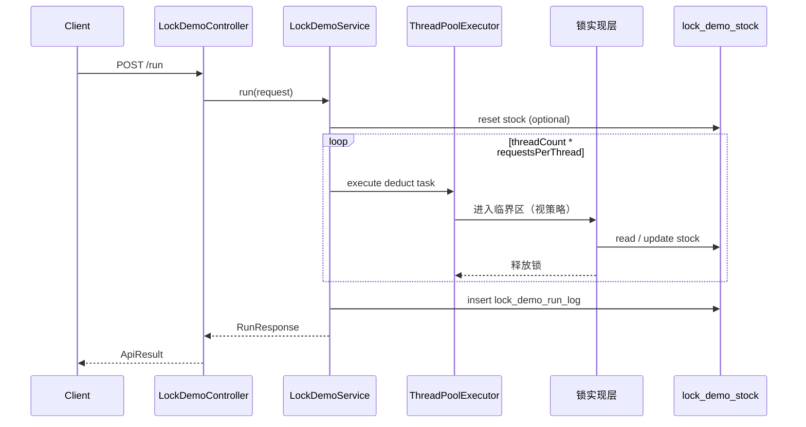

# TestAllModel：并发锁实验详细设计

> **定位**：[26052601-锁实验学习路径与总纲.md](./26052601-锁实验学习路径与总纲.md) 的**可运行落地设计**（API + 数据库 + 可选 Redis）。  
> **实现模块**：`TestAllModel`（聚合 `web` + `mybatis`，默认 H2，可切 MySQL / PostgreSQL / Redis）。  
> **状态**：实验 0～5 已实现；实验 6（Redis）待实现。

**关联文档**：[26052601-锁实验学习路径与总纲.md](./26052601-锁实验学习路径与总纲.md)

---

## 一、设计目标

| 目标 | 说明 |
|------|------|
| 统一业务场景 | 所有锁方案共用「库存扣减」，结果可横向对比 |
| 可观测 | 每次实验落库：批次号、策略、成功/失败、最终库存、是否异常 |
| API 驱动 | REST 触发并发，与线程池实验风格一致 |
| 递进式 | 从无锁 → JVM 锁 → DB 锁 → Redis 锁 |
| 对照实验 | 故意错误用法（错锁对象、未 unlock）单独开关 |

---

## 二、业务模型

### 2.1 核心实体

**商品库存表 `lock_demo_stock`**

| 字段 | 类型 | 说明 |
|------|------|------|
| `sku_id` | VARCHAR(64) PK | 实验用固定 `SKU-DEMO-001` |
| `stock` | INT NOT NULL | 当前库存 |
| `version` | INT NOT NULL DEFAULT 0 | 乐观锁版本 |
| `updated_at` | TIMESTAMP | 最后修改时间 |

**实验批次日志 `lock_demo_run_log`**

| 字段 | 类型 | 说明 |
|------|------|------|
| `id` | BIGINT PK | 自增 |
| `batch_id` | VARCHAR(64) | 一次 API 调用 |
| `lock_strategy` | VARCHAR(32) | 见 §3.1 枚举 |
| `thread_count` | INT | 并发线程数 |
| `requests_per_thread` | INT | 每线程请求次数 |
| `success_count` | INT | 扣减成功 |
| `fail_count` | INT | 业务失败（库存不足） |
| `error_count` | INT | 异常（锁超时、DB 冲突耗尽等） |
| `initial_stock` | INT | 实验前库存 |
| `final_stock` | INT | 实验后库存 |
| `anomaly` | BOOLEAN | 是否超卖：`success_count > initial_stock` 或 `final_stock < 0` |
| `elapsed_ms` | BIGINT | 耗时 |
| `instance_id` | VARCHAR(64) | 区分多实例（`spring.application.name` + port） |
| `created_at` | TIMESTAMP | 创建时间 |

**扣减明细（可选，高并发时可用采样）`lock_demo_deduct_log`**

| 字段 | 说明 |
|------|------|
| `batch_id`, `thread_name`, `seq` | 定位并发序 |
| `result` | SUCCESS / INSUFFICIENT / LOCK_TIMEOUT / VERSION_CONFLICT / ERROR |
| `stock_after` | 本次扣减后库存（便于画时间线） |

> 首版可实现「仅批次汇总 + 失败样本」，明细表在 `thread_count <= 50` 时全量写入。

### 2.2 扣减语义（Service 内伪代码）

```text
deductOne(skuId):
  1. 读取当前 stock（或带 version）
  2. 若 stock < 1 → 返回 INSUFFICIENT
  3. stock = stock - 1（在锁 / 乐观锁 / 原子 SQL 保护下）
  4. 返回 SUCCESS
```

**无锁错误写法（实验 0 专用）**：读、判断、写三步不在同一临界区。

**推荐原子 SQL（实验 4c，可与乐观锁对照）**：

```sql
UPDATE lock_demo_stock
SET stock = stock - 1, version = version + 1, updated_at = CURRENT_TIMESTAMP
WHERE sku_id = ? AND stock >= 1;
-- rows == 1 → 成功；rows == 0 → 库存不足
```

---

## 三、锁策略枚举与实现要点

### 3.1 `LockStrategy` 枚举（API 入参）

| 值 | 说明 | 实现层 |
|----|------|--------|
| `NONE` | 无锁 | 实验 0 |
| `SYNC_INSTANCE` | `synchronized` 实例方法 | 锁 `this`，多 Bean 不互斥 |
| `SYNC_STATIC` | `synchronized static` | 锁 `Class`，全 JVM 互斥 |
| `SYNC_BLOCK_SKU` | `synchronized(skuLock)` | `ConcurrentHashMap<String,Object>` 按 sku 分段 |
| `SYNC_WRONG_INTEGER` | 故意 `synchronized(Integer.valueOf(1))` | 反例：缓存池导致锁错 |
| `REENTRANT` | `ReentrantLock` 非公平 | `finally unlock` |
| `REENTRANT_FAIR` | 公平锁 | 观察吞吐下降 |
| `REENTRANT_TRY` | `tryLock(timeout)` | 超时记 `LOCK_TIMEOUT` |
| `READ_WRITE` | 写锁保护扣减 | 读接口用读锁（若有 GET 查询） |
| `SEMAPHORE` | 限制并发度为 N | 配置 `lock.demo.semaphore-permits` |
| `DB_OPTIMISTIC` | version 字段 | 冲突重试 `maxRetries` |
| `DB_PESSIMISTIC` | `@Transactional` + `SELECT … FOR UPDATE` | 行锁 |
| `DB_ATOMIC_UPDATE` | 单条 CAS SQL | 无显式锁对象 |
| `REDIS` | 分布式锁 | Redisson `RLock` 或自研 Lua |
| `REDIS_LOCAL_ONLY` | 仅 `synchronized` | 双实例时故意失败对照 |

### 3.2 各策略实验要点（面试可答）

**`SYNC_INSTANCE` vs `SYNC_STATIC`**

- 单例 Service 时实例方法有效；若误配 `prototype` 或 new 多个 Service，实例锁失效。
- 静态锁锁全类，所有 sku 共用一把锁，吞吐最低但最安全（单 JVM）。

**`SYNC_BLOCK_SKU`**

- 模拟「分段锁」：不同 `sku_id` 可并行，同一 sku 互斥。
- 锁对象必须 `new Object()` 或从 map `computeIfAbsent` 获取，**不能**用字符串字面量/intern。

**`REENTRANT`**

- 演示 `lock()` → `deductInner()` 可重入。
- 实验 **2b**：中途 `lock()` 后不 `unlock`（仅 `lockStrategy=REENTRANT_LEAK` 调试 profile），观察线程池 hang。

**`DB_OPTIMISTIC`**

- `UPDATE … SET stock=stock-1, version=version+1 WHERE sku_id=? AND version=?`
- `rows=0` 时重试或记 `VERSION_CONFLICT`；记录重试次数分布。

**`DB_PESSIMISTIC`**

- 事务内：`SELECT stock FROM lock_demo_stock WHERE sku_id=? FOR UPDATE` → 判断 → 更新。
- 观察长事务下其它线程阻塞（`elapsed_ms` 上升）。

**`REDIS`**

- Key：`lock:stock:{skuId}`；value：实例 UUID + 线程 id（可重入时 Hash 计数）。
- 参数：`leaseSeconds`、`waitSeconds`；说明 watchdog 续期。
- **双实例实验**：两端口各 `thread_count=100`，只有 Redis 策略 `anomaly=false`。

---

## 四、API 设计

### 4.1 接口一览

| 方法 | 路径 | 职责 |
|------|------|------|
| `POST` | `/api/lock-demo/run` | **主入口**：重置库存并发起并发扣减 |
| `GET` | `/api/lock-demo/run/{batchId}` | 查询批次结果 |
| `POST` | `/api/lock-demo/stock/reset` | 重置 `SKU-DEMO-001` 库存与 version |
| `GET` | `/api/lock-demo/stock/{skuId}` | 查询当前库存（可选读锁实验） |

### 4.2 `POST /api/lock-demo/run` 请求体

```json
{
  "lockStrategy": "NONE",
  "skuId": "SKU-DEMO-001",
  "initialStock": 100,
  "threadCount": 200,
  "requestsPerThread": 1,
  "poolCoreSize": 50,
  "poolMaxSize": 50,
  "resetStockBeforeRun": true,
  "optimisticMaxRetries": 3,
  "tryLockTimeoutMs": 100,
  "semaphorePermits": 10,
  "batchTag": "exp0-baseline"
}
```

| 字段 | 用途 |
|------|------|
| `lockStrategy` | §3.1 枚举 |
| `initialStock` | 重置为该值（当 `resetStockBeforeRun=true`） |
| `threadCount` | 并发线程数（或任务数） |
| `requestsPerThread` | 每线程扣减次数；总请求 = 乘积 |
| `poolCoreSize` / `poolMaxSize` | 扣减任务用的线程池（可与锁实验解耦配置） |
| `resetStockBeforeRun` | 保证每次实验可重复 |
| `optimisticMaxRetries` | 乐观锁重试上限 |
| `tryLockTimeoutMs` | `REENTRANT_TRY` / Redis 等待 |
| `semaphorePermits` | `SEMAPHORE` 策略 |
| `batchTag` | 备注 |

### 4.3 响应体

```json
{
  "batchId": "uuid",
  "lockStrategy": "NONE",
  "initialStock": 100,
  "finalStock": -37,
  "successCount": 137,
  "failCount": 0,
  "errorCount": 63,
  "anomaly": true,
  "anomalyReason": "SUCCESS_COUNT_EXCEEDS_INITIAL_STOCK",
  "elapsedMs": 842,
  "instanceId": "testAllModel:8080"
}
```

### 4.4 调用链路



---

## 五、分组实验（对照表）

### 实验 0：无锁基线

| 项 | 值 |
|----|-----|
| `lockStrategy` | `NONE` |
| `threadCount` | 200 |
| `initialStock` | 100 |
| **预期** | `anomaly=true`，`successCount` 往往 > 100 或 `finalStock` < 0 |

**观察**：多跑几次，结果不稳定，理解「丢失更新」。

---

### 实验 1：`synchronized` 系列

| 编号 | lockStrategy | 预期 |
|------|--------------|------|
| 1a | `SYNC_STATIC` | 单实例 `anomaly=false` |
| 1b | `SYNC_BLOCK_SKU` | 单实例正确；换 sku 可并行 |
| 1c | `SYNC_INSTANCE` | 单例 Service 下正确 |
| 1d | `SYNC_WRONG_INTEGER` | 可能仍异常或偶发正确（反例） |

**扩展 1e（可重入）**：`lockStrategy=SYNC_INSTANCE` 且 Service 内 `deduct` 调 `synchronized log()`，不应死锁。

---

### 实验 2：`ReentrantLock`

| 编号 | lockStrategy | 观察 |
|------|--------------|------|
| 2a | `REENTRANT` | 与 1a 结果一致，对比 `elapsedMs` |
| 2b | `REENTRANT_TRY` | 锁竞争激烈时部分 `LOCK_TIMEOUT` |
| 2c | `REENTRANT_FAIR` | 成功数仍正确，耗时通常更长 |

---

### 实验 3：JUC 补充

| 编号 | lockStrategy | 观察 |
|------|--------------|------|
| 3a | `SEMAPHORE` permits=10 | 总成功仍应 ≤100，但耗时分批拉长 |
| 3b | `READ_WRITE` | 并发 GET 不阻塞；写仍互斥 |
| 3c | （单测）`AtomicInteger` 只累加 | 与库存扣减对比，理解 CAS 局限 |

---

### 实验 4：数据库乐观锁与原子更新

| 编号 | lockStrategy | 观察 |
|------|--------------|------|
| 4a | `DB_OPTIMISTIC` | `anomaly=false`；日志有 `VERSION_CONFLICT` 重试 |
| 4b | `DB_ATOMIC_UPDATE` | 无 version 也能正确；实现更简单 |
| 4c | 4a + 故意 sleep 扩大冲突窗口 | 重试次数上升 |

**SQL 核对**：

```sql
SELECT sku_id, stock, version FROM lock_demo_stock WHERE sku_id = 'SKU-DEMO-001';

SELECT batch_id, lock_strategy, success_count, final_stock, anomaly
FROM lock_demo_run_log ORDER BY created_at DESC LIMIT 10;
```

---

### 实验 5：数据库悲观锁

| 编号 | lockStrategy | 观察 |
|------|--------------|------|
| 5a | `DB_PESSIMISTIC` | 正确；`elapsed_ms` 通常大于乐观锁 |
| 5b | 事务内 sleep 2s | 其它线程长时间阻塞（慎用生产） |

**注意**：H2 与 MySQL 行锁行为有差异；悲观锁完整体验建议 `spring.profiles.active=mysql`。

---

### 实验 6：Redis 分布式锁

**前置**：Redis 7+；`lock.redis.enabled=true`；可选 Redisson 依赖。

| 编号 | 场景 | 预期 |
|------|------|------|
| 6a | 单实例 + `REDIS` | `anomaly=false` |
| 6b | 双实例 + `REDIS_LOCAL_ONLY`（仅 synchronized） | 至少一台 `anomaly=true` |
| 6c | 双实例 + `REDIS` | 合计 `successCount` ≤ 100，`finalStock=0` |
| 6d | 同线程重入加锁 2 次 | 释放后其它线程可获取 |

**双实例启动示例（实现后写入 26052603）**：

```bash
# 终端 A
SERVER_PORT=8080 mvn -pl TestAllModel spring-boot:run

# 终端 B
SERVER_PORT=8081 mvn -pl TestAllModel spring-boot:run
```

各发 `threadCount=100`，总请求 200，库存 100。

---

## 六、包结构（拟）

```text
TestAllModel/src/main/java/com/lance/testall/lock/
├── config/
│   ├── LockDemoThreadPoolConfig.java    # 扣减任务线程池
│   └── RedisLockConfig.java             # 可选 RedissonClient
├── controller/LockDemoController.java
├── service/
│   ├── LockDemoService.java             # 编排：重置、提交任务、汇总
│   └── StockDeductService.java          # 各 LockStrategy 分支
├── lock/                                # 策略实现（策略模式）
│   ├── LockStrategy.java
│   ├── NoneLockExecutor.java
│   ├── SynchronizedLockExecutor.java
│   ├── ReentrantLockExecutor.java
│   ├── DbOptimisticLockExecutor.java
│   ├── DbPessimisticLockExecutor.java
│   └── RedisLockExecutor.java
├── entity/LockDemoStock.java, LockDemoRunLog.java
├── mapper/...
└── dto/LockRunRequest.java, LockRunResponse.java
```

| 层 | 职责 |
|----|------|
| `Controller` | 校验枚举、包装 `ApiResult` |
| `LockDemoService` | 批次 ID、线程池提交、`CountDownLatch` 等待 |
| `StockDeductService` | 按策略调用对应 `*Executor` |
| `*Executor` | 只关心「进入临界区 → 扣 1」 |

与 `com.lance.testall.threadpool` **包级隔离**，避免与线程池实验耦合。

---

## 七、配置项（`application.yml` 规划）

```yaml
lock:
  demo:
    default-sku-id: SKU-DEMO-001
    thread-pool:
      core-pool-size: 50
      max-pool-size: 50
      queue-capacity: 500
      thread-name-prefix: lock-demo-
    semaphore-permits: 10
    optimistic-max-retries: 5
  redis:
    enabled: false
    host: localhost
    port: 6379
    key-prefix: "lock:stock:"
    wait-seconds: 3
    lease-seconds: 10
```

---

## 八、schema 片段（拟加入 `schema.sql`）

```sql
CREATE TABLE IF NOT EXISTS lock_demo_stock (
    sku_id     VARCHAR(64)  PRIMARY KEY,
    stock      INT          NOT NULL,
    version    INT          NOT NULL DEFAULT 0,
    updated_at TIMESTAMP    DEFAULT CURRENT_TIMESTAMP
);

CREATE TABLE IF NOT EXISTS lock_demo_run_log (
    id                   BIGINT AUTO_INCREMENT PRIMARY KEY,
    batch_id             VARCHAR(64)  NOT NULL,
    lock_strategy        VARCHAR(32)  NOT NULL,
    thread_count         INT          NOT NULL,
    requests_per_thread  INT          NOT NULL,
    success_count        INT          NOT NULL,
    fail_count           INT          NOT NULL,
    error_count          INT          NOT NULL,
    initial_stock        INT          NOT NULL,
    final_stock          INT          NOT NULL,
    anomaly              BOOLEAN      NOT NULL,
    elapsed_ms           BIGINT,
    instance_id          VARCHAR(64),
    batch_tag            VARCHAR(128),
    created_at           TIMESTAMP    DEFAULT CURRENT_TIMESTAMP
);

CREATE INDEX idx_lock_run_batch ON lock_demo_run_log(batch_id);
```

---

## 九、实现注意点

1. **先复现问题再修**：实验 0 必须能稳定看到 `anomaly=true`（可多跑几次取典型）。
2. **单例 Service**：`SYNC_INSTANCE` 依赖 Spring 默认单例；反例实验单独类演示多实例。
3. **事务边界**：悲观锁、乐观锁的 `@Transactional` 只包在「读-改-写」最小范围；不要在锁内调远程 HTTP。
4. **线程池与连接池**：`threadCount` 不宜远大于数据源连接数，避免瓶颈误判为「锁无效」。
5. **Redis 失败降级**：Redis 不可用时 `REDIS` 策略应快速失败并返回明确错误，勿静默退化为无锁。
6. **分布式实验**：两实例的 `success_count` 之和 ≤ `initialStock`；最终库存在共享 DB 上为 0。
7. **与幂等区分**：本实验只谈「互斥」；订单幂等（唯一键）可作为 26052601 扩展阅读，不混入首版 API。

---

## 十、个人实验记录表（附录）

| 日期 | 实验编号 | lockStrategy | threadCount | success | finalStock | anomaly | 一句话结论 |
|------|----------|--------------|-------------|---------|------------|---------|------------|
| | 0 | NONE | 200 | | | | |
| | 1a | SYNC_STATIC | 200 | | | | |
| | 2a | REENTRANT | 200 | | | | |
| | 4a | DB_OPTIMISTIC | 200 | | | | |
| | 5a | DB_PESSIMISTIC | 200 | | | | |
| | 6c | REDIS（双实例） | 100+100 | | | | |

---

## 十一、实现清单（代码阶段）

- [x] `schema.sql` / `schema-postgresql.sql` 增加锁实验表
- [x] `LockDemoController` + `LockDemoService` + `StockDeductService`
- [x] 实验 0～2 单 JVM 可跑通
- [x] 实验 3～5（JUC / DB 乐观悲观锁）
- [ ] MySQL profile：悲观锁完整体验（H2 已可跑通）
- [ ] Redis + Redisson（或 Lua）：实验 6
- [x] 实现说明 [26052603-TestAllModel-锁实验实现说明.md](./26052603-TestAllModel-锁实验实现说明.md)
- [ ] （可选）`LockDemoServiceTest` 固定种子复现无锁超卖

---

## 十二、其它锁方案速查（实现优先级低）

| 方案 | 一句话 | 本仓库 |
|------|--------|--------|
| **ZooKeeper 临时顺序节点** | 最小序号持有锁 | 文档列举 |
| **etcd Lease** | 带租约的强一致锁 | 文档列举 |
| **数据库 `lock_table` 唯一键** | `INSERT` 成功即获锁 | 文档列举 |
| **ShedLock** | `@Scheduled` 集群单跑 | 见线程池总纲 |
| **Hazelcast / Ignite** | JVM 集群锁 | 文档列举 |
| **Kafka 单分区 key** | 同一 key 串行消费 | 架构列举 |
| **Segment 锁（JDK7 CHM）** | 历史分段，对比 JDK8 桶锁 synchronized | 面试列举 |
| **Striped<Lock>（Guava）** | 按 key 哈希分段 | 可选依赖实验 |

---

## 相关文档

- [26052603-TestAllModel-锁实验实现说明.md](./26052603-TestAllModel-锁实验实现说明.md) — 已实现代码说明与 curl
- [26052601-锁实验学习路径与总纲.md](./26052601-锁实验学习路径与总纲.md)
- [随笔 — synchronized](file:///Users/m684620/work/gitee/technologyStack/【1-develop】/100-java/随笔.md)
- [26052502-TestAllModel-JDK线程池批量写库实验设计.md](../thread/26052502-TestAllModel-JDK线程池批量写库实验设计.md)
