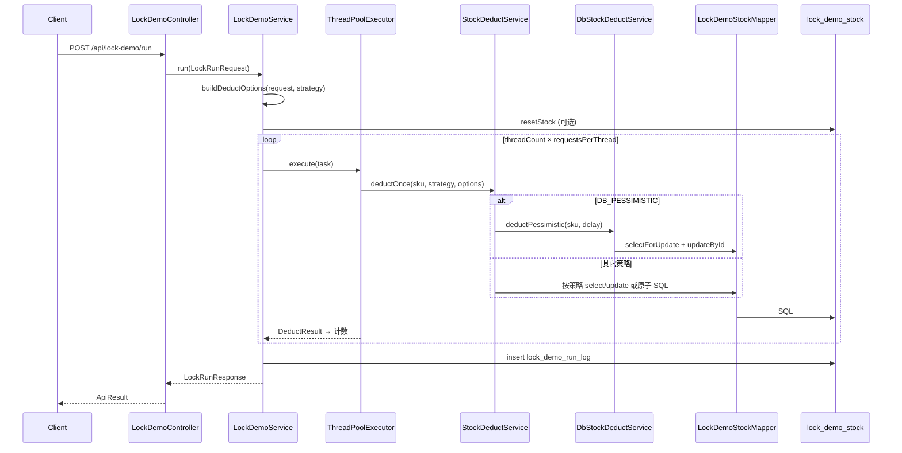

# TestAllModel：并发锁实验（0～6）实现说明

> **设计文档**：[26052602-TestAllModel-并发锁实验设计.md](./26052602-TestAllModel-并发锁实验设计.md)  
> **学习总纲**：[26052601-锁实验学习路径与总纲.md](./26052601-锁实验学习路径与总纲.md)  
> **Redis 实验操作**：[26052604-Redis分布式锁实验思路与操作指南.md](./26052604-Redis分布式锁实验思路与操作指南.md)  
> **代码位置**：`TestAllModel/src/main/java/com/lance/testall/lock/`  
> **实现范围**：实验 0～6（含 Redis SET NX + Lua；6d 可重入未实现）

---

## 一、实现目标回顾

用**同一套业务**（库存扣减）和**同一套 API**，切换 `lockStrategy` 即可对比不同锁方案的行为差异：

| 场景 | 初始库存 | 并发请求 | 正确结果 | 无锁典型结果 |
|------|----------|----------|----------|--------------|
| 标准实验 | 100 | 200（每请求扣 1） | 成功 100、失败 100、最终库存 0 | 成功 > 100 或最终库存 < 0 |

代码通过 `anomaly` 字段自动标记是否出现超卖。

---

## 二、模块与文件结构

```text
TestAllModel/
├── src/main/java/com/lance/testall/lock/
│   ├── controller/LockDemoController.java      # REST 入口
│   ├── service/
│   │   ├── LockDemoService.java                # 编排：线程池、DeductOptions、汇总、落库
│   │   ├── StockDeductService.java             # JVM/JUC/DB/Redis 扣减分发
│   │   ├── DbStockDeductService.java           # 实验 5：@Transactional + FOR UPDATE
│   │   └── RedisStockLockService.java          # 实验 6：SET NX + Lua 释放
│   ├── config/
│   │   ├── LockDemoConfig.java                 # 配置 + @EnableTransactionManagement
│   │   ├── LockDemoProperties.java             # lock.demo.* 绑定
│   │   └── LockDemoRedisProperties.java        # lock.redis.* 绑定
│   ├── dto/
│   │   ├── LockRunRequest.java                 # /run 请求体
│   │   ├── DeductOptions.java                  # 批次级扣减参数（Semaphore 等）
│   │   └── LockRunResponse.java                # /run 响应体
│   ├── entity/                                 # LockStrategy、DeductResult、表实体
│   └── mapper/
│       └── LockDemoStockMapper.java            # 含原子 UPDATE / FOR UPDATE 注解 SQL
├── src/main/resources/
│   ├── schema.sql
│   └── application.yml
└── src/test/java/com/lance/testall/lock/
    ├── LockDemoServiceTest.java                # 实验 0～5 集成测试
    └── LockDemoAtomicCompareTest.java          # 实验 3c：AtomicInteger 对照
```

**与线程池实验的关系**：

- 线程池实验包：`com.lance.testall.threadpool`（负责「如何并发」）
- 锁实验包：`com.lance.testall.lock`（负责「临界区如何互斥」）
- 锁实验在每次 `run` 时**临时创建** `ThreadPoolExecutor`，与 JDK 线程池实验的常驻 Bean 池独立。

---

## 三、数据层

### 3.1 表结构

**`lock_demo_stock`**

| 字段 | 说明 |
|------|------|
| `sku_id` | 主键，默认 `SKU-DEMO-001` |
| `stock` | 当前库存 |
| `version` | 乐观锁版本（实验 4a）；每次扣减成功 +1 |
| `updated_at` | 最后更新时间 |

**`lock_demo_run_log`**：批次汇总（`batch_id`、`lock_strategy`、`anomaly` 等）。

### 3.2 Mapper 与 SQL 策略

| 场景 | 使用方式 |
|------|----------|
| 实验 0～2、3a/3b（应用层锁） | `selectById` + `updateById`（读-改-写） |
| 实验 4b | `LockDemoStockMapper.atomicDecrementStock` 单条 UPDATE |
| 实验 4a | `selectById` 读 version + `optimisticDecrementStock` |
| 实验 5 | `selectForUpdate` + `updateById`（在事务内） |

实验 0 **刻意不用**原子 SQL，以暴露无锁竞态；实验 4b 起展示数据库侧原子/行锁方案。

---

## 四、分层职责与调用链

### 4.1 主路径时序（POST /run）



### 4.2 读库存路径（GET /stock/{skuId}）

```text
LockDemoController.getStock
  → LockDemoService.getStock
    → StockDeductService.loadStockUnderReadLock   // ReentrantReadWriteLock 读锁
      → LockDemoStockMapper.selectById
```

实验 3b：写扣减走 `READ_WRITE` 写锁，查询走读锁，读写可并发。

### 4.3 类职责

| 类 | 职责 |
|----|------|
| `LockDemoController` | REST、`ApiResult` 包装 |
| `LockDemoService` | 校验、重置库存、`buildDeductOptions`、线程池、`CountDownLatch`、`anomaly`、落库 |
| `StockDeductService` | `deductOnce` 按 `LockStrategy` 分发（0～4b、3） |
| `DbStockDeductService` | 实验 5 悲观锁（独立 Bean 保证 `@Transactional` 代理生效） |
| `DeductOptions` | 每批次的 `Semaphore`、重试次数、模拟延迟等 |

---

## 五、核心流程：`LockDemoService.run`

### 5.1 步骤说明

1. **校验**请求参数（`threadCount`、`requestsPerThread`、总任务 ≤ 10000）。
2. **解析** `LockStrategy.fromApiValue(lockStrategy)`。
3. **`buildDeductOptions(request, strategy)`**：构造本批 `DeductOptions`（见 §5.3）。
4. **重置库存**（可选）→ 记录 `recordedInitial`。
5. **创建临时线程池**，提交 `threadCount × requestsPerThread` 个任务。
6. 每个任务调用 `stockDeductService.deductOnce(skuId, strategy, deductOptions)`。
7. **`CountDownLatch` 等待**全部结束 → 读最终库存 → 计算 `anomaly` → 写入 `lock_demo_run_log`。

### 5.2 计数规则

| `DeductResult` | 计入 |
|----------------|------|
| `SUCCESS` | `successCount` |
| `INSUFFICIENT` | `failCount` |
| `VERSION_CONFLICT` | `failCount`（乐观锁重试耗尽） |
| `LOCK_TIMEOUT` | `errorCount` |
| `ERROR` / 未捕获异常 | `errorCount` |

### 5.3 `buildDeductOptions` 逻辑

| 字段 | 来源 | 用途 |
|------|------|------|
| `tryLockTimeoutMs` | 请求或 `lock.demo.try-lock-timeout-ms` | `REENTRANT_TRY` |
| `optimisticMaxRetries` | 请求或 `lock.demo.optimistic-max-retries` | `DB_OPTIMISTIC` |
| `simulateDelayMs` | 请求，默认 0 | 实验 4c / 5b 扩大冲突或阻塞窗口 |
| `semaphore` | 仅 `SEMAPHORE` 时 `new Semaphore(permits)` | 每批独立实例，避免多请求共享许可 |

```java
// LockDemoService 内（简化）
DeductOptions options = buildDeductOptions(request, strategy);
stockDeductService.deductOnce(skuId, strategy, options);
```

---

## 六、锁策略实现

### 6.1 入口签名

```java
// StockDeductService
public DeductResult deductOnce(String skuId, LockStrategy strategy, DeductOptions options)
```

`switch (strategy)` 分发；**实验 5** 委托 `DbStockDeductService.deductPessimistic`（事务 + 行锁）。

### 6.2 实验 0：`NONE` — `deductUnsafe`

无锁读-改-写 → 易超卖（`anomaly=true`）。

### 6.3 实验 1：`synchronized` 系列

| 策略 | 实现 |
|------|------|
| `SYNC_INSTANCE` | `synchronized` 实例方法 |
| `SYNC_STATIC` | `synchronized (StockDeductService.class)` |
| `SYNC_BLOCK_SKU` | 按 `skuId` 的 `Object` 分段锁 |
| `SYNC_WRONG_INTEGER` | `synchronized(Integer.valueOf(1))` 反例 |

加锁后 → `deductWithReentrantTrace` → `deductCore`。

### 6.4 实验 2：`ReentrantLock` 系列

| 策略 | 实现 |
|------|------|
| `REENTRANT` | 非公平 `ReentrantLock` |
| `REENTRANT_FAIR` | 公平锁 |
| `REENTRANT_TRY` | `tryLock(tryLockTimeoutMs)` |

### 6.5 实验 3：JUC 补充

| 策略 | 方法 | 说明 |
|------|------|------|
| `SEMAPHORE` | `deductWithSemaphore` | `Semaphore.acquire` 限制同时进入线程数；**内层仍 `synchronized(sku)` + `deductCore`** 保证正确 |
| `READ_WRITE` | `deductReadWrite` | `ReentrantReadWriteLock` **写锁** 保护扣减 |
| （3c 单测） | `LockDemoAtomicCompareTest` | `AtomicInteger` 并发累加精确，**不能**替代 DB 库存读-改-写 |

`GET /stock/{skuId}` → `loadStockUnderReadLock`（**读锁**），可与 `READ_WRITE` 写扣减并发。

### 6.6 实验 4：数据库乐观锁与原子更新

| 策略 | 方法 | SQL / 逻辑 |
|------|------|------------|
| `DB_OPTIMISTIC` | `deductOptimistic` | 读 `version` → `UPDATE … WHERE sku_id=? AND version=? AND stock>=1`；`rows=0` 则重试；耗尽 → `VERSION_CONFLICT` |
| `DB_ATOMIC_UPDATE` | `deductAtomicUpdate` | `atomicDecrementStock`：`UPDATE stock=stock-1, version=version+1 WHERE sku_id=? AND stock>=1` |

**实验 4c**：请求体 `"simulateDelayMs": 50`（在乐观锁读 version 后、UPDATE 前 sleep），观察重试与 `elapsedMs` 上升。

### 6.7 实验 5：数据库悲观锁

| 策略 | 实现 |
|------|------|
| `DB_PESSIMISTIC` | `DbStockDeductService.deductPessimistic` |

```text
@Transactional
  SELECT … FOR UPDATE          // LockDemoStockMapper.selectForUpdate
  if stock < 1 → INSUFFICIENT
  optional sleep(simulateDelayMs)   // 实验 5b
  stock-- ; version++ ; updateById
```

须在**独立 Service Bean** 上标注 `@Transactional`，保证线程池内调用仍走 Spring 代理。`LockDemoConfig` 已 `@EnableTransactionManagement`。

---

## 七、API 说明

基础路径：`http://localhost:8080/api/lock-demo`

| 方法 | 路径 | 说明 |
|------|------|------|
| POST | `/run` | 执行一批并发扣减实验 |
| GET | `/run/{batchId}` | 查询历史批次 |
| POST | `/stock/reset` | 重置库存 |
| GET | `/stock/{skuId}` | 查询库存（读锁路径） |

### 7.1 `POST /run` 请求体字段

| 字段 | 默认 | 说明 |
|------|------|------|
| `lockStrategy` | `NONE` | 见 `LockStrategy` 枚举 |
| `skuId` | `SKU-DEMO-001` | 商品 ID |
| `initialStock` | 100 | 重置目标库存 |
| `threadCount` | 200 | 并发任务组数 |
| `requestsPerThread` | 1 | 每组扣减次数 |
| `resetStockBeforeRun` | true | 是否先重置库存 |
| `poolCoreSize` / `poolMaxSize` | 配置 50 | 本批线程池大小 |
| `tryLockTimeoutMs` | 100 | `REENTRANT_TRY` |
| `semaphorePermits` | 10 | `SEMAPHORE` |
| `optimisticMaxRetries` | 5 | `DB_OPTIMISTIC` |
| `simulateDelayMs` | 0 | `DB_OPTIMISTIC` / `DB_PESSIMISTIC` 持锁延迟 |
| `batchTag` | - | 备注 |

### 7.2 请求示例（实验 4 / 5）

```json
{
  "lockStrategy": "DB_OPTIMISTIC",
  "initialStock": 100,
  "threadCount": 200,
  "requestsPerThread": 1,
  "optimisticMaxRetries": 10,
  "simulateDelayMs": 0,
  "batchTag": "exp4a"
}
```

```json
{
  "lockStrategy": "DB_PESSIMISTIC",
  "initialStock": 100,
  "threadCount": 200,
  "requestsPerThread": 1,
  "simulateDelayMs": 0,
  "batchTag": "exp5a"
}
```

### 7.3 响应字段（`LockRunResponse`）

| 字段 | 含义 |
|------|------|
| `successCount` / `failCount` / `errorCount` | 汇总计数 |
| `finalStock` | 实验后 DB 库存 |
| `anomaly` | 是否超卖或负库存 |
| `anomalyReason` | `SUCCESS_COUNT_EXCEEDS_INITIAL_STOCK` / `FINAL_STOCK_NEGATIVE` |
| `batchId` | 可查 `GET /run/{batchId}` 或 `lock_demo_run_log` |

---

## 八、配置项

```yaml
lock:
  demo:
    default-sku-id: SKU-DEMO-001
    thread-pool:
      core-pool-size: 50
      max-pool-size: 50
      queue-capacity: 500
      thread-name-prefix: lock-demo-
    try-lock-timeout-ms: 100
    semaphore-permits: 10
    optimistic-max-retries: 5
```

---

## 九、启动与 curl 对照实验

### 9.1 启动

```bash
cd /Users/m684620/work/github_GD25/gd25-arch-backend-java
mvn -pl TestAllModel -am spring-boot:run
```

### 9.2 实验 0～2

（同前，见 §6.2～6.4）

```bash
# 实验 0
curl -s -X POST http://localhost:8080/api/lock-demo/run \
  -H 'Content-Type: application/json' \
  -d '{"lockStrategy":"NONE","initialStock":100,"threadCount":200,"requestsPerThread":1,"batchTag":"exp0"}'

# 实验 2
curl -s -X POST http://localhost:8080/api/lock-demo/run \
  -H 'Content-Type: application/json' \
  -d '{"lockStrategy":"REENTRANT","initialStock":100,"threadCount":200,"requestsPerThread":1,"batchTag":"exp2a"}'
```

### 9.3 实验 3：JUC

```bash
# 3a Semaphore（permits=10，成功数仍应 ≤100）
curl -s -X POST http://localhost:8080/api/lock-demo/run \
  -H 'Content-Type: application/json' \
  -d '{"lockStrategy":"SEMAPHORE","semaphorePermits":10,"initialStock":100,"threadCount":200,"requestsPerThread":1,"batchTag":"exp3a"}'

# 3b 读写锁写扣减
curl -s -X POST http://localhost:8080/api/lock-demo/run \
  -H 'Content-Type: application/json' \
  -d '{"lockStrategy":"READ_WRITE","initialStock":100,"threadCount":200,"requestsPerThread":1,"batchTag":"exp3b"}'

# 3b 读路径（可与写并发）
curl -s http://localhost:8080/api/lock-demo/stock/SKU-DEMO-001
```

### 9.4 实验 4：数据库乐观锁 / 原子更新

```bash
# 4a 乐观锁
curl -s -X POST http://localhost:8080/api/lock-demo/run \
  -H 'Content-Type: application/json' \
  -d '{"lockStrategy":"DB_OPTIMISTIC","optimisticMaxRetries":10,"initialStock":100,"threadCount":200,"requestsPerThread":1,"batchTag":"exp4a"}'

# 4b 单条原子 UPDATE
curl -s -X POST http://localhost:8080/api/lock-demo/run \
  -H 'Content-Type: application/json' \
  -d '{"lockStrategy":"DB_ATOMIC_UPDATE","initialStock":100,"threadCount":200,"requestsPerThread":1,"batchTag":"exp4b"}'

# 4c 扩大冲突窗口（可选）
curl -s -X POST http://localhost:8080/api/lock-demo/run \
  -H 'Content-Type: application/json' \
  -d '{"lockStrategy":"DB_OPTIMISTIC","simulateDelayMs":50,"optimisticMaxRetries":20,"initialStock":100,"threadCount":200,"requestsPerThread":1,"batchTag":"exp4c"}'
```

### 9.5 实验 5：悲观锁

```bash
curl -s -X POST http://localhost:8080/api/lock-demo/run \
  -H 'Content-Type: application/json' \
  -d '{"lockStrategy":"DB_PESSIMISTIC","initialStock":100,"threadCount":200,"requestsPerThread":1,"batchTag":"exp5a"}'

# 5b 持锁延迟（慎用，elapsedMs 明显增大）
curl -s -X POST http://localhost:8080/api/lock-demo/run \
  -H 'Content-Type: application/json' \
  -d '{"lockStrategy":"DB_PESSIMISTIC","simulateDelayMs":2000,"initialStock":100,"threadCount":20,"requestsPerThread":1,"batchTag":"exp5b"}'
```

**说明**：H2 默认即可验证；生产级行锁行为建议 `--spring.profiles.active=mysql`。

### 9.6 实验 6：Redis 分布式锁

启动 profile 见 [26052604](./26052604-Redis分布式锁实验思路与操作指南.md)（`postgresql,redis-cloud`，`export REDIS_PASSWORD`）。

| 策略 | 实现类 / 方法 | 说明 |
|------|----------------|------|
| `REDIS` | `RedisStockLockService` + `StockDeductService#deductWithRedis` | `SET NX` + `lease-seconds` TTL；Lua 校验 token 后 `DEL` |
| `REDIS_LOCAL_ONLY` | `StockDeductService#deductRedisLocalOnly` → `deductSyncStatic` | 故意不用 Redis，双实例对照超卖 |

配置（`application.yml` → `lock.redis`）：

```yaml
lock.redis.enabled: true
lock.redis.key-prefix: "lock:stock:"
lock.redis.wait-seconds: 3
lock.redis.lease-seconds: 10
```

```bash
# 6a 单实例
curl -s -X POST http://localhost:8080/api/lock-demo/run \
  -H 'Content-Type: application/json' \
  -d '{"lockStrategy":"REDIS","initialStock":100,"threadCount":200,"requestsPerThread":1,"resetStockBeforeRun":true,"batchTag":"exp6a"}'
```

双实例 6b/6c 的 curl 与操作时序见 26052604 §五。

### 9.7 SQL 核对

```sql
SELECT batch_id, lock_strategy, success_count, fail_count, error_count,
       final_stock, anomaly, elapsed_ms
FROM lock_demo_run_log
ORDER BY created_at DESC
LIMIT 10;

SELECT sku_id, stock, version FROM lock_demo_stock WHERE sku_id = 'SKU-DEMO-001';
```

---

## 十、单元测试

| 文件 | 覆盖 |
|------|------|
| `LockDemoServiceTest` | 0～5 各策略 + `REDIS_LOCAL_ONLY`；`REDIS` 在设置 `REDIS_PASSWORD` 时运行 |
| `LockDemoAtomicCompareTest` | 实验 3c：`AtomicInteger` 累加 |

```bash
cd TestAllModel
mvn test -Dtest=LockDemoServiceTest,LockDemoAtomicCompareTest
```

---

## 十一、与设计文档的对应关系

| 设计（26052602） | 代码实现 |
|------------------|----------|
| 实验 0～2 | `StockDeductService`（`deductUnsafe` / `synchronized` / `ReentrantLock`） |
| 实验 3a `SEMAPHORE` | `deductWithSemaphore` + `DeductOptions.semaphore` |
| 实验 3b `READ_WRITE` | `deductReadWrite` + `loadStockUnderReadLock` |
| 实验 3c | `LockDemoAtomicCompareTest` |
| 实验 4a `DB_OPTIMISTIC` | `deductOptimistic` + `optimisticDecrementStock` |
| 实验 4b `DB_ATOMIC_UPDATE` | `deductAtomicUpdate` + `atomicDecrementStock` |
| 实验 5 `DB_PESSIMISTIC` | `DbStockDeductService.deductPessimistic` + `selectForUpdate` |
| `POST /api/lock-demo/run` | `LockDemoController` → `LockDemoService.run` |
| 实验 6 `REDIS` / `REDIS_LOCAL_ONLY` | `RedisStockLockService` + `deductWithRedis` / `deductRedisLocalOnly` |

---

## 十二、后续扩展（未实现）

1. **实验 6d**：Redisson 可重入 / watchdog 续期。
2. **MySQL profile**：悲观锁、行锁在真实 InnoDB 下的完整体验文档化。

---

## 相关文档

- [26052601-锁实验学习路径与总纲.md](./26052601-锁实验学习路径与总纲.md)
- [26052602-TestAllModel-并发锁实验设计.md](./26052602-TestAllModel-并发锁实验设计.md)
- [26052503-TestAllModel-JDK线程池实验操作说明.md](../thread/26052503-TestAllModel-JDK线程池实验操作说明.md)
