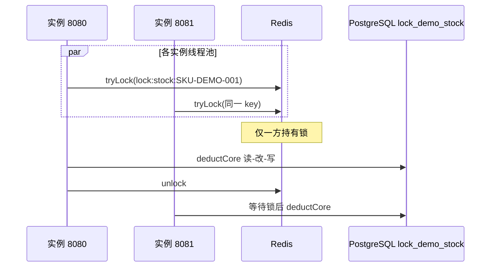

# Redis 分布式锁实验：思路与操作指南

> **定位**：实验 6（学习路径最后一步），在 [26052601-锁实验学习路径与总纲.md](./26052601-锁实验学习路径与总纲.md) 与 [26052602-TestAllModel-并发锁实验设计.md](./26052602-TestAllModel-并发锁实验设计.md) 基础上，单独说明 **Redis 已就绪后如何开展分布式锁实验**。  
> **前置文档**：[26052603-TestAllModel-锁实验实现说明.md](./26052603-TestAllModel-锁实验实现说明.md)（实验 0～5 已实现）  
> **代码现状**：`lockStrategy=REDIS` / `REDIS_LOCAL_ONLY` **已接入** `/api/lock-demo/run`（`RedisStockLockService`：SET NX + TTL + Lua 释放）。  
> **本仓库实验 6 已确定环境（你已打通）**：见下表。

### 已确定环境（实验 6 默认）

| 组件 | Profile / 配置 | 说明 |
|------|----------------|------|
| **Redis** | `redis-cloud` → [application-redis-cloud.yml](../../TestAllModel/src/main/resources/application-redis-cloud.yml) | Redis Cloud，host `filigreed-interest-splendid-39890.db.redis.io`，port `16857`，username `default`，**非 TLS** |
| **数据库** | `postgresql` → [application-postgresql.yml](../../TestAllModel/src/main/resources/application-postgresql.yml) | 本地 PostgreSQL，`jdbc:postgresql://localhost:5432/testdb`，建表脚本 `schema-postgresql.sql` |
| **探活** | `GET /api/redis-test/ping` | 在 `postgresql,redis-cloud` 下启动后已验证可用 |

**统一启动 Profile（单实例 / 双实例均使用）**：

```text
spring.profiles.active=postgresql,redis-cloud
```

**必设环境变量**（Redis 密码不入库；PostgreSQL 按需覆盖）：

| 变量 | 用途 |
|------|------|
| `REDIS_PASSWORD` | Redis Cloud 密码（**必填**） |
| `PG_URL` | 可选，默认 `jdbc:postgresql://localhost:5432/testdb` |
| `PG_USER` | 可选，默认 `m684620` |
| `PG_PASSWORD` | 本地库密码（若需要） |

---

## 一、为什么要做 Redis 锁实验

| 层次 | 已学方案 | 局限 |
|------|----------|------|
| JVM 内 | `synchronized`、`ReentrantLock` | 只管**单进程**内线程 |
| 数据库 | 乐观锁、悲观锁、`FOR UPDATE` | 管**数据行**，多实例仍可能重复逻辑（需配合唯一约束等） |
| **Redis** | 分布式锁 | 管**跨进程 / 跨机器**的互斥，是多实例部署下的常见手段 |

**核心对照问题**：

> 两台 Spring Boot（8080 / 8081）各打 100 次扣减，库存只有 100，**本地锁**挡不住另一台机器，**Redis 锁**可以。

这与随笔中 Redisson `RLock`、Lua 原子、过期续期（watchdog）属于同一知识层次，但本实验先用「库存扣减 + `anomaly`」把现象跑通。

---

## 二、项目里与实验 6 相关的能力

### 2.1 依赖与配置（当前以 Cloud Redis + PostgreSQL 为准）

| 项 | 位置 | 说明 |
|----|------|------|
| Redis 依赖 | `TestAllModel/pom.xml` | `spring-boot-starter-data-redis` |
| **Redis（实验用）** | `application-redis-cloud.yml` | 覆盖 `spring.data.redis` 的 host/port/username/ssl |
| **数据库（实验用）** | `application-postgresql.yml` | 数据源 + `schema-postgresql.sql`（含 `lock_demo_*` 表） |
| 基线配置 | `application.yml` | 默认 H2 + 本地 Redis 占位；**做实验 6 时不要单独用默认 profile** |
| 探活 API | `GET /api/redis-test/ping` | PING + 临时键 SET/GET（`redis.test.key-prefix`） |

**`application-redis-cloud.yml` 要点**：

```yaml
spring.data.redis:
  host: filigreed-interest-splendid-39890.db.redis.io
  port: 16857
  username: default
  ssl.enabled: false
# 密码仅环境变量 REDIS_PASSWORD，不写进 yml
```

**`application-postgresql.yml` 要点**：

```yaml
spring.datasource.url: ${PG_URL:jdbc:postgresql://localhost:5432/testdb}
spring.datasource.username: ${PG_USER:m684620}
spring.sql.init.schema-locations: classpath:schema-postgresql.sql
mybatis-plus.db-type: postgresql
```

双实例时两台 JVM 必须使用**相同的 `PG_URL`**，这样 `lock_demo_stock` 才是同一份数据。

**锁实验专用配置（设计中有，实现后启用）**：

```yaml
# 规划见 26052602 §七，实现 lock 模块时建议增加
lock:
  redis:
    enabled: true
    key-prefix: "lock:stock:"
    wait-seconds: 3      # 获取锁最长等待
    lease-seconds: 10    # 锁过期（防死锁）；Redisson 可走 watchdog 续期
```

与现有 `redis.test.key-prefix`（连接测试用）**分开命名空间**，避免键冲突。

### 2.2 锁实验仍缺什么（实现清单）

在现有 `/api/lock-demo/run` 链路上补齐：

| 序号 | 工作项 | 说明 |
|------|--------|------|
| 1 | `LockStrategy` 增加 `REDIS`、`REDIS_LOCAL_ONLY` | 与 26052602 §3.1 一致 |
| 2 | `RedisLockExecutor` 或 `StockDeductService` 分支 | 扣减前 `tryLock`，扣减后 `unlock` |
| 3 | 共享 DB + 共享 Redis | 双实例均 `postgresql,redis-cloud`，同一 `PG_URL` + 同一 Redis Cloud |
| 4 | Redis 不可用时快速失败 | 禁止静默退化为无锁 |
| 5 | （可选）Redisson `RLock` | 可重入、watchdog；或先用 `StringRedisTemplate` + Lua |

---

## 三、实验环境准备（动手前必做）

### 3.1 启动命令（标准：PostgreSQL + Redis Cloud）

在仓库根目录执行（**先导出 Redis 密码**）：

```bash
export REDIS_PASSWORD='你的RedisCloud密码'
# 若 PostgreSQL 非默认账号密码，可一并设置：
# export PG_URL='jdbc:postgresql://localhost:5432/testdb'
# export PG_USER='m684620'
# export PG_PASSWORD='你的PG密码'

cd /Users/m684620/work/github_GD25/gd25-arch-backend-java

# 单实例（端口 8080）
mvn -pl TestAllModel -am spring-boot:run \
  -Dspring-boot.run.profiles=postgresql,redis-cloud
```

**双实例**（6b / 6c 必用）：开两个终端，**同一套 profile 与环境变量**，仅改端口：

```bash
# 终端 A
export REDIS_PASSWORD='你的RedisCloud密码'
SERVER_PORT=8080 mvn -pl TestAllModel -am spring-boot:run \
  -Dspring-boot.run.profiles=postgresql,redis-cloud

# 终端 B
export REDIS_PASSWORD='你的RedisCloud密码'
SERVER_PORT=8081 mvn -pl TestAllModel -am spring-boot:run \
  -Dspring-boot.run.profiles=postgresql,redis-cloud
```

### 3.2 探活与库表

**Redis**（必须先过）：

```bash
curl -s http://localhost:8080/api/redis-test/ping | jq .
```

**预期**：`connected: true`；`host` 为 `filigreed-interest-splendid-39890.db.redis.io`，`port` 为 `16857`（与 yml 一致）。

**PostgreSQL**（应用启动时会执行 `schema-postgresql.sql`，含 `lock_demo_stock` / `lock_demo_run_log`）：

```bash
# 可选：用 psql 确认表存在
psql -h localhost -U m684620 -d testdb -c "\dt lock_demo*"
```

实验 0～5 在相同 profile 下也可直接跑 `/api/lock-demo/run`；实验 6 实现 `REDIS` 后同样使用该启动方式。

### 3.3 不要用默认 profile 做双实例对照

| 配置 | 双实例问题 |
|------|------------|
| 仅默认 `application.yml`（H2 `mem:testall`） | 每个 JVM 独立内存库，**无法**做 6b/6c |
| **`postgresql` + `redis-cloud`（本文默认）** | 共用 `testdb` 与同一 Redis Cloud，**适合** 6b/6c |

| 字段 | 用途 |
|------|------|
| `instance_id`（响应） | `test-all-model:8080` / `:8081`，区分批次来源 |

### 3.4 备选：本地 Redis（仅当不用 Cloud 时）

若临时改回本地 Redis，需同时改 profile 或设置 `REDIS_HOST`/`REDIS_PORT` 覆盖 yml，并**仍建议保留 `postgresql`** 以保证双实例共库。实验 6 以你已打通的 **redis-cloud** 为准，本节仅作备用说明。

---

## 四、分布式锁在本实验中的职责

### 4.1 调用链（实现后）



**要点**：Redis 锁保护的是「进入 DB 扣减临界区」；锁本身**不存库存**，库存仍在 `lock_demo_stock`。

### 4.2 Key 设计（建议）

| 项 | 建议值 | 说明 |
|----|--------|------|
| Key | `lock:stock:{skuId}` | 与业务 sku 绑定 |
| Value（简单锁） | `UUID:threadId` 或随机 token | 释放时校验，避免删别人的锁 |
| TTL | `lease-seconds`（如 10s） | 防止持有者崩溃导致死锁 |
| 可重入（进阶） | Hash：`field=客户端ID`，`value=重入次数` | 对应随笔 Redisson 方案 |

### 4.3 两种实现路线（选型）

| 路线 | 优点 | 本实验建议 |
|------|------|------------|
| **SET NX + EX + Lua 解锁** | 无额外依赖、理解透彻 | 首版可实现 6a～6c |
| **Redisson `RLock`** | 可重入、watchdog 续期 | 6d 可重入、面试对照随笔 |

Lua 释放示例（思路，非项目代码）：

```lua
-- if redis.call('get', KEYS[1]) == ARGV[1] then return redis.call('del', KEYS[1]) else return 0 end
```

---

## 五、分组实验设计（6a～6d）

> 以下 curl 均假设应用已按 **§3.1** 以 `postgresql,redis-cloud` 启动。

统一参数（与实验 0～5 一致）：

- `initialStock: 100`
- 两实例各 `threadCount: 100`，`requestsPerThread: 1` → 总请求 **200**

### 实验 6a：单实例 + `REDIS`

**目的**：验证 Redis 锁在单 JVM 下行为与 JVM 锁一致（不应超卖）。

```bash
curl -s -X POST http://localhost:8080/api/lock-demo/run \
  -H 'Content-Type: application/json' \
  -d '{
    "lockStrategy": "REDIS",
    "initialStock": 100,
    "threadCount": 200,
    "requestsPerThread": 1,
    "resetStockBeforeRun": true,
    "batchTag": "exp6a-redis-single"
  }'
```

**预期**：`successCount=100`，`finalStock=0`，`anomaly=false`。

---

### 实验 6b：双实例 + `REDIS_LOCAL_ONLY`（对照）

**目的**：故意只用 `synchronized`（或 `SYNC_STATIC`），证明**本地锁无法跨实例**。

| 实例 | 策略 | 请求量 |
|------|------|--------|
| 8080 | `REDIS_LOCAL_ONLY` | 100 |
| 8081 | `REDIS_LOCAL_ONLY` | 100 |

```bash
# 8080
curl -s -X POST http://localhost:8080/api/lock-demo/run \
  -H 'Content-Type: application/json' \
  -d '{"lockStrategy":"REDIS_LOCAL_ONLY","threadCount":100,"requestsPerThread":1,"initialStock":100,"batchTag":"exp6b-8080"}'

# 8081
curl -s -X POST http://localhost:8081/api/lock-demo/run \
  -H 'Content-Type: application/json' \
  -d '{"lockStrategy":"REDIS_LOCAL_ONLY","threadCount":100,"requestsPerThread":1,"resetStockBeforeRun":false,"batchTag":"exp6b-8081"}'
```

**预期**：至少一侧或合计 `successCount > 100`，或 `finalStock < 0`，`anomaly=true`。  
**注意**：第二次请求若 `resetStockBeforeRun=false`，需在 8080 跑之前重置库存，或两台都 `true` 但会互相覆盖初始值——对照实验更稳妥流程见 §5.4。

---

### 实验 6c：双实例 + `REDIS`（核心）

**目的**：跨机器互斥，合计成功 ≤ 100。

| 实例 | 策略 | 请求量 |
|------|------|--------|
| 8080 | `REDIS` | 100 |
| 8081 | `REDIS` | 100 |

```bash
# 先在一台重置库存为 100，再两台几乎同时发 run（REDIS）
```

**预期**：

- 两台 `successCount` 之和 ≤ 100
- 最终 DB `stock=0`
- 两台 `anomaly=false`（以共享 DB 最终行为准）

---

### 实验 6d：可重入（Redisson 或 Hash 计数）

**目的**：同线程对同一 `RLock` 连续 `lock` 两次，计数正确，释放干净。

- 实现后可在单测或调试接口中验证；面试可对照随笔「Hash field + 重入次数 + Lua」。

---

### 5.4 双实例推荐操作时序

```text
1. 确认 PostgreSQL testdb 可连；export REDIS_PASSWORD
2. 终端 A/B 分别启动：profiles=postgresql,redis-cloud，端口 8080 / 8081
3. curl /api/redis-test/ping → connected=true（任一台即可）
4. POST /api/lock-demo/stock/reset → stock=100（或在首次 run 时 resetStockBeforeRun=true）
5. 几乎同时：
   - 8080 POST /run  lockStrategy=…  threadCount=100
   - 8081 POST /run  …  threadCount=100  resetStockBeforeRun=false（6c 第二台勿重置库存）
6. psql 查 lock_demo_stock、lock_demo_run_log
7. （可选）redis-cli 连 Cloud 看 lock:stock:* 与 TTL
```

---

## 六、观察与记录

### 6.1 API 字段

| 字段 | 6b 本地锁 | 6c Redis 锁 |
|------|-----------|-------------|
| `successCount` | 可能合计 > 100 | 合计 ≈ 100 |
| `finalStock` | 可能 < 0 | 0 |
| `anomaly` | true | false |
| `instanceId` | 区分 8080/8081 | 同左 |

### 6.2 SQL（PostgreSQL / testdb）

```bash
psql -h localhost -U m684620 -d testdb
```

```sql
SELECT batch_id, lock_strategy, instance_id, success_count, final_stock, anomaly
FROM lock_demo_run_log
ORDER BY created_at DESC
LIMIT 20;

SELECT sku_id, stock, version FROM lock_demo_stock WHERE sku_id = 'SKU-DEMO-001';
```

### 6.3 Redis CLI（可选，连 Redis Cloud）

```bash
redis-cli -h filigreed-interest-splendid-39890.db.redis.io -p 16857 \
  --user default -a "$REDIS_PASSWORD"
# KEYS lock:stock:*
# TTL lock:stock:SKU-DEMO-001
```

### 6.4 个人实验记录表

| 日期 | 实验 | 实例 | lockStrategy | success | finalStock | anomaly | 结论 |
|------|------|------|--------------|---------|------------|---------|------|
| | 6a | 单实例 | REDIS | | | | |
| | 6b | 8080+8081 | REDIS_LOCAL_ONLY | | | | |
| | 6c | 8080+8081 | REDIS | | | | |

---

## 七、面试与原理对照（简表）

| 话题 | 本实验如何体现 |
|------|----------------|
| 与 `synchronized` 层次不同 | 6b vs 6c 双实例对照 |
| 过期时间 / 死锁 | `lease-seconds`；持有者宕机后锁自动释放（也可能过早释放，需续期） |
| 可重入 | 6d / Redisson Hash |
| 主从切换丢锁 | 文档级了解；生产用 Redlock 或 etcd 等，本实验不展开 |
| SET NX 原子 | 加锁；Lua 校验 value 再 DEL 释放 |

---

## 八、常见问题

| 现象 | 可能原因 |
|------|----------|
| `/redis-test/ping` 失败 | 未设 `REDIS_PASSWORD`、未启用 `redis-cloud` profile、网络不通 |
| 启动仍连 H2 | 未加 `postgresql` profile，用了默认 `application.yml` |
| 6c 仍超卖 | 两实例 `PG_URL` 不一致；或未走 Redis 分支（代码未实现） |
| 锁长期不释放 | 未设 TTL、未 finally unlock、崩溃未清理 |
| `resetStockBeforeRun` 打乱对照 | 6c 时 8081 应 `false` |
| PostgreSQL 建表失败 | `testdb` 不存在、账号无权限、未执行 `schema-postgresql.sql` |

---

## 九、与现有文档的衔接

| 文档 | 关系 |
|------|------|
| [26052602](./26052602-TestAllModel-并发锁实验设计.md) §实验 6 | 策略枚举、配置项、双实例 curl 来源 |
| [26052603](./26052603-TestAllModel-锁实验实现说明.md) | 0～5 已实现；6 实现后补 §六 与 curl |
| `TestAllModel` `redis` 包 | 仅连接探活；锁逻辑待并入 `lock` 包 |

**建议实现顺序**（环境已就绪，从第 2 步开始）：

1. ~~`postgresql,redis-cloud` 启动 + `/api/redis-test/ping` 通过~~  
2. ~~实现 `REDIS`（SET NX + Lua）单实例 6a~~  
3. ~~实现 `REDIS_LOCAL_ONLY`~~；**双实例 8080/8081** 跑 6b / 6c（共用 PostgreSQL + Redis Cloud）— 按 §5.4 手动验证  
4. ~~更新 [26052603](./26052603-TestAllModel-锁实验实现说明.md) 与 26052602 清单~~  

---

## 相关文档

- [26052601-锁实验学习路径与总纲.md](./26052601-锁实验学习路径与总纲.md)
- [26052602-TestAllModel-并发锁实验设计.md](./26052602-TestAllModel-并发锁实验设计.md)
- [26052603-TestAllModel-锁实验实现说明.md](./26052603-TestAllModel-锁实验实现说明.md)
