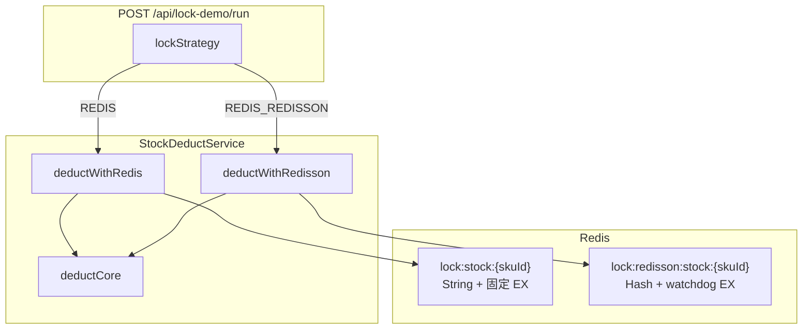
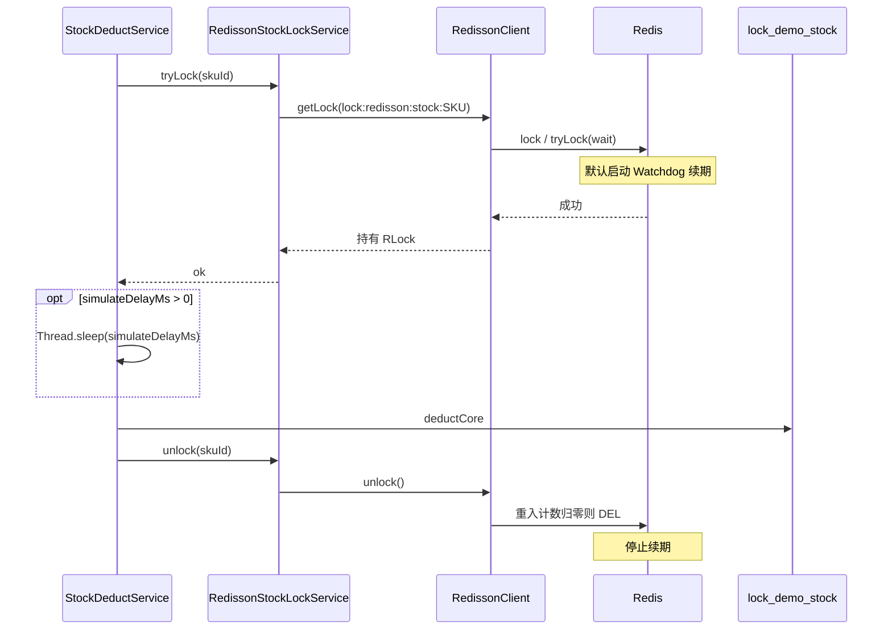

# Redisson 看门狗分布式锁技术方案（实验 6d）

> **状态**：已实现（与 `TestAllModel` 代码一致，下文实验步骤可直接执行）  
> **关联枚举**：`LockStrategy.REDIS_REDISSON`  
> **API**：`POST /api/lock-demo/run`，`lockStrategy=REDIS_REDISSON`  
> **对照实现**：`REDIS` → `RedisStockLockService`（SET NX + 固定 `lease-seconds`，无续期）  
> **前置文档**：[26052604-Redis分布式锁实验思路与操作指南.md](./26052604-Redis分布式锁实验思路与操作指南.md)、[26052603-TestAllModel-锁实验实现说明.md](./26052603-TestAllModel-锁实验实现说明.md)

---

## 一、目标与范围

### 1.1 为什么要新增策略

| 痛点（当前 `REDIS`） | Redisson 看门狗如何解决 |
|----------------------|-------------------------|
| `lease-seconds` 固定，临界区超过 TTL 会「锁过期仍执行业务」 | 默认 `lock()` 启用 watchdog，周期性把 TTL 续回 `lockWatchdogTimeout` |
| 为防过早过期把 lease 调到 300s，进程崩溃后恢复慢 | 可用较短 watchdog TTL（如 30s），存活则续期，崩溃则约 30s 内释放 |
| 无重入，同线程嵌套加锁会死锁或抢锁失败 | `RLock` 可重入（Hash 结构 + 计数） |
| 自研需自己维护续期线程、Lua、取消任务 | Redisson 内置 `LockWatchdogTimeout` 与全局调度 |

本方案**不替换**现有 `REDIS`，而是新增 **`REDIS_REDISSON`**，便于同库存、同并发参数下对比 `anomaly`、Redis Key 形态与 TTL 行为。

### 1.2 实现范围（当前代码）

| 已包含 | 未包含（后续） |
|--------|----------------|
| `RedissonClient`（`RedissonLockConfig` + `RedisProperties`） | Redlock 多节点 |
| `RLock.tryLock(wait, SECONDS)` 两参数形式 + 看门狗 + `deductCore` | 同线程重入两次的专用 HTTP/单测 |
| `lock.redis` / `lock.redisson` 开关联动；Key 前缀隔离 | 替换 `RedisStockLockService` |
| 单实例 **6d-a**、双实例 **6d-c**、可选 **6d-w**（`simulateDelayMs`） | `REDIS` 策略下启用 `simulateDelayMs` |

---

## 二、与现有 `REDIS` 策略对比



| 维度 | `REDIS`（6a/6c） | `REDIS_REDISSON`（6d） |
|------|------------------|------------------------|
| 实现类 | `RedisStockLockService` | `RedissonStockLockService` |
| `simulateDelayMs` | **忽略**（不进入 `deductWithRedis`） | **持锁后、`deductCore` 前** `Thread.sleep` |
| Redis 结构 | String：`SET key token NX EX` | Hash：`{线程标识: 重入次数}`（Redisson 内部） |
| Key 前缀 | `lock:stock:`（`lock.redis.key-prefix`） | **`lock:redisson:stock:`**（独立前缀，避免与 6a 互删） |
| 租约 | 加锁时一次 `EX lease-seconds` | `lock()` 默认 **watchdog 30s**，每 **10s** 续期（Redisson 默认，可配置） |
| 等待 | `wait-seconds` + 50ms 轮询 `SET NX` | `RLock.tryLock(wait, SECONDS)` 或 `lock(wait, …)` |
| 释放 | 自研 Lua：`GET==token` 则 `DEL` | `RLock.unlock()`（内部校验线程与重入计数） |
| 可重入 | 否 | 是（本实验扣减路径可不依赖，但能力具备） |

---

## 三、Redisson 看门狗原理（与本项目相关的部分）

### 3.1 何时启用

- `RLock.lock()` **未指定** `leaseTime` → `leaseTime = -1` → **启用看门狗**。
- `lock(10, TimeUnit.SECONDS)` 等**显式租约** → **不启用**看门狗（与自研 `REDIS` 类似，到期自动释放）。

本实验主路径应使用 **`lock()` / `tryLock(wait, unit)` 不带 leaseTime**，以体现续期能力。

### 3.2 续期在做什么（简化）

```text
加锁成功 → 在 Redisson 客户端注册 LockEntry（key、线程、重入次数）
         → 全局 Watchdog 定时任务（默认每 lockWatchdogTimeout/3 执行）
         → Lua/命令：若仍持有锁，则 EXPIRE 重置为 lockWatchdogTimeout（默认 30s）
unlock   → 重入计数减为 0 时删除 Redis Key，并取消该 entry 的续期
进程崩溃 → 无人续期 → 最多约 30s 后 Key 过期
```

### 3.3 与 `lock.redis.wait-seconds` / `lease-seconds` 的映射建议

| 配置项（`lock.redisson.*`） | 含义 | `application.yml` 当前值 |
|------------------------------|------|-------------------------|
| `enabled` | 为 false 时不创建 `RedissonClient`，`REDIS_REDISSON` 运行时报错 | `true` |
| `key-prefix` | Redisson 锁 Key 前缀 | `lock:redisson:stock:` |
| （无独立项）`wait-seconds` | 复用 `lock.redis.wait-seconds` → `RedissonStockLockService#tryLock` | `3` |
| `watchdog-timeout-seconds` | `Config.setLockWatchdogTimeout`（毫秒） | `30` |
| `lock.redis.lease-seconds` | **仅 `REDIS`** 的 `SET NX EX` | `300` |

说明：现有 `lock.redis.lease-seconds: 300` **仅作用于 `REDIS` 策略**；`REDIS_REDISSON` 走 watchdog 后，**不应**把 300 秒直接当作 `lock(300, SECONDS)`，否则看门狗不会启动，与实验目的相悖。

---

## 四、架构设计

### 4.1 已落地类结构

```text
TestAllModel/
├── pom.xml                          # + org.redisson:redisson:3.35.0（非 starter）
└── src/main/java/com/lance/testall/lock/
    ├── config/
    │   ├── LockDemoRedissonProperties.java
    │   └── RedissonLockConfig.java           # @ConditionalOnExpression(lock.redis && lock.redisson)
    ├── service/
    │   ├── RedissonStockLockService.java     # @ConditionalOnBean(RedissonClient)
    │   └── StockDeductService.java
    └── entity/
        └── LockStrategy.java                 # REDIS_REDISSON
```

单元测试：`src/test/resources/application.yml` 将 `lock.redis.enabled` / `lock.redisson.enabled` 设为 `false`，避免无 Redis 时创建 `RedissonClient`。

### 4.2 核心时序（单次扣减）



### 4.3 实际代码路径（与仓库一致）

`StockDeductService#deductOnce` 分发：

```java
case REDIS_REDISSON -> deductWithRedisson(skuId, options.getSimulateDelayMs());
```

`deductWithRedisson`（持锁 → 可选休眠 → 扣减 → 释放）：

```java
public DeductResult deductWithRedisson(String skuId, int simulateDelayMs) {
    if (redissonStockLockService == null) {
        throw new IllegalStateException("REDIS_REDISSON 未启用：…");
    }
    if (!redissonStockLockService.tryLock(skuId)) {
        return DeductResult.LOCK_TIMEOUT;
    }
    try {
        if (simulateDelayMs > 0) {
            sleepQuietly(simulateDelayMs);  // 仅 REDIS_REDISSON；在 deductCore 之前
        }
        return deductCore(skuId);
    } finally {
        redissonStockLockService.unlock(skuId);
    }
}
```

`RedissonStockLockService#tryLock`（**两参数** `tryLock`，启用看门狗）：

```java
return lock.tryLock(redisProperties.getWaitSeconds(), TimeUnit.SECONDS);
```

`unlock`：`if (lock.isHeldByCurrentThread()) lock.unlock();`

---

## 五、依赖与 Redisson 配置

### 5.1 Maven（`TestAllModel/pom.xml`）

```xml
<dependency>
    <groupId>org.redisson</groupId>
    <artifactId>redisson</artifactId>
    <version>3.35.0</version>
</dependency>
```

采用 **核心库 `redisson`** + 手写 `RedissonLockConfig`（未使用 `redisson-spring-boot-starter`，避免与现有 `spring.data.redis` 双份自动配置）。

与 `spring-boot-starter-data-redis` **可共存**：探活仍走 `StringRedisTemplate`；分布式锁走 `RedissonClient`。

### 5.2 `RedissonClient` 与现有 Redis 连接对齐（已实现：方案 A）

`application-redis-cloud.yml` / `redis-local` 中已有：

```yaml
spring.data.redis:
  host: ...
  port: ...
  username: ...
  password: ...
```

**方案 A（推荐）**：`RedissonLockConfig` 读取 `RedisProperties`（或 `Environment`）手动构建 `Config`：

```java
config.useSingleServer()
    .setAddress("redis://" + host + ":" + port)
    .setUsername(...)
    .setPassword(...);
```

`RedissonLockConfig` 仅在 `lock.redis.enabled=true` **且** `lock.redisson.enabled=true` 时注册 Bean（`@ConditionalOnExpression`）。

Cloud 实例 **非 TLS** 时地址用 `redis://`；`spring.data.redis.ssl.enabled=true` 时自动用 `rediss://`。

### 5.3 `application.yml`（当前仓库）

```yaml
lock:
  redis:
    enabled: true
    key-prefix: "lock:stock:"
    wait-seconds: 3
    lease-seconds: 300          # 仅 REDIS 使用
  redisson:
    enabled: true
    key-prefix: "lock:redisson:stock:"
    watchdog-timeout-seconds: 30  # 映射 Config.lockWatchdogTimeout
```

`RedissonLockConfig` 中：

```java
config.setLockWatchdogTimeout(Duration.ofSeconds(props.getWatchdogTimeoutSeconds()).toMillis());
```

---

## 六、`StockDeductService` 分发（已实现）

```java
case REDIS -> deductWithRedis(skuId);
case REDIS_REDISSON -> deductWithRedisson(skuId, options.getSimulateDelayMs());
case REDIS_LOCAL_ONLY -> deductRedisLocalOnly(skuId);
```

`LockDemoRunLog.lock_strategy` 存 `REDIS_REDISSON` 字符串即可，表结构无变更。

---

## 七、实验操作步骤（与代码一致）

> 环境与 **6a/6c** 相同，见 [26052604 §3.1](./26052604-Redis分布式锁实验思路与操作指南.md)。  
> 下文 curl 默认 profile：`postgresql,redis-cloud`（或本地 `redis-local` + 可连 Redis）。

### 7.0 前置检查

```bash
export REDIS_PASSWORD='你的RedisCloud密码'   # 云实例必填

# 单实例示例
mvn -pl TestAllModel spring-boot:run -Dspring-boot.run.profiles=postgresql,redis-cloud

curl -s http://localhost:8080/api/redis-test/ping | jq .
# connected: true

# 配置：lock.redis.enabled=true、lock.redisson.enabled=true（application.yml 默认均为 true）
```

双实例 **6d-c** 时序与 [26052604 §5.4](./26052604-Redis分布式锁实验思路与操作指南.md) 相同：8080/8081、共用 PG + Redis；第二台 `resetStockBeforeRun=false`。

统一参数（与 6a 一致）：

- `initialStock: 100`
- 单实例压测：`threadCount: 200`，`requestsPerThread: 1` → 总请求 **200**
- 双实例：每台 `threadCount: 100` → 总请求 **200**

### 7.1 实验 6d-a：单实例 + `REDIS_REDISSON`（对齐 6a）

```bash
curl -s -X POST http://localhost:8080/api/lock-demo/run \
  -H 'Content-Type: application/json' \
  -d '{
    "lockStrategy": "REDIS_REDISSON",
    "initialStock": 100,
    "threadCount": 200,
    "requestsPerThread": 1,
    "resetStockBeforeRun": true,
    "batchTag": "exp6d-redisson-single"
  }'
```

**预期**（与 `REDIS` 6a 相同）：

- `successCount=100`
- `finalStock=0`
- `anomaly=false`

Redis 中锁 Key 为 **`lock:redisson:stock:SKU-DEMO-001`**（运行结束后通常已 `unlock` 删除；并发进行中可用 `TTL` / `TYPE hash` 观察）。

### 7.2 实验 6d-c：双实例 + `REDIS_REDISSON`（对齐 6c）

| 实例 | 策略 | 请求量 |
|------|------|--------|
| 8080 | `REDIS_REDISSON` | 100 |
| 8081 | `REDIS_REDISSON` | 100 |

```bash
# 8080（重置库存并跑第一批）
curl -s -X POST http://localhost:8080/api/lock-demo/run \
  -H 'Content-Type: application/json' \
  -d '{
    "lockStrategy": "REDIS_REDISSON",
    "threadCount": 100,
    "requestsPerThread": 1,
    "initialStock": 100,
    "resetStockBeforeRun": true,
    "batchTag": "exp6d-c-8080"
  }'

# 8081（勿重置库存，与 6c 相同）
curl -s -X POST http://localhost:8081/api/lock-demo/run \
  -H 'Content-Type: application/json' \
  -d '{
    "lockStrategy": "REDIS_REDISSON",
    "threadCount": 100,
    "requestsPerThread": 1,
    "resetStockBeforeRun": false,
    "batchTag": "exp6d-c-8081"
  }'
```

**预期**：

- 两台 `successCount` 之和 ≤ 100
- 最终 DB `stock=0`
- 两台 `anomaly=false`（以共享 DB 为准）

### 7.3 实验 6d-w：看门狗可观测（可选）

**代码行为**：仅 `REDIS_REDISSON` 在 **`tryLock` 成功之后、`deductCore` 之前** 执行 `simulateDelayMs` 毫秒休眠；`REDIS` 策略**忽略**该字段。

| 场景 | `REDIS` + `simulateDelayMs` | `REDIS_REDISSON` + `simulateDelayMs` |
|------|----------------------------|--------------------------------------|
| 持锁休眠 60s | 无额外休眠（字段无效） | 持锁 sleep 60s，TTL 约每 10s 续回 ~30 |
| 持锁休眠 400s | 无额外休眠 | 续期正常则全程互斥；可用单线程观察 |

**推荐请求**（单线程，便于 redis-cli 观察；勿用 200 线程各睡 60s）：

```bash
curl -s -X POST http://localhost:8080/api/lock-demo/run \
  -H 'Content-Type: application/json' \
  -d '{
    "lockStrategy": "REDIS_REDISSON",
    "threadCount": 1,
    "requestsPerThread": 1,
    "initialStock": 100,
    "resetStockBeforeRun": true,
    "simulateDelayMs": 60000,
    "batchTag": "exp6d-watchdog-60s"
  }'
```

请求发出后，在 **60s 内**另开终端：

```redis
TTL lock:redisson:stock:SKU-DEMO-001
TYPE lock:redisson:stock:SKU-DEMO-001
```

**预期**：`TYPE` 为 `hash`；`TTL` 在续期作用下在 **约 30 附近波动**，而非线性倒数到 0（与 `lock:stock:` 下 `REDIS` 的 string + 固定 300s 不同）。

若要对比 `REDIS` 固定租约，请对 `lockStrategy=REDIS` 单独压测或断点调试（当前实现不传 `simulateDelayMs` 到 `deductWithRedis`）。

---

## 八、实施记录

| 步骤 | 状态 | 说明 |
|------|------|------|
| 1 | ✅ | `redisson` 依赖 + `RedissonLockConfig` + `LockDemoRedissonProperties` |
| 2 | ✅ | `RedissonStockLockService` + `deductWithRedisson` + 枚举分发 |
| 3 | ✅ | 双实例 6d-c 可按 §7.2 手测；`mvn -pl TestAllModel test`（测试 profile 关闭 Redis/Redisson） |

**启用条件**：`lock.redis.enabled=true` 且 `lock.redisson.enabled=true`，且 Redis 可达；否则 `REDIS_REDISSON` 抛 `IllegalStateException`（Bean 缺失或 `assertEnabled`）。

---

## 九、风险与约束

1. **Key 命名空间**：必须与 `lock:stock:` 分离，否则两种策略可能操作不同数据结构导致异常。
2. **线程模型**：`unlock` 必须在加锁成功的同一线程（Redisson 要求）；线程池任务内加锁/释放已满足。
3. **Redisson 与 Lettuce 连接池**：两套客户端，连接数略增，实验环境可接受。
4. **云 Redis 非 TLS**：`redis://` 地址；密码仍用 `REDIS_PASSWORD`。
5. **看门狗与显式 lease 勿混用**：代码评审禁止对 `REDIS_REDISSON` 使用 `lock(leaseTime, unit)` 作为主路径。
6. **长事务**：看门狗只防「锁过早过期」，不替代业务幂等与 DB 事务；`deductCore` 仍是非事务读-改-写（与现网实验一致）。
7. **`simulateDelayMs`**：仅 `REDIS_REDISSON` 在持锁后生效；文档中「`REDIS` 持锁 400s 超卖」需改代码或断点，不能仅靠该请求字段复现。

---

## 十、后续可选增强

- **6d 重入演示**：`RedissonStockLockService` 内 `lock()` 两次 + `unlock()` 两次，单测断言 Redis Hash 计数。
- **对照实验**：同批请求分别跑 `REDIS` 与 `REDIS_REDISSON`，比较 `lock_timeout` 与 Redis 监控。
- **关闭看门狗对照**：配置开关 `use-watchdog: false` 时走 `tryLock(wait, lease, unit)`，用于教学对比（非默认）。

---

## 十一、文档与代码索引

| 项 | 路径 |
|----|------|
| 新枚举 | `TestAllModel/.../LockStrategy.java` → `REDIS_REDISSON` |
| 现有自研锁 | `RedisStockLockService.java` |
| Redisson 锁 | `RedissonStockLockService.java` |
| 扣减入口 | `StockDeductService#deductWithRedisson` |
| Redis 实验指南 | `ai_docs/lock/26052604-*.md` |
| 本方案 | `ai_docs/lock/26052701-Redisson看门狗分布式锁技术方案.md` |

---

## 十二、已落地设计选择

| 项 | 结论 |
|----|------|
| 枚举名 | `REDIS_REDISSON` |
| Key 前缀 | `lock:redisson:stock:`（`lock.redisson.key-prefix`） |
| 看门狗 TTL | `watchdog-timeout-seconds: 30`，与 `lease-seconds: 300` 脱钩 |
| 长休眠 | `LockRunRequest.simulateDelayMs` 仅传入 `deductWithRedisson`，在 `deductCore` 前 sleep |
