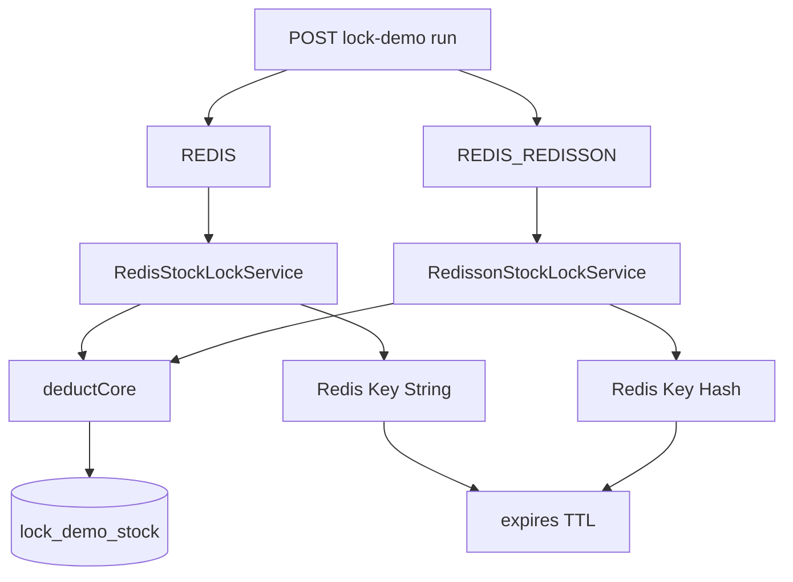

# Redis 分布式锁知识点总结（TestAllModel 实验对话整理）

> **来源**：围绕 `TestAllModel` 锁实验（`REDIS` / `REDIS_REDISSON`）的对话归纳  
> **关联文档**：[26052604-Redis分布式锁实验思路与操作指南.md](./26052604-Redis分布式锁实验思路与操作指南.md)、[26052701-Redisson看门狗分布式锁技术方案.md](./26052701-Redisson看门狗分布式锁技术方案.md)  
> **代码入口**：`RedisStockLockService`、`RedissonStockLockService`、`StockDeductService#deductWithRedis` / `#deductWithRedisson`

---

## 一、总览：两种 Redis 锁策略

| 维度 | `REDIS`（实验 6a/6c，自研） | `REDIS_REDISSON`（实验 6d，Redisson） |
|------|------------------------------|--------------------------------------|
| Java 类 | `RedisStockLockService` | `RedissonStockLockService` |
| Redis 类型 | **String** | **Hash** |
| Key 前缀 | `lock:stock:` | `lock:redisson:stock:` |
| 示例 Key | `lock:stock:SKU-DEMO-001` | `lock:redisson:stock:SKU-DEMO-001` |
| 加锁 | `SET key token NX EX lease` | `RLock.tryLock(wait, SECONDS)`（内部 Lua + Hash） |
| 解锁 | Lua：`GET==token` 则 `DEL` | `RLock.unlock()`（内部 Lua） |
| 租约 | 固定 `lock.redis.lease-seconds`（当前 **300s**） | 看门狗 `watchdog-timeout-seconds`（当前 **30s**） |
| 续期 | **无** | **有**（看门狗周期性 `PEXPIRE`） |
| 等待抢锁 | `wait-seconds` + 每 **50ms** 重试 `SET NX` | `wait-seconds` 内 Redisson 内部重试 |
| `simulateDelayMs` | **忽略** | 持锁后、`deductCore` 前 `Thread.sleep` |

两套客户端共存：

- `spring-boot-starter-data-redis` → `StringRedisTemplate`（探活、自研锁）
- `org.redisson:redisson` → `RedissonClient`（Redisson 锁）

**Key 前缀必须隔离**，避免 String 与 Hash 混在同一 key 上导致异常。

---

## 二、自研 `REDIS` 锁：流程与参数

### 2.1 单次扣减链路

```text
deductWithRedis
  → tryLock(skuId)     // SET NX EX，成功返回 token
  → deductCore         // DB 读-改-写
  → unlock(skuId, token)  // Lua 安全释放
```

### 2.2 三个时间参数（不要混淆）

| 配置 | 当前值 | 作用阶段 | 含义 |
|------|--------|----------|------|
| `lock.redis.wait-seconds` | 3 | **加锁前** | 抢锁最长等待；超时返回 `LOCK_TIMEOUT` |
| （实现）50ms 间隔 | 固定代码 | **加锁前** | 每次 `SET NX` 失败后 `sleep(50)` 再试 |
| `lock.redis.lease-seconds` | 300 | **加锁后** | Key 的 TTL；到期 Redis 自动删 key；**无续期** |

注意：

- 正常路径会在 `finally` 里 **主动 unlock**，Redis 里锁通常只存在毫秒级。
- 若临界区 **超过 300s** 仍在执行，锁可能已过期，其它线程可再次加锁 → **互斥失效**（应用层仍以为持有锁）。

### 2.3 加锁时在 Redis 里写什么

等价命令：

```redis
SET lock:stock:SKU-DEMO-001 {token} NX EX 300
```

- **token 示例**：`test-all-model:8080:{UUID}:{threadId}`
- **成功**：返回 `OK`，Java 侧得到 token
- **失败**：返回 `(nil)`，继续重试直到超过 `wait-seconds`

---

## 三、Redisson `REDIS_REDISSON` 锁

### 3.1 Redisson 是什么

**Redisson** 是 Java 的 **Redis 客户端增强库**（jar：`org.redisson:redisson`），不是 Redis 服务器。在 Redis 命令之上封装了 `RLock`、分布式集合等；本项目主要用 **`RLock` + 看门狗续期**。

### 3.2 单次扣减链路

```text
deductWithRedisson
  → tryLock(skuId)              // 两参数 tryLock，启用看门狗
  → [可选] sleep(simulateDelayMs)
  → deductCore
  → unlock(skuId)               // isHeldByCurrentThread() 再 unlock
```

### 3.3 看门狗（Watchdog）

| 概念 | 说明 |
|------|------|
| 何时启用 | `tryLock(wait, SECONDS)` **不指定** leaseTime |
| 禁用方式 | `lock(10, SECONDS)` 等带 lease 的重载 → 与自研固定 TTL 类似 |
| 默认行为 | TTL 约 **30s**（`lock.redisson.watchdog-timeout-seconds`），约每 **1/3** 周期续回 |
| 进程崩溃 | 无人续期 → 最多约 30s 后 Key 过期 |
| 持锁期间 value | Hash field 的 **重入计数** 通常保持 `"1"`；**变的是 Key 的 TTL** |

### 3.4 Hash 结构与「为何用 Hash」

**运行时（排他锁、无重入嵌套）**：持锁期间 Hash 里通常 **0 或 1 个 field**。

| Redis 层级 | 内容 |
|------------|------|
| Key | `lock:redisson:stock:{skuId}` |
| Type | `hash` |
| Field | `{RedissonClient的UUID}:{线程Id}` |
| Value | 重入次数字符串 `"1"`、`"2"`… |

**为何不用 String**（MianShi/理解用）：

1. **可重入**：同一 field，value 从 1 递增，Lua 原子 `HINCRBY`。
2. **主人标识在 field 名**：释放只动自己的 field。
3. **统一模型**：读写锁等场景下同一 Hash 可有多 field（多个读持有者）；`RLock` 只是其中最简单的一种。

抢锁 **失败** 的线程 **不会** 在 Hash 里留下 field。

---

## 四、在 Redis / IDEA 中如何查看锁

### 4.1 常用命令

```redis
# 自研锁（String）
GET lock:stock:SKU-DEMO-001
TYPE lock:stock:SKU-DEMO-001          # string
TTL lock:stock:SKU-DEMO-001

# Redisson 锁（Hash）
TYPE lock:redisson:stock:SKU-DEMO-001 # hash
HGETALL lock:redisson:stock:SKU-DEMO-001
TTL lock:redisson:stock:SKU-DEMO-001

# 通配（仅开发环境）
KEYS lock:stock:*
KEYS lock:redisson:stock:*
```

### 4.2 为何经常「看不到」

1. `tryLock` 失败 → 未写入新 key（可能仍有别人的 key）。
2. 业务很快 `unlock` → key 已删除。
3. 连错实例 / database（Spring 默认 db `0`）。

**调试技巧**：在 `tryLock` 成功后、`unlock` 前打断点；或 `REDIS_REDISSON` + `simulateDelayMs` + `threadCount=1` 拉长持锁时间。

---

## 五、过期时间（TTL）在 Redis 里怎么存

### 5.1 核心结论

**过期时间不在 String 的 value 里，也不在 Hash 的 field/value 里**，而是 Key 的 **元数据**，存在 Redis 内部的 **expires 字典**（Key → 绝对过期时间戳）。

```text
键空间：Key → 值（string / hash / …）
expires：Key → 过期时间戳（毫秒）
```

- `GET` / `HGETALL` **看不到** TTL，必须用 `TTL` / `PTTL` / `EXPIRETIME`。
- **Hash 的 field 不能单独过期**；Redisson 续期是对 **整个 Hash Key** 做 `PEXPIRE`。

### 5.2 两种锁的过期设置方式

| 策略 | 谁设过期 |
|------|----------|
| 自研 `REDIS` | `SET ... NX EX 300` 一条命令 |
| Redisson | 加锁 Lua 写 Hash + 对 Key `PEXPIRE`；看门狗周期性续期 |

### 5.3 Key 到期后

- 客户端访问时像 key 不存在（`GET` → nil，`HGETALL` → 空）。
- Redis 通过 **惰性删除**（访问时发现过期）+ **定期删除**（后台扫描 expires）回收内存。

---

## 六、Lua 脚本

### 6.1 Lua 是什么

**Lua** 是嵌入 Redis 的轻量脚本语言。通过 `EVAL` 在 **Redis 服务端**执行，**整段脚本原子执行**（执行期间不会被其它命令插队）。

### 6.2 为何解锁要用 Lua

释放锁需要：**先判断 value/token 是否属于自己，再删除**。若分两条命令：

```text
A: GET → 是自己的
（锁过期，B 已加锁）
A: DEL → 误删 B 的锁
```

自研解锁脚本（项目内 `UNLOCK_SCRIPT`）：

```lua
if redis.call('get', KEYS[1]) == ARGV[1] then
    return redis.call('del', KEYS[1])
else
    return 0
end
```

执行：

```redis
EVAL "脚本" 1 lock:stock:SKU-DEMO-001 {token}
```

Redisson 的加锁、解锁、续期 **内部也大量使用 Lua**，应用层不手写。

---

## 七、MianShi常问：Redis 加锁 / 解锁「命令」

问的是 **Redis 原语**，不是 Java API。

### 7.1 标准答法（自研锁）

**加锁**：

```redis
SET lock_key 唯一token NX EX 30
```

- `NX`：仅当 key 不存在 → 互斥
- `EX`：过期秒数，防死锁
- 不要用老的 `SETNX` + 单独 `EXPIRE` 两步（非原子，可能永不过期）

**解锁**：

```redis
EVAL "if redis.call('get',KEYS[1])==ARGV[1] then return redis.call('del',KEYS[1]) else return 0 end" 1 lock_key token
```

**等待锁**：Redis 无阻塞锁命令 → 客户端循环 `SET NX` + sleep（本项目 50ms）。

### 7.2 Redisson 怎么答

业务侧：`RLock.tryLock()` / `unlock()`。  
底层：**Lua + Hash**（非简单 `SET NX` 字符串），看门狗对 Key 做 **`PEXPIRE` 续期**。

### 7.3 Java API 与 Redis 命令对照

| MianShi问 | 本项目 |
|--------|--------|
| Redis 加锁 | `SET NX EX` |
| Redis 解锁 | `EVAL` + Lua |
| Java 自研 | `setIfAbsent`、`redisTemplate.execute(script)` |
| Java Redisson | `RLock.tryLock` / `unlock` |

---

## 八、配置速查（application.yml）

```yaml
lock:
  redis:
    enabled: true
    key-prefix: "lock:stock:"
    wait-seconds: 3          # 两种策略共用：最长等待抢锁
    lease-seconds: 300       # 仅 REDIS：SET NX EX
  redisson:
    enabled: true
    key-prefix: "lock:redisson:stock:"
    watchdog-timeout-seconds: 30   # 仅 REDIS_REDISSON：看门狗 TTL

spring.data.redis:
  host: ...
  port: ...
  # 云实例：username/password、profile redis-cloud
```

**启用 `REDIS_REDISSON` 条件**：`lock.redis.enabled=true` 且 `lock.redisson.enabled=true`，且 Redis 可达。

---

## 九、实验操作速查

| 实验 | lockStrategy | 要点 |
|------|--------------|------|
| 6a | `REDIS` | 单实例 200 线程，`anomaly=false` |
| 6c | `REDIS` | 双实例各 100 线程，第二台 `resetStockBeforeRun=false` |
| 6d-a | `REDIS_REDISSON` | 对齐 6a |
| 6d-c | `REDIS_REDISSON` | 对齐 6c |
| 6d-w | `REDIS_REDISSON` + `simulateDelayMs` | 建议 `threadCount=1`，观察 `TTL` 在 ~30 附近波动 |

详细 curl 见 [26052701 §七](./26052701-Redisson看门狗分布式锁技术方案.md#七实验操作步骤与代码一致)。

---

## 十、风险与最佳实践（对话中强调过的点）

1. **lease 与临界区耗时**：自研锁无续期，临界区不能长期超过 `lease-seconds`。
2. **看门狗不是万能**：只解决「锁过早过期」；不替代 DB 事务与幂等。
3. **误删锁**：解锁必须校验持有者（Lua 或 Redisson 内部机制）。
4. **Key 命名空间**：`lock:stock:` 与 `lock:redisson:stock:` 不可混用。
5. **TTL 观察**：用 `TTL key`，不要从 `GET`/`HGETALL` 里找过期时间。
6. **进程故障**：自研锁最多占满 `lease-seconds`；Redisson 看门狗约 `watchdog-timeout-seconds` 后释放。

---

## 十一、相关代码文件索引

| 文件 | 说明 |
|------|------|
| `LockStrategy.java` | `REDIS`、`REDIS_REDISSON`、`REDIS_LOCAL_ONLY` |
| `RedisStockLockService.java` | SET NX + Lua 解锁 |
| `RedissonStockLockService.java` | RLock tryLock/unlock |
| `RedissonLockConfig.java` | RedissonClient Bean |
| `LockDemoRedissonProperties.java` | `lock.redisson.*` |
| `StockDeductService.java` | `deductWithRedis` / `deductWithRedisson` |

---

## 十二、概念关系图



**说明（与上图等价）**：

```text
POST /api/lock-demo/run
├── REDIS ──► RedisStockLockService ──► SET NX EX / EVAL ──► lock:stock:* (string) ──┐
├── REDIS_REDISSON ──► RedissonStockLockService ──► Lua+PEXPIRE ──► lock:redisson:stock:* (hash) ──┤
│                                                                                              │
└── deductCore ──► lock_demo_stock (DB)                                                        │
                                                                                               ▼
                                                                                    expires（Key 级 TTL）
```

| 节点 | 含义 |
|------|------|
| String Key | 自研锁 `lock:stock:{skuId}`，value 为 token |
| Hash Key | Redisson 锁 `lock:redisson:stock:{skuId}`，field 为客户端+线程 |
| expires | 过期时间不在 value 内，为 Key 元数据 |

---

*文档生成自项目内 Redis 锁实验相关对话，与仓库实现保持一致；若配置或代码变更，以 `application.yml` 与上述 Java 类为准。*
