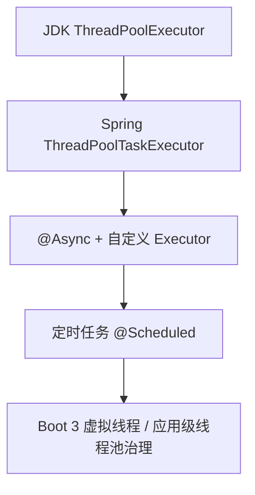

# Spring 线程池使用与学习路径

> 适用环境：Spring Boot 3 / Java 17+  
> 仓库现状：当前项目尚未配置显式线程池，可按本文「动手练习」在 `common` 或 `web` 模块落地实验。  
> **JDK 实验落地设计**：[26052502-TestAllModel-JDK线程池批量写库实验设计.md](./26052502-TestAllModel-JDK线程池批量写库实验设计.md)（`TestAllModel` 模块，API + 写库验证）。

---

## 一、线程池在解决什么

线程池的核心不是「多开几个线程」，而是：

- **复用线程**，避免频繁 `new Thread` 的开销
- **限制并发**，防止任务把机器打满
- **排队与拒绝**，在过载时有可控行为（排队、丢弃、抛异常、调用方自己跑）

Spring 里几乎所有「异步写法」，底层都是把任务交给某种 `Executor` / `ThreadPoolExecutor`。

---

## 二、学习路径（建议按顺序练）



### 第 1 步：JDK `ThreadPoolExecutor`（必学地基）

先不用 Spring，在单元测试或 `main` 里写：

```java
ThreadPoolExecutor executor = new ThreadPoolExecutor(
    2,                      // corePoolSize：常驻线程数
    4,                      // maximumPoolSize：高峰最多线程数
    60, TimeUnit.SECONDS,   // keepAliveTime：非核心线程空闲多久回收
    new LinkedBlockingQueue<>(100),  // 工作队列
    new ThreadFactoryBuilder().setNameFormat("biz-%d").build(),
    new ThreadPoolExecutor.CallerRunsPolicy()  // 拒绝策略
);
```

#### 必须理解的 7 个参数

| 参数 | 含义 | 常见误区 |
|------|------|----------|
| corePoolSize | 核心线程数，一般一直存活 | 不是「CPU 核数」的唯一答案，要看任务类型 |
| maximumPoolSize | 队列满之后还能扩到的最大线程数 | 和队列容量一起决定「何时新建线程」 |
| keepAliveTime | 超过 core 的空闲线程存活时间 | 只对「非核心线程」生效（除非 `allowCoreThreadTimeOut`） |
| workQueue | 有界/无界队列 | **无界队列会导致 maximum 永远用不上** |
| threadFactory | 线程命名、是否 daemon | 生产环境一定要能 trace 线程名 |
| rejectedExecutionHandler | 队列满且线程满时的行为 | 默认 `AbortPolicy` 会直接抛异常 |

#### 任务提交后的执行顺序（面试也常考）

1. 当前线程数 < core → 新建核心线程执行
2. 否则尝试入队
3. 队满且当前线程数 < max → 新建非核心线程
4. 否则走拒绝策略

#### 不同队列的注意点

| 队列类型 | 特点 | 注意点 |
|----------|------|--------|
| `LinkedBlockingQueue` | 常用 | **无界时 max 形同虚设**，容易 OOM |
| `ArrayBlockingQueue` | 有界 | 行为更可预测，生产更推荐 |
| `SynchronousQueue` | 不存任务 | 适合 `CachedThreadPool` 风格 |
| `PriorityBlockingQueue` | 按优先级 | 任务必须可比较 |

#### 四种拒绝策略

| 策略 | 行为 |
|------|------|
| `AbortPolicy`（默认） | 抛 `RejectedExecutionException` |
| `CallerRunsPolicy` | 调用方线程自己跑（背压） |
| `DiscardPolicy` | 静默丢弃 |
| `DiscardOldestPolicy` | 丢队列里最老的一个再试提交 |

---

### 第 2 步：Spring 的 `ThreadPoolTaskExecutor`（项目里最常用）

Spring 对 JDK 线程池做了 Bean 友好封装：

```java
@Configuration
public class ThreadPoolConfig {

    @Bean("bizExecutor")
    public ThreadPoolTaskExecutor bizExecutor() {
        ThreadPoolTaskExecutor executor = new ThreadPoolTaskExecutor();
        executor.setCorePoolSize(4);
        executor.setMaxPoolSize(8);
        executor.setQueueCapacity(200);
        executor.setKeepAliveSeconds(60);
        executor.setThreadNamePrefix("biz-");
        executor.setRejectedExecutionHandler(new ThreadPoolExecutor.CallerRunsPolicy());
        executor.setWaitForTasksToCompleteOnShutdown(true);  // 优雅停机
        executor.setAwaitTerminationSeconds(30);
        executor.initialize();  // 必须调用
        return executor;
    }
}
```

#### 与直接 `new ThreadPoolExecutor` 的注意点

| 点 | 说明 |
|----|------|
| 必须 `initialize()` | 否则池子没真正启动 |
| 优雅停机 | `waitForTasksToCompleteOnShutdown` + `awaitTerminationSeconds` 配合 Spring 生命周期 |
| Bean 注入 | 业务里 `@Qualifier("bizExecutor")` 注入，便于监控、替换、测试 mock |
| 不要到处 `new` | 每个业务共用一个池，或按域拆池（IO 池 / CPU 池），避免线程爆炸 |

手动提交任务：

```java
bizExecutor.execute(() -> { /* 无返回值 */ });
Future<String> future = bizExecutor.submit(() -> "ok");
```

---

### 第 3 步：`@Async`（语法简单，坑最多）

```java
@Configuration
@EnableAsync
public class AsyncConfig implements AsyncConfigurer {

    @Override
    public Executor getAsyncExecutor() {
        return bizExecutor(); // 返回上面配置的 Bean
    }
}

@Service
public class OrderService {
    @Async("bizExecutor")  // 指定 Bean 名；不写则用默认
    public void notifyAsync(Long orderId) {
        // 在 bizExecutor 线程里执行
    }
}
```

#### 关键注意点（踩坑高发）

1. **同类内部调用不生效**  
   `this.notifyAsync()` 不会走代理，必须走 Spring 注入的 Bean 或拆到另一个类。

2. **`@Async` 方法不能是 `private`**  
   代理无法拦截。

3. **返回值**  
   - `void`：火后即忘，异常默认只打日志（可配 `AsyncUncaughtExceptionHandler`）  
   - `Future` / `CompletableFuture`：调用方可 `get()` 拿结果或异常

4. **事务边界**  
   异步方法在**另一个线程**，和调用方不在同一事务；若要在异步里写库，需单独 `@Transactional` 或传已提交的数据。

5. **SecurityContext / RequestContext**  
   主线程的 `ThreadLocal`（用户、Request）**不会自动带到异步线程**，要显式传参或用 `TaskDecorator`：

```java
executor.setTaskDecorator(runnable -> {
    // 拷贝当前上下文到 runnable
    return () -> {
        try {
            runnable.run();
        } finally {
            // clear context
        }
    };
});
```

6. **异常处理**  
   `void` 的 `@Async` 抛异常，调用方感知不到，务必配全局异步异常处理器或打日志 + 告警。

7. **默认池**  
   不配置时 Spring 用 `SimpleAsyncTaskExecutor`（**每次新线程**），生产环境几乎一定要换成 `ThreadPoolTaskExecutor`。

---

### 第 4 步：定时任务 `@Scheduled`（另一套线程模型）

```java
@EnableScheduling
@Configuration
public class ScheduleConfig {
    @Bean
    public TaskScheduler taskScheduler() {
        ThreadPoolTaskScheduler scheduler = new ThreadPoolTaskScheduler();
        scheduler.setPoolSize(4);
        scheduler.setThreadNamePrefix("sched-");
        scheduler.setWaitForTasksToCompleteOnShutdown(true);
        scheduler.initialize();
        return scheduler;
    }
}
```

#### 注意点

- 默认是**单线程**调度所有 `@Scheduled`，一个任务卡住会拖死其它定时任务 → 生产建议自定义 `TaskScheduler` 并设 `poolSize > 1`
- **不要**在 `@Scheduled` 里做长时间阻塞 IO，除非池够大且任务彼此独立
- `fixedRate` vs `fixedDelay`：前者按开始时间间隔，后者按**上次结束**再间隔
- 集群多实例时，要考虑分布式锁或 XXL-Job / ShedLock，避免重复执行

---

### 第 5 步：Spring Boot 3 的虚拟线程（了解后再决定用不用）

Boot 3.2+ 可配置：

```yaml
spring:
  threads:
    virtual:
      enabled: true
```

或在 Java 21+ 使用 `Executors.newVirtualThreadPerTaskExecutor()`。

| 维度 | 说明 |
|------|------|
| 适合 | 大量阻塞型任务（HTTP、DB、RPC） |
| 不适合 | 大量 CPU 密集计算（仍占 carrier 线程） |
| 注意 | 与 `synchronized`、部分 native 库、线程本地变量混用时行为要单独验证 |

---

## 三、各种「写法」对照与选型

| 写法 | 典型场景 | 主要注意点 |
|------|----------|------------|
| 直接 `Executor.execute` | 明确控制、非 Spring 管理 | 自己管生命周期、监控、停机 |
| `ThreadPoolTaskExecutor` Bean | 业务异步、批量、消息消费 | 有界队列 + 命名 + 优雅停机 |
| `@Async` | Service 层「顺便异步一下」 | 代理、事务、ThreadLocal、异常 |
| `@Scheduled` | 定时扫表、对账、清理 | 单线程默认、集群重复执行 |
| `CompletableFuture.supplyAsync(..., executor)` | 组合多个异步结果 | **必须传入自己的 executor**，否则用 `ForkJoinPool.commonPool()` |
| `parallelStream()` | 集合并行计算 | 共用 common pool，和业务池抢资源，CPU 任务要谨慎 |
| `WebClient` / reactive | IO 密集 | 不是传统线程池思维，但底层也有 event loop |

---

## 四、参数怎么估（实用公式，不是银弹）

- **CPU 密集**（算数、编解码）：线程数 ≈ `CPU 核数` 或 `核数 + 1`
- **IO 密集**（调 DB、HTTP）：可更大，例如 `核数 * 2` 到 `核数 * (1 + 等待/计算)`，但要结合连接池、下游限流
- **队列容量**：能缓冲突发即可；过大 = 延迟变高 + 内存占用；过小 = 频繁拒绝
- **有界队列 + 明确拒绝策略** 比「无界队列图省事」更适合生产

---

## 五、生产环境必查清单

1. **线程名前缀**：日志、线程 dump 能一眼看出业务
2. **有界队列**：避免 `Integer.MAX_VALUE` 无界
3. **拒绝策略与监控**：队列长度、活跃线程、拒绝次数、任务耗时
4. **优雅停机**：配合 K8s `preStop`、Spring `ContextClosedEvent`
5. **与连接池对齐**：线程 200 个但 DB 连接只有 10，会在池外排队或打爆 DB
6. **MDC / 链路追踪**：异步要传播 `traceId`（Slf4j MDC + `TaskDecorator`）
7. **不要用 `Executors.newFixedThreadPool` 等静态工厂的无界队列写法**（阿里规约也强调这点）

---

## 六、在本仓库中的动手练习顺序

当前项目还没有线程池代码。建议先完成 **JDK 地基实验**（已有详细设计稿），再按下面 A–D 递进：

| 阶段 | 实验 | 内容 | 观察点 | 文档 |
|------|------|------|--------|------|
| **0（推荐先做）** | JDK 批量写库 | `POST /api/thread-pool/demo/submit` + 实验表 | 并发线程名、拒绝、队列、写库耗时 | [26052502](./26052502-TestAllModel-JDK线程池批量写库实验设计.md) / [26052503](./26052503-TestAllModel-JDK线程池实验操作说明.md) |
| **A** | Spring 封装池 | `POST /api/thread-pool/spring/submit`，与 JDK A/B 对照 | `initialize`、优雅停机、`tp-spring-*`、`queueType` | [26052504 Spring 实验总结](./26052504-TestAllModel-Spring线程池封装实验总结.md) |
| B | `@Async` | `@EnableAsync` + `@Async` Service，用接口调用 | 自调用不生效 | 本文第 3 步 |
| C | 上下文传递 | `TaskDecorator` 传 `traceId` | 主线程 vs 子线程日志 | 本文第 3 步 |
| D | 定时任务 | 两个 `@Scheduled`，一个长时间 `sleep` | 默认单线程 vs `TaskScheduler` poolSize=2 | 本文第 4 步 |

每个实验可配合 `jstack` 或 Actuator metrics（若已引入）加深理解。

---

## 七、与 Spring 生态的衔接

| 组件 | 要点 |
|------|------|
| Spring MVC | 请求在 Tomcat 线程；`@Async` 把后续挪到业务池 |
| `@Transactional` | 只在当前线程有效；异步写库需新事务 |
| MyBatis / JDBC | `SqlSession`、Connection 不能跨线程共享 |
| Redis / HTTP 客户端 | 连接池大小要和线程池一起规划 |

---

## 八、速查：ThreadPoolExecutor 执行流程

```
提交任务
  │
  ├─ 线程数 < corePoolSize ──► 新建核心线程执行
  │
  ├─ 否则尝试入队
  │     ├─ 队列未满 ──► 入队等待
  │     └─ 队列已满
  │           ├─ 线程数 < maximumPoolSize ──► 新建非核心线程执行
  │           └─ 否则 ──► 拒绝策略
```

---

## 相关文档

- [26052502-TestAllModel-JDK线程池批量写库实验设计.md](./26052502-TestAllModel-JDK线程池批量写库实验设计.md) — JDK `ThreadPoolExecutor` 在 `TestAllModel` 中的 API + 写库实验设计（阶段 0）
- [26052503-TestAllModel-JDK线程池实验操作说明.md](./26052503-TestAllModel-JDK线程池实验操作说明.md) — JDK 三组对照实验 curl（已实现）
- [26052504-TestAllModel-Spring线程池封装实验总结.md](./26052504-TestAllModel-Spring线程池封装实验总结.md) — Spring `ThreadPoolTaskExecutor` 对照实验（已实现）
