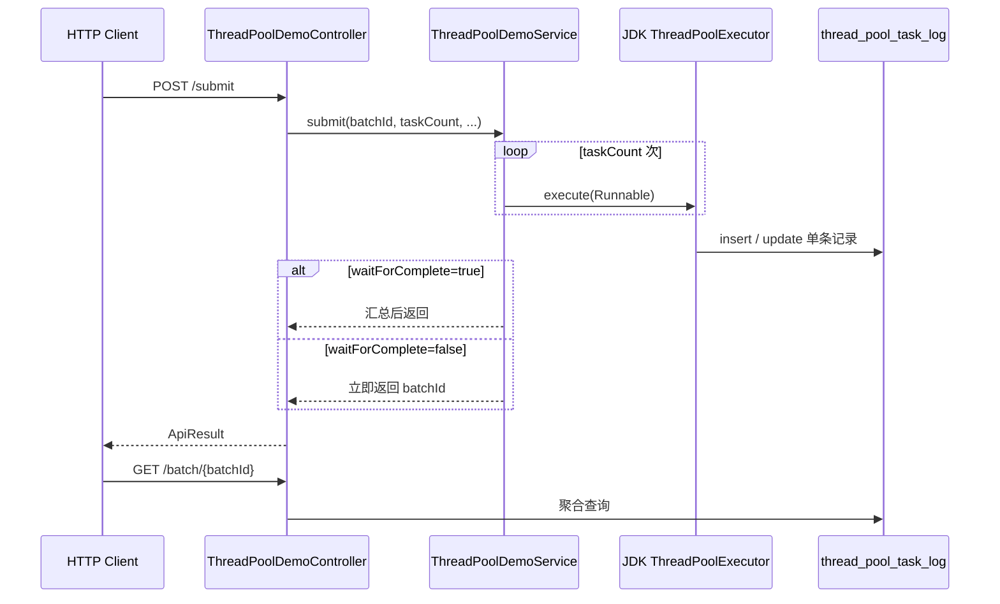

# TestAllModel：JDK 线程池批量写库实验设计

> **定位**：学习路径 [第 1 步 JDK `ThreadPoolExecutor`](./26052501-Spring线程池使用与学习路径.md#第-1-步jdk-threadpoolexecutor必学地基) 的**可运行落地设计**（API 入口 + 数据库写操作）。  
> **实现模块**：`TestAllModel`（聚合 `web` + `mybatis`，默认 H2，可切 MySQL / PostgreSQL）。  
> **状态**：已实现。操作说明见 [26052503-TestAllModel-JDK线程池实验操作说明.md](./26052503-TestAllModel-JDK线程池实验操作说明.md)。

**关联文档**：[26052501-Spring线程池使用与学习路径.md](./26052501-Spring线程池使用与学习路径.md)

---

## 一、设计目标

| 目标 | 说明 |
|------|------|
| 验证 JDK 线程池行为 | 并发、队列积压、拒绝策略、线程命名 |
| API 作为唯一调用入口 | 所有实验通过 REST 触发，符合 Web 请求链路 |
| 数据库可观测 | 每条子任务落库，用 SQL 核对 `thread_name`、状态、耗时 |
| 与 `@Async` 解耦 | 显式 `ThreadPoolExecutor` + `execute`，不依赖 Spring 异步代理 |

对应总纲文档中的能力点：

- [任务提交执行顺序](./26052501-Spring线程池使用与学习路径.md#任务提交后的执行顺序面试也常考)
- [拒绝策略](./26052501-Spring线程池使用与学习路径.md#四种拒绝策略)
- [MyBatis / JDBC 与线程](./26052501-Spring线程池使用与学习路径.md#七与-spring-生态的衔接)

---

## 二、推荐场景：批量写库任务

**业务故事（刻意简化）：**

一次 HTTP 请求要写入 N 条「任务执行记录」。每条记录在池线程中执行：可选 `sleep` 模拟慢 IO → `insert` 落库。用于观察：

- 并发是否真实发生（`thread_name` 只有少数几种前缀）
- 队列是否在排队（`created_at` / `finished_at` 拉开）
- 池满 + 队满时拒绝策略是否生效（`status = REJECTED`）
- 总耗时是否明显低于串行（`workDelayMs × taskCount`）

**为何不直接并发写 `test_entity`：**

- 现有 `TestAllModel` 中的 `TestEntityController`（`/api/test-entities`）是示例 CRUD，混用不利于按批次统计
- 独立实验表可按 `batch_id` 聚合，实验可重复、可清理

---

## 三、API 设计（入口必须在 Controller）

### 3.1 接口一览

| 方法 | 路径 | 职责 |
|------|------|------|
| `POST` | `/api/thread-pool/demo/submit` | **主入口**：提交一批写库任务 |
| `GET` | `/api/thread-pool/demo/batch/{batchId}` | 查询批次汇总（成功/失败/拒绝数） |
| `GET` | `/api/thread-pool/demo/pool/stats` | （可选）当前池 active、queue size、completed |

### 3.2 `submit` 请求体

```json
{
  "taskCount": 20,
  "workDelayMs": 200,
  "waitForComplete": true,
  "batchTag": "manual-test-1"
}
```

| 字段 | 用途 |
|------|------|
| `taskCount` | 本批子任务数量 |
| `workDelayMs` | 写库前休眠，放大 IO 型特征 |
| `waitForComplete` | `true`：API 阻塞至全部结束（`CountDownLatch` / `Future`）；`false`：立即返回 `batchId`，靠查询接口看进度 |
| `batchTag` | 可选备注，写入 log 便于筛选 |

### 3.3 `submit` 响应体（建议）

```json
{
  "batchId": "uuid",
  "submitted": 20,
  "success": 18,
  "failed": 0,
  "rejected": 2,
  "elapsedMs": 1250
}
```

### 3.4 查询批次示例 SQL

```sql
SELECT batch_id, thread_name, status, COUNT(*) AS cnt
FROM thread_pool_task_log
WHERE batch_id = ?
GROUP BY batch_id, thread_name, status
ORDER BY thread_name, status;
```

**预期现象**（例如 `core=2, max=4`）：`thread_name` 仅少数几种（如 `tp-demo-1`、`tp-demo-2`），而非 `taskCount` 个互不相同的线程名。

---

## 四、调用链路



---

## 五、分层与包结构（拟）

```
TestAllModel/src/main/java/com/lance/testall/threadpool/
├── config/JdkThreadPoolConfig.java      # ThreadPoolExecutor Bean、@PreDestroy shutdown
├── controller/ThreadPoolDemoController.java
├── service/ThreadPoolDemoService.java
├── entity/ThreadPoolTaskLog.java
├── mapper/ThreadPoolTaskLogMapper.java
└── dto/...                              # SubmitRequest / SubmitResponse / BatchSummary
```

| 层 | 职责 |
|----|------|
| `Controller` | 参数校验、`ApiResult` 包装，不写池逻辑 |
| `Service` | 生成 `batchId`、循环 `executor.execute`、汇总、拒绝计数 |
| `JdkThreadPoolConfig` | 有界队列、命名 `ThreadFactory`、拒绝策略、优雅停机 |
| `Mapper` | 池线程内单条 `insert` / `update` |

与现有 `com.lance.testall.controller.TestEntityController` **包级隔离**，避免污染示例 CRUD。

---

## 六、数据表设计

在 `TestAllModel/src/main/resources/schema.sql`（及 `schema-postgresql.sql`）增加：

```sql
CREATE TABLE IF NOT EXISTS thread_pool_task_log (
    id           BIGINT AUTO_INCREMENT PRIMARY KEY,
    batch_id     VARCHAR(64)  NOT NULL,
    task_index   INT          NOT NULL,
    thread_name  VARCHAR(128),
    status       VARCHAR(32)  NOT NULL,  -- PENDING / SUCCESS / FAIL / REJECTED
    error_message VARCHAR(512),
    batch_tag    VARCHAR(128),
    created_at   TIMESTAMP DEFAULT CURRENT_TIMESTAMP,
    finished_at  TIMESTAMP
);
```

| 字段 | 验证用途 |
|------|----------|
| `batch_id` | 关联一次 API 调用 |
| `task_index` | 子任务序号 0..N-1 |
| `thread_name` | 证明任务在池线程执行 |
| `status` | 成功 / 失败 / 拒绝 |
| `created_at` / `finished_at` | 观察排队与执行时长 |

---

## 七、线程池配置（实验向，偏保守）

建议在 `application.yml` 中可配置（便于对照实验）：

```yaml
thread-pool:
  demo:
    core-pool-size: 2
    max-pool-size: 4
    queue-capacity: 10
    keep-alive-seconds: 60
    thread-name-prefix: tp-demo-
    # abort | caller-runs | discard | discard-oldest
    rejection-policy: abort
```

| 配置项 | 设计理由 |
|--------|----------|
| 有界 `ArrayBlockingQueue` 或有限 `LinkedBlockingQueue` | 无界队列无法观察 `maxPoolSize` 与拒绝 |
| `thread-name-prefix` | 日志、`jstack`、库字段一致 |
| 小 `queue` + 大 `taskCount` | 刻意制造积压或拒绝，做第 3 组实验 |

**生命周期**：`@Bean` 创建 `ThreadPoolExecutor`；`@PreDestroy` 中 `shutdown()` + `awaitTermination`，对齐总纲 [生产环境必查：优雅停机](./26052501-Spring线程池使用与学习路径.md#五生产环境必查清单)。

---

## 八、三组对照实验

| 编号 | 条件 | 观察点 |
|------|------|--------|
| **实验 1：正常吞吐** | `taskCount=10`, `workDelayMs=100`, 默认池 | 全部 `SUCCESS`；`elapsedMs` ≪ 串行 1000ms；`thread_name` 种类 ≤ maxPool |
| **实验 2：队列积压** | `taskCount=50`, `workDelayMs=300`, 小池 | `finished_at` 明显晚于 `created_at`；API `waitForComplete=true` 时响应变慢 |
| **实验 3：触发拒绝** | `queue=5`, `max=2`, `taskCount=30`, `AbortPolicy` | 部分 `REJECTED` 或异常计数；换 `CallerRunsPolicy` 时 Tomcat 线程变慢（背压） |

每组实验后执行第八章 SQL +（可选）`GET /pool/stats`。

---

## 九、实现注意点（设计约束）

1. **不使用 `@Async`**：本实验专练 JDK API；Spring 封装见总纲 [第 2 步](./26052501-Spring线程池使用与学习路径.md#第-2-步spring-的-threadpooltaskexecutor项目里最常用)。
2. **事务**：池线程内每次 `insert` 视为独立操作；不要假设与 API 线程同一 `@Transactional`。
3. **连接池**：`taskCount` 不宜远大于数据源 `maximum-pool-size`，否则瓶颈在拿连接而非线程池。
4. **拒绝可观测**：在 `RejectedExecutionHandler` 中写 `REJECTED` 记录或递增计数，避免只靠日志猜。
5. **拒绝与失败区分**：`REJECTED` = 未入队未执行；`FAIL` = 已执行但写库异常。

---

## 十、与总纲「动手练习」的对应关系

总纲 [第六节](./26052501-Spring线程池使用与学习路径.md#六在本仓库中的动手练习顺序) 原列实验 A–D 偏 Spring 能力。本文档可视为：

| 总纲实验 | 本设计 |
|----------|--------|
| 地基：JDK 池 + execute/submit | **完整落地**（API + 写库 + 可查） |
| A：`ThreadPoolTaskExecutor` | 后续可实现为「同一业务，换 Spring 封装」对照 |
| B–D：`@Async` / `@Scheduled` | 独立迭代，不在本设计范围 |

---

## 十一、后续实现清单（代码阶段）

- [x] `schema.sql` / `schema-postgresql.sql` 增加 `thread_pool_task_log`
- [x] `JdkThreadPoolConfig` + `ThreadPoolDemoService` + `ThreadPoolDemoController`
- [x] 默认 `application.yml` 增加 `thread-pool.demo` 配置段
- [x] curl 实验 1–3：[26052503-TestAllModel-JDK线程池实验操作说明.md](./26052503-TestAllModel-JDK线程池实验操作说明.md)
- [x] profile `exp3-reject` 用于实验 3

---

## 相关文档

- [26052503-TestAllModel-JDK线程池实验操作说明.md](./26052503-TestAllModel-JDK线程池实验操作说明.md) — JDK 三组对照实验 curl 与观察要点
- [26052504-TestAllModel-Spring线程池封装实验总结.md](./26052504-TestAllModel-Spring线程池封装实验总结.md) — Spring 封装对照实验（`/api/thread-pool/spring`）
- [26052501-Spring线程池使用与学习路径.md](./26052501-Spring线程池使用与学习路径.md) — 线程池理论与 Spring 学习路径总纲
- [26052501 第 1 步：JDK ThreadPoolExecutor](./26052501-Spring线程池使用与学习路径.md#第-1-步jdk-threadpoolexecutor必学地基)
- [26052501 第六节：动手练习](./26052501-Spring线程池使用与学习路径.md#六在本仓库中的动手练习顺序)
