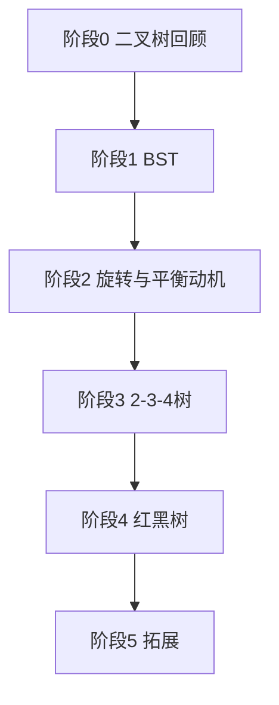

# 树结构学习认知大纲（从二叉树到红黑树）

> **写给谁**：已掌握二叉树基础（节点、左右子、遍历），但对二叉搜索树（BST）、平衡树、红黑树接触较少。  
> **目标**：按难度梯次补齐前置知识，先搞懂 **2-3-4 树** 的逻辑，再读 **红黑树**，避免一上来就被旋转和变色劝退。  
> **本目录角色**：`ai_docs/tree/` 是专题学习区；本文是**总索引 + 自检清单**，后续可按章节拆成独立小文档。

---

## 一、你现在的位置（自检）

在往下读之前，用下面问题判断自己属于哪一档。**不必全对**，标出「不确定」的项就是你该优先补的层。

### 1.1 二叉树基础（你说已有一定了解）

| 自检项                     | 能口头说清？ |
|-------------------------|--------|
| 树、根、父/子、叶子、深度、高度、层      | ☐      |
| 二叉树：每个节点最多两个孩子          | ☐      |
| 前序 / 中序 / 后序 / 层序遍历在干什么 | ☐      |
| 满二叉树、完全二叉树（和堆的关系可后补）    | ☐      |

### 1.2 你接触较少、但读红黑树前**必须**过关的

| 自检项 | 能口头说清？ |
|--------|--------------|
| BST：左 < 根 < 右；中序遍历得到**升序** | ☐ |
| 在 BST 里查找、插入、删除的大致步骤 | ☐ |
| BST 按有序序列插入会退化成链（O(n)） | ☐ |
| 「平衡」指控制**树高**，让增删查稳定在 O(log n) | ☐ |
| 左旋 / 右旋：不改变中序序列，只改形状 | ☐ |

### 1.3 可以等学完 2-3-4 再深究的

| 自检项 | 建议学习阶段 |
|--------|----------------|
| AVL 与红黑树的对比 | 学完红黑树后 |
| B 树 / B+ 树 | 单独「数据库索引」专题 |
| 线段树、Trie、堆 | 与搜索树并列的其它树族 |

**结论**：若 **1.2 有一半以上打圈**，请先学 **阶段 1～2**，不要直接啃红黑树插入删除的 8 种 case。

---

## 二、推荐技术栈（由易到难）

整体是一条**依赖链**，不是并列知识点清单：

```text
阶段 0  二叉树回顾（你已有基础，快速过）
   ↓
阶段 1  二叉搜索树 BST（有序 + 退化问题）
   ↓
阶段 2  旋转 +「为什么要平衡」（直觉，不必背 AVL 公式）
   ↓
阶段 3  多路搜索树：2-3 树 → 2-3-4 树（红黑树的「语义原型」）
   ↓
阶段 4  红黑树（2-3-4 的等价实现 + 工程里的 Map/Set）
   ↓
阶段 5  拓展（AVL、B+、工程选型）— 可选
```



---

## 三、分阶段学什么、学到什么程度

### 阶段 0：二叉树回顾（0.5～1 天）

**目的**：统一术语，避免后面「高度」「叶子」混用。

| 主题 | 掌握标准（够即可） |
|------|-------------------|
| 结构术语 | 能画一棵 5 节点树并标深度/高度 |
| 四种遍历 | 给定小树，能写出中序序列；知道递归/队列模板即可 |
| 完全二叉树 | 知道「最后一层从左填满」；为堆铺垫，不展开 |

**可跳过**：证明、竞赛式建树技巧。

**本目录后续文档（计划）**：`260528xx-阶段0-二叉树回顾.md`（可选，基础牢可跳过）

---

### 阶段 1：二叉搜索树 BST（1～2 天）⭐ 必学

**目的**：红黑树**首先是 BST**；所有操作都先按「大小关系」走，再谈平衡。

| 主题 | 掌握标准 |
|------|----------|
| 定义 | 左子树键 < 根 < 右子树键 |
| 查找 | 从根比较，向左或向右，直到命中或空 |
| 插入 | 落到空位；新节点当叶子 |
| 删除 | 0/1 个孩子直接摘；2 个孩子用**后继**（右子树最小）替换 |
| 中序性质 | 中序遍历 = 有序序列 |
| 退化 | 1,2,3,4,5 顺序插入 → 链；高度 n，操作 O(n) |

**动手**：在纸上对 `[5,3,7,1,4]` 做插入；再对 `[1,2,3,4,5]` 看链化。

**过关自测**：

1. 画出插入 `3,1,5,2` 后的 BST。  
2. 删除有两个孩子的节点时，为什么用后继不会破坏 BST 性质？

**本目录后续文档（计划）**：`阶段1-BST与退化.md`

---

### 阶段 2：平衡动机 + 旋转（1 天）⭐ 必学

**目的**：理解「平衡」在修什么；旋转是后面 2-3-4、红黑树的**同一套手势**。

| 主题 | 掌握标准 |
|------|----------|
| 平衡动机 | 控制 h = O(log n)，增删查才是 O(log n) |
| 左旋 / 右旋 | 会画「谁上去、谁下去」；能说**中序不变** |
| 与 BST 关系 | 旋转只改形状，不改左<根<右 |

**暂不要求**：AVL 的 balance factor = -1,0,1；四种双旋转命名可后补。

**过关自测**：对一条链 `1-2-3`（右斜），画一次左旋后的树，并写出中序（应与旋转前相同）。

**本目录后续文档（计划）**：`阶段2-旋转与平衡动机.md`

---

### 阶段 3：2-3 树与 2-3-4 树（2～3 天）⭐ 红黑树前置核心

**目的**：用**多路、分裂、上移**建立「自平衡」直觉；红黑树 = 用「红边」把 3/4 节点画成二叉的样子。

#### 3.1 2-3 树

| 主题 | 掌握标准 |
|------|----------|
| 节点类型 | 2-节点（1 个键）、3-节点（2 个键） |
| 查找 | 在节点内比较 1～2 个键，选分支 |
| 插入 | 先落到叶子；满则**分裂**并把中间键**上推** |
| 高度 | 所有叶子同一层；树矮且稳定 O(log n) |

#### 3.2 2-3-4 树（=B 树阶数为 4 的特例）

| 主题 | 掌握标准 |
|------|----------|
| 4-节点 | 3 个键、4 个孩子 |
| 插入满节点 | 分裂成两个 2-节点，中间键上移（与 2-3 同一逻辑） |
| 与 BST 对比 | 不再「一条链」；增长靠分裂，不靠单边变深 |

**过关自测**：

1. 向空 2-3-4 树依次插入 `10, 20, 30`，叙述是否分裂、根是否变化。  
2. 用一句话说明：为什么 2-3-4 树不会出现 BST 那种链式退化？

**本目录后续文档（计划）**：

- `阶段3-23树插入与分裂.md`  
- `阶段3-234树与B树关系.md`

---

### 阶段 4：红黑树（2～4 天）⭐ 在阶段 3 之后

**目的**：在**已理解 2-3-4 分裂/上推**的前提下，把规则翻译成「颜色 + 旋转」。

| 顺序 | 主题 | 掌握标准 |
|------|------|----------|
| 4.1 | 五条性质 | 能复述；重点：**无连续红**、**黑高一致** |
| 4.2 | 与 2-3-4 对应 | 黑节点 = 2-节点；红边「粘合」= 3/4 节点 |
| 4.3 | 插入 | 新节点红色；uncle 红 → 变色上移；uncle 黑 → 旋转 |
| 4.4 | 删除 | 知道比插入难；先理解「删黑破坏黑高」再分 case |
| 4.5 | 工程 | Java `TreeMap`、HashMap 树化阈值 8 等（应用向） |

**建议学习路径（本阶段内部）**：

```text
4.1 五条性质 + 黑高直觉
  → 4.2 与 2-3-4 的对应（建立心理模型，少背 case）
  → 4.3 只练插入（含 zig-zag / zig-zig）
  → 4.4 删除（可第二遍再读）
  → 4.5 对照 JDK / 面试题
```

**过关自测**：

1. 不查资料说出三条性质（连续红、根黑、黑高）。  
2. 解释：为什么插入时新节点先涂红而不是黑？

**本目录后续文档（计划）**：

- `阶段4-红黑树与234树对应.md`  
- `阶段4-红黑树插入修复.md`  
- `阶段4-红黑树删除概要.md`（进阶）

---

### 阶段 5：拓展（按需）

| 主题 | 何时学 |
|------|--------|
| AVL | 想对比「更严平衡 vs 更少旋转」 |
| B / B+ 树 | 学数据库索引、InnoDB |
| Treap、Splay | 竞赛或特定场景 |
| 堆、Trie、线段树 | 与「有序 Map」无关的另一条树线 |

---

## 四、依赖关系一览（先修表）

| 你想学的内容 | 必须先会 |
|--------------|----------|
| BST | 二叉树遍历、递归/循环 |
| 旋转 | BST 查找路径 |
| 2-3 树 | BST 有序性；插入「满则分裂」概念 |
| 2-3-4 树 | 2-3 树 |
| 红黑树 | **2-3-4 树** + 旋转 + BST 插入删除 |
| B+ 树 | 2-3-4 / 多路树（不必先学完红黑树删除） |
| AVL 深入 | BST + 旋转（可与红黑树并行对比） |

---

## 五、建议阅读顺序（本目录内）

按文件创建进度，**从上到下**读即可：

| 顺序 | 文档（计划文件名） | 阶段 |
|------|-------------------|------|
| 0 | **本文** `26052801-树结构认知大纲.md` | 总览 |
| 1 | `阶段1-BST与退化.md` | 1 |
| 2 | `阶段2-旋转与平衡动机.md` | 2 |
| 3 | `阶段3-23树插入与分裂.md` | 3 |
| 4 | `阶段3-234树与B树关系.md` | 3 |
| 5 | `阶段4-红黑树与234树对应.md` | 4 |
| 6 | `阶段4-红黑树插入修复.md` | 4 |
| 7 | `阶段4-红黑树删除概要.md` | 4（可选） |

> 说明：带 `阶段*` 的文件尚未全部创建；你完成某一阶段自检后，可让我按上表补全对应章节。

---

## 六、每阶段最小动手练习（防「看懂不会画」）

| 阶段 | 练习 |
|------|------|
| 1 | 纸笔插入/删除 8 个以内整数；画中序结果 |
| 2 | 对右链做左旋、对左链做右旋，核对中序不变 |
| 3 | 2-3-4 插入 `1..10` 或讲义例题，逐步画分裂 |
| 4 | 只做插入：如 `10,20,30` 与 `10,5,1`，对照是否旋转 |

---

## 七、与「上一版红黑树长文」的关系

若你已读过仓库里或其它对话中的**红黑树详解**：

- **感到难受** → 正常，说明缺的是 **阶段 1～3**，不是理解力问题。  
- **正确姿势**：用本文跳到 **阶段 1**，自检过关后再打开 **阶段 3 的 2-3-4**，最后只读「红黑树与 234 对应」那一篇，插入 case 会短很多。

一句话：**红黑树不是新物种，是 2-3-4 树用两种颜色画在二叉指针上的实现。**

---

## 八、你的个人学习路线（推荐）

基于你的描述（二叉树 ✓，BST/平衡树 △），建议：

```text
第 1 周
  Day 1-2：阶段 1 BST（含删除与退化实验）
  Day 3：  阶段 2 旋转（只练会画）
  Day 4-6：阶段 3 的 2-3-4（重点：插入分裂，暂不抠删除）

第 2 周
  Day 1-2：阶段 4.1～4.2 性质 + 与 234 对应
  Day 3-4：阶段 4.3 插入修复
  Day 5+：  删除或 JDK 源码（二选一）
```

---

## 九、下一步你可以怎么做

1. **自检**：回到 [第一节](#一你现在的位置自检)，标出打圈项。  
2. **从阶段 1 开始**：若 BST 删除不熟，先别碰红黑树。  
3. **让我补文档**：回复「生成阶段 1」或「生成 2-3-4 树章节」，我会在 `ai_docs/tree/` 下按上表拆分撰写。

---

## 十、外部参考（可选）

| 资料 | 适合阶段 |
|------|----------|
| 《算法导论》BST、红黑树章节 | 3～4 |
| VisuAlgo 等 BST / RB-Tree 动画 | 1～4 |
| Open Data Structures（免费在线） | 1～3 |
| Linux `Documentation/rbtree.txt` | 4 工程向 |

---

*文档版本：初版 | 目录：`ai_docs/tree/` | 文件名：`26052801-树结构认知大纲.md`*
