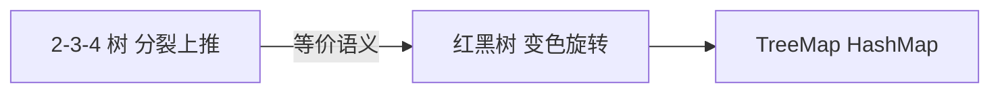

# 阶段 4：红黑树

> **前置**：阶段 1 BST、阶段 2 旋转（[`26052901-阶段2-旋转与平衡动机.md`](26052901-阶段2-旋转与平衡动机.md)）、阶段 3 的 2-3-4 树（[`26052902-阶段3-23树与234树.md`](26052902-阶段3-23树与234树.md)）。  
> **定位**：2-3-4 树用「红/黑 + 二叉指针」实现的等价结构；JDK `TreeMap` / 树化 `HashMap` 的底层。  
> **索引**：[`26052801-树结构认知大纲.md`](26052801-树结构认知大纲.md)

---

## 一、本阶段要达成什么

| 顺序 | 主题 | 掌握标准 |
|------|------|----------|
| 4.1 | 五条性质 | 能复述；重点：**无连续红**、**黑高一致** |
| 4.2 | 与 2-3-4 对应 | 黑节点 ≈ 2-节点；红边「粘合」≈ 3/4 节点 |
| 4.3 | 插入修复 | 新节点红色；叔红 → 变色上移；叔黑 → 旋转 |
| 4.4 | 删除概要 | 知道比插入难；删黑破坏黑高时的修复思路 |
| 4.5 | 工程应用 | `TreeMap`、HashMap 树化阈值 8/6 等 |

**建议学习路径**：

```text
4.1 五条性质 + 黑高直觉
  → 4.2 与 2-3-4 的对应（建立心理模型，少背 case）
  → 4.3 只练插入（含 zig-zig / zig-zag）
  → 4.4 删除（可第二遍再读）
  → 4.5 对照 JDK / 面试题
```

**建议用时**：2～4 天。插入画熟后再碰删除。

**一句话**：红黑树不是新物种，是 **2-3-4 树**画成二叉树后的工程实现。

---

## 二、为什么需要红黑树

| 问题 | 红黑树的回答 |
|------|--------------|
| BST 会链化 | 通过颜色不变量把高度压在 `O(log n)` |
| 2-3-4 不好直接写 | 每个节点 2～4 路，指针操作繁琐 |
| 工程要什么 | **标准二叉指针** + **增删查均 `O(log n)`** + 实现可维护 |



---

## 三、五条性质（4.1）

记五条不变量（不同教材表述略异，本质相同）：

| # | 性质 | 直觉 |
|---|------|------|
| 1 | 每个节点非红即黑 | 只有两种颜色 |
| 2 | **根节点为黑** | 树根固定黑色 |
| 3 | 所有空子指针（NIL / 叶子哨兵）视为**黑** | 外部「空」不算红 |
| 4 | **红节点的两个孩子都是黑**（不能有连续红） | 等价：路径上不能出现「红红」 |
| 5 | 从任意节点到其各后代空指针的路径上，**黑节点个数相同**（黑高一致） | 树的「厚度」由黑高控制 |

### 3.1 黑高（black-height）

**黑高** `bh(x)`：从节点 `x` 出发到任一叶子空指针，经过的**黑节点个数**（通常**不计** `x` 自身，空指针算黑）。

性质 5 保证：

> 最长路径 ≤ 2 × 最短路径（红节点最多插在黑节点之间）

因此树高 `h = O(log n)`，查找 / 插入 / 删除为 `O(log n)`。

### 3.2 过关自测（性质）

不查资料说出下面三条即可过关：

1. **根黑**  
2. **无连续红**（红父 ⇒ 黑子）  
3. **黑高一致**（任意节点到叶空路径黑数相同）

---

## 四、与 2-3-4 树的对应（4.2）

阶段 3 已预习，这里展开成可画图的规则。

### 4.1 节点对应（左倾画法，与 Sedgewick 一致）

| 2-3-4 树 | 红黑树（一种标准画法） |
|----------|------------------------|
| 2-节点 `[K]` | 单个**黑**节点 `K` |
| 3-节点 `[K1 \| K2]` | 黑 `K1`，**红** `K2` 作为 `K1` 的右孩子 |
| 4-节点 `[K1 \| K2 \| K3]` | 黑 `K2`，左红 `K1`、右红 `K3` 作为其子 |

```text
2-3-4 的 3-节点 [10 | 20]：          4-节点 [10 | 20 | 30]：

    [10 | 20]                            [10 | 20 | 30]
         ↓                                      ↓
    10(黑)                                   20(黑)
      \                                     /     \
      20(红)                              10(红)   30(红)
```

**红边**把「本应在同一 3/4 节点里的键」在二叉树上**粘合**起来。

### 4.2 操作对应

| 2-3-4 树 | 红黑树 |
|----------|--------|
| 向 4-节点插入导致满 | 出现**连续红**或临时「4 键粘合」形态 |
| 分裂，中间键上推 | **变色** + 必要时 **旋转** |
| 根分裂，树增高 | 新根上推后**涂黑** |

先想 2-3-4 的「满则裂、中间上推」，再翻译成颜色 case，比死记 8 种插入图快得多。

---

## 五、插入（4.3）

### 5.1 总流程

```text
1. 按 BST 规则找到空位，插入新节点
2. 新节点涂 **红色**（关键！见 §5.2）
3. 若破坏性质（连续红），从插入点向上 **修复（fix-up）**
4. 修复结束后，根节点涂黑（保证性质 2）
```

### 5.2 为什么新节点先涂红？

| 涂黑 | 涂红 |
|------|------|
| 黑高立刻 +1，**性质 5 必坏** | 黑高不变，**性质 5 仍成立** |
| 几乎总要大动干戈 | 若父是黑，**四种性质全满足**，无需修复 |
| | 仅当父也是红时，才出现「连续红」一种违规 |

**结论**：先红 = 把问题缩小成「最多修连续红」，而不是同时修黑高。

### 5.3 修复时的角色

设刚插入节点为 `N`，父为 `P`，祖父为 `G`，叔父（`G` 的另一子）为 `U`。

```text
        G
       / \
      P   U    ← U 为叔父（可为空，空视为黑）
     /
    N          ← 新插入（红）
```

只可能出现一种违规：**连续红**（`P` 红且 `N` 红）。分两大类：

### 5.4 Case A：叔父 `U` 为红

```text
操作：变色 —— P、U 改黑，G 改红（若 G 是根，最后统一把根涂黑）
效果：相当于 2-3-4 里「父满则分裂上推」的变色版，问题上升到 G
```

```text
修复前（G 黑）：          修复后（G 变红，可能继续向上）：

      G(黑)                    G(红)
     /   \                    /   \
  P(红)  U(红)    =>      P(黑)  U(黑)
   /                        /
 N(红)                    N(红)
```

若 `G` 变红后与其父又形成连续红，**重复** Case A 或 B。

### 5.5 Case B：叔父 `U` 为黑（或空）

必须 **旋转 + 变色**。按 `N`、`P` 相对 `G` 的左右位置分两种形态：

#### B1：zig-zig（一条直线）

`P` 是 `G` 的左孩子，且 `N` 是 `P` 的左孩子（**右旋** `G`）；镜像对称时 **左旋** `G`。

```text
      G(黑)                 P(黑)
     /                     /   \
  P(红)        右旋 G       N(红) G(红)
   /            ====>            \
 N(红)                            ...
```

旋转后：`P` 变黑，`G` 变红（具体配色依实现，目标是消除连续红且黑高一致）。

#### B2：zig-zag（折线）

`P` 是 `G` 的左孩子，但 `N` 是 `P` 的**右**孩子：先 **左旋 `P`**，再按 B1 **右旋 `G`**（镜像同理）。

```text
    G              P              N
   /              / \            / \
  P      =>      N   G    =>    P   G
   \            /
    N          P
```

**记忆**：叔黑 ⇒ 看是直线还是折线 ⇒ 1 次或 2 次旋转。

### 5.6 例题 1：插入 `10, 20, 30`（zig-zig）

BST 插入后是一条右链，三个红（临时违规）：

```text
10(黑根)  →  10(黑)     →  10(黑)
              \              \
              20(红)         20(红)
                                \
                                30(红)   ← 连续红，叔 U 为空(黑)
```

`30` 的父 `20` 红、叔空黑、直线右右 ⇒ **左旋 10**（对根 zig-zig）：

```text
        20(黑)
       /     \
    10(红)   30(红)
```

对应 2-3-4：满 `[10|20|30]` 分裂上推 `20` 为根。

### 5.7 例题 2：插入 `10, 5, 1`（zig-zag）

```text
插 5：        插 1：
  10(黑)        10(黑)
  /             /
5(红)         5(红)
              /
            1(红)    ← 1 是 5 的左子，5 是 10 的左子，但 1-5-10 在 5 处折线
```

对 `5` 先 **右旋**（把折线拉直），再对 `10` **左旋**：

```text
        5(黑)
       /    \
    1(红)  10(红)
```

### 5.8 例题 3：叔父为红 — 插入 `10, 5, 15, 3`

前三次后（叔红变色典型）：

```text
插 10：  10(黑)
插 5：   10(黑) / 5(红)
插 15：  10(黑) / 5(红)  \ 15(红)  → 叔红，P/U 变黑、10 变红… 依序修复
```

纸笔时抓住：**叔红就变色上移，叔黑就旋转**；不必背每一棵终态树。

### 5.9 插入修复决策表（简版）

| 条件 | 操作 |
|------|------|
| 父黑 | 结束 |
| 父红，叔红 | `P`、`U` 变黑，`G` 变红；`G` 继续向上检查 |
| 父红，叔黑，zig-zig | 旋转 `G` + 调整颜色 |
| 父红，叔黑，zig-zag | 旋转 `P` + 旋转 `G` + 调整颜色 |

---

## 六、删除概要（4.4，进阶）

删除比插入难，**第二遍**再精读即可；第一遍建立直觉就够。

### 6.1 为什么难

- 删**红**节点：不破坏黑高，通常**无需**修复  
- 删**黑**节点：某条路径少了一个黑，性质 5 被破坏 → 引入「双黑」概念，向兄弟子树借黑或旋转

### 6.2 修复直觉

```text
1. 按 BST 删除（两子节点时用后继替换）
2. 若删掉的是红节点 → 结束
3. 若删掉的是黑节点 → 从「额外少一个黑」的位置向上 fix-up
4. 通过兄弟节点 S 的颜色与子侄情况，选择：
   - 变色（兄弟红等）
   - 旋转（与插入类似的 zig-zig / zig-zag）
5. 根始终涂黑
```

与 2-3-4 删除的「下借、合并、降层」同样繁琐；**面试与 JDK 先掌握插入**即可。

### 6.3 本阶段对删除的要求

- [ ] 知道「删黑破坏黑高」是核心难点  
- [ ] 能说：修复依赖**兄弟节点**与**侄子**颜色  
- [ ] 不必第一遍背全 case 表

---

## 七、工程应用（4.5）

### 7.1 Java `TreeMap` / `TreeSet`

- 底层：**红黑树**（按 key 有序）  
- `O(log n)` 的 `put` / `get` / `remove`  
- 迭代 = 中序遍历（升序）  
- 源码类：`java.util.TreeMap`（JDK 8+ 常见实现为 `TreeMap.Entry` 节点 + 父指针）

### 7.2 `HashMap` 的树化

| 参数 | 典型值（JDK 8+） | 含义 |
|------|------------------|------|
| `TREEIFY_THRESHOLD` | **8** | 单桶链表长度 ≥ 8 且表容量 ≥ 64 时，链表转红黑树 |
| `UNTREEIFY_THRESHOLD` | **6** | 树节点 ≤ 6 时退化为链表 |
| 最小树化容量 | **64** | 表太小时先扩容，不急于树化 |

**原因**：链表平均 `O(1)`，树 `O(log n)` 有常数开销；仅当哈希冲突严重时才树化。阈值 8 来自泊松分布：单桶长度达到 8 的概率极低，一旦出现说明冲突异常。

### 7.3 与 AVL 的选型（了解）

| | 红黑树 | AVL |
|---|--------|-----|
| 平衡严格度 | 较松（黑高约束） | 更严（平衡因子 ±1） |
| 旋转次数 | 插入/删除通常更少 | 查找略优，增删旋转更多 |
| 典型用途 | `TreeMap`、Linux rbtree、标准库 | 读多写少、数据库部分场景 |

---

## 八、动手练习

### 练习 1（必做）：性质口述

不查资料说出：根黑、无连续红、黑高一致。

### 练习 2（必做）：插入 `10, 20, 30`

按 §5.6 画 BST 插入过程与左旋修复，并对照 2-3-4 分裂上推 `20`。

### 练习 3（必做）：插入 `10, 5, 1`

按 §5.7 练 zig-zag（先旋 `P` 再旋 `G`）。

### 练习 4：为什么先涂红

用自己的话回答大纲过关题（见 §5.2）。

### 练习 5（可选）

在 IDE 中对 `TreeMap` 连续 `put(10,20,30,5,15)`，用调试或打印对比本文图示（结构因实现细节可能略有不同，中序键序应一致）。

---

## 九、常见误区

| 误区 | 正解 |
|------|------|
| 「红黑树不是 BST」 | **首先是 BST**，中序升序；颜色只约束形状 |
| 「新节点应涂黑更安全」 | 涂黑易破坏黑高；**先红**使修复只需处理连续红 |
| 「叔父 = 父的兄弟」 | 正确；空叔父视为**黑** |
| 「zig-zig / zig-zag 是新操作」 | 就是阶段 2 的**左旋 / 右旋**组合 |
| 「背完插入 case 就不用 2-3-4」 | 2-3-4 是理解变色的**语义模型** |
| 「HashMap 全是红黑树」 | 仅**冲突严重时**单桶树化；默认数组 + 链表 |

---

## 十、自检清单（阶段 4 过关）

- [ ] 能复述五条性质中的核心三条（根黑、无连续红、黑高一致）  
- [ ] 能画 2-节点 / 3-节点 / 4-节点 与红黑树的对应  
- [ ] 解释：插入为何先涂红  
- [ ] 能区分：叔红（变色上移）vs 叔黑（旋转）  
- [ ] 完成 `10,20,30` 与 `10,5,1` 插入修复图示  
- [ ] 知道删黑节点会破坏黑高（删除细节可后补）  
- [ ] 知道 `TreeMap` 与 HashMap 树化阈值 8 / 6  

---

## 十一、阅读顺序

| 顺序 | 文档 |
|------|------|
| 上一篇 | [`26052902-阶段3-23树与234树.md`](26052902-阶段3-23树与234树.md) |
| **本文** | 阶段 4：红黑树 |
| 拓展 | 阶段 5（AVL、B+ 树等，见大纲） |

---

## 十二、外部参考

| 资料 | 适合 |
|------|------|
| 《算法导论》第 13 章 | 性质证明与删除完整 case |
| VisuAlgo RB-Tree 动画 | 插入 / 删除可视化 |
| `java.util.TreeMap` 源码 | 工程实现 |
| Linux `Documentation/rbtree.txt` | 内核用法与约定 |

---

*文档版本：初版 | 目录：`ai_docs/tree/` | 文件名：`26052903-阶段4-红黑树.md`*
